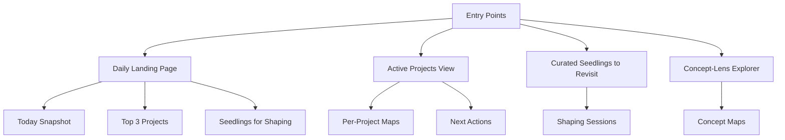

# Example: Flow Map – Entry Points Architecture

```yaml
block_type: map
map_type: concept_cluster
focus: entry_points
related_concepts: [motivation, adhd_time, executive_function]
related_seedlings: [S2, S4, S5]
entry_points:
  - "Start at 'Daily Landing Page' if you want a gentle, low-friction overview."
  - "Start at 'Projects' if you want to move something concrete forward."
created_at: 2025-12-05T11:00:00-05:00
last_touched_at: 2025-12-05T11:00:00-05:00
```

## 1. How to Read This Map

This map shows how different **entry point mechanisms** work together to prevent
“starting from zero.” It connects Seedlings, Concepts, and concrete system
features like daily pages and project dashboards.

## 2. Diagram



## 3. Key Nodes

- **Daily Landing Page** – A generated starting point for “right now.”
- **Active Projects View** – A way to start from doing, not thinking.
- **Curated Seedlings** – Ways to start from interesting questions, not tasks.
- **Concept-Lens Explorer** – Ways to start from “how do I understand X right now?”

## 4. Entry Points

- Start at **Daily Landing Page** if you feel unfocused.
- Start at **Active Projects** if you’re in a doing mood.
- Start at **Curated Seedlings** if you want to explore and think.
- Start at **Concept-Lens Explorer** if you’re in “map my brain” mode.
