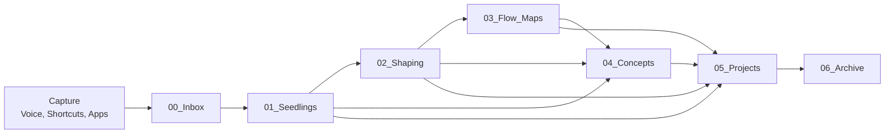

# IES ↔ SiYuan Data Flow Architecture

This document describes how information moves between:

- IES modes (Capture, Dialogue, Flow, Synthesis, Archive)
- External tools (Shortcuts, MCP servers, task managers)
- The SiYuan-based knowledge base defined in this package.

---

## 1. High-Level Flow

---

## 2. Capture Stage

**Sources:**

- iOS Shortcuts
- MCP tools (e.g., email, calendar, browser, GitHub, Karakeep, etc.)
- Manual notes
- Voice-to-text

**Destination:**

- `00_Inbox/` for raw capture
- Occasionally directly to `01_Seedlings/` if the capture is already atomic.

**Processing Actions (by AI):**

1. Normalize: unify format (Markdown with basic metadata).
2. Classify: detect type (idea, question, task, quote, reference, etc.).
3. Route:
   - To `01_Seedlings` if it can be broken into seeds.
   - To `05_Projects` if clearly tied to a project.
   - To `04_Concepts` if it obviously updates a known concept.

---

## 3. Seedlings Stage

**Folder:** `01_Seedlings/…`

**Role:**

- Represent minimal thinking units.
- Feed Dialogue, Flow Maps, Concepts, and Projects.

**Operations:**

- Group seeds by type and domain.
- Enrich metadata (clarity, confidence, relations).
- Detect clusters of related seeds to recommend:
  - Dialogue sessions
  - Flow Maps
  - Concept updates

---

## 4. Dialogue (Shaping) Stage

**Folder:** `02_Shaping/…`

**Role:**

- Provide structured, guided questioning to refine thinking.
- Transform loose Seedlings into clearer models.

**Operations:**

- Generate question sequences.
- Mark turning points in understanding.
- Propose:
  - New Seedlings
  - Concept updates
  - Flow Maps to create/extend
  - Project changes

---

## 5. Flow Maps Stage

**Folder:** `03_Flow_Maps/…`

**Role:**

- Turn sets of Seedlings and Shaping notes into:
  - Maps
  - Diagrams
  - Timelines
  - System views

**Operations:**

- Create or update maps keyed by focal concepts/questions.
- Use block references to:
  - Seedlings
  - Shaping notes
  - Concept pages
  - Project decisions

---

## 6. Concepts Stage

**Folder:** `04_Concepts/…`

**Role:**

- Maintain canonical, evolving definitions and understandings of concepts in Chris’s world.

**Operations:**

- Integrate evidence from:
  - Seedlings
  - Shaping sessions
  - Flow Maps
  - Projects
- Keep a mini-changelog of conceptual changes.
- Surface concept-level entry points for exploration.

---

## 7. Projects Stage

**Folder:** `05_Projects/…`

**Role:**

- Host structured working spaces for things being built or done.

**Operations:**

- Pull in relevant concepts, maps, and seedlings.
- Track decisions and logs.
- Maintain up-to-date:
  - Goals
  - Plan
  - Next actions
  - Status

---

## 8. Archive Stage

**Folder:** `06_Archive/…`

**Role:**

- Preserve older states without cluttering active views.

**Operations:**

- Move:
  - Completed projects
  - Superseded concept versions
  - Old maps
- Tag archived items with reason and date.

---

## 9. Integration with External Systems

You can connect MCP tools and other integrations so that:

- New captures → `00_Inbox/`
- Tasks discovered in notes → external task manager (with backlinks)
- Calendar events / logs → `05_Projects` or a daily log structure
- Research (PDFs, articles) → attached or referenced in relevant project / concept pages

Your AI orchestrator can implement these flows as:

- Scheduled sync jobs
- Event-driven triggers (webhooks)
- Manual commands (e.g., “Process inbox”, “Review concepts related to ADHD motivation”)
