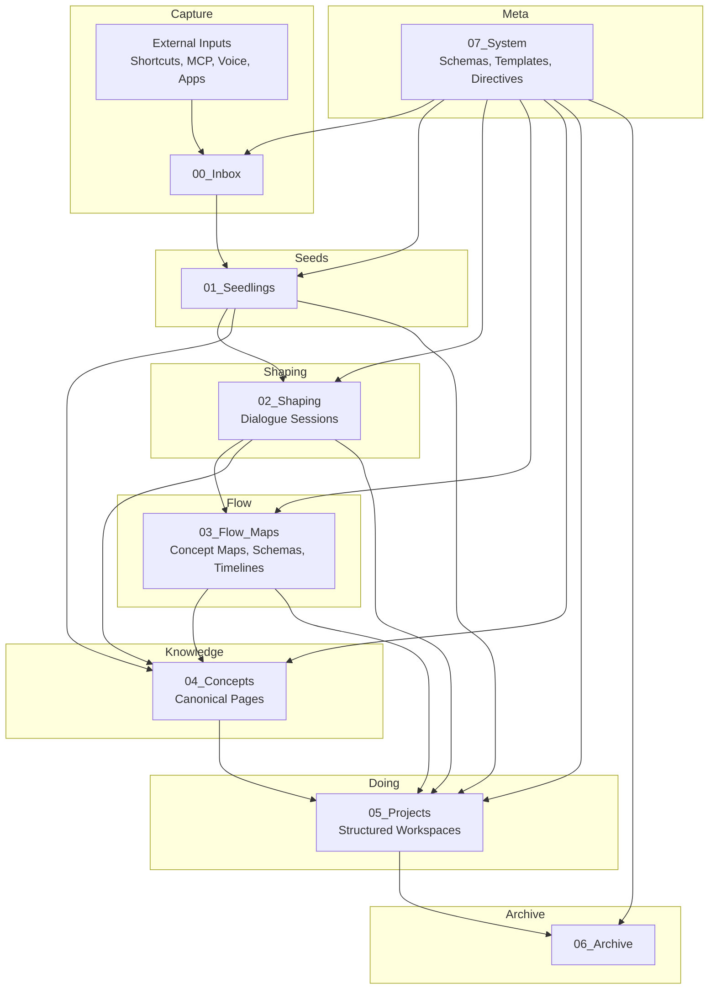

# System Architecture Diagram (Mermaid)

This diagram expresses the **logical architecture** of the IES × SiYuan system:

- `07_System` influences how all other layers behave.
- Data flows mostly left-to-right (Capture → Archive) but with flexible
  shortcuts based on context.
