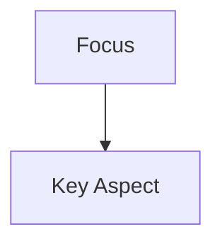

# TEMPLATE: Flow Map

> A map of concepts, relationships, or a system.

```yaml
block_type: map
map_type: <concept_cluster|timeline|system|schema|perspective|other>
focus: <primary_concept_or_question>
related_concepts: []
related_seedlings: []
entry_points: []
created_at: <ISO timestamp>
last_touched_at: <ISO timestamp>
```

## 1. How to Read This Map

Explain in 2–4 sentences what this map is about and how to navigate it.

## 2. Diagram

Use Mermaid (or another visual format) to lay out the relationships.



## 3. Key Nodes

- **Node A:** summary + links
- **Node B:** summary + links

## 4. Entry Points

- Start at [Node A](#) if you are interested in …
- Start at [Node B](#) if you are curious about …

## 5. References

- Seedlings: ...
- Dialogue sessions: ...
- Concept pages: ...
- Projects: ...
