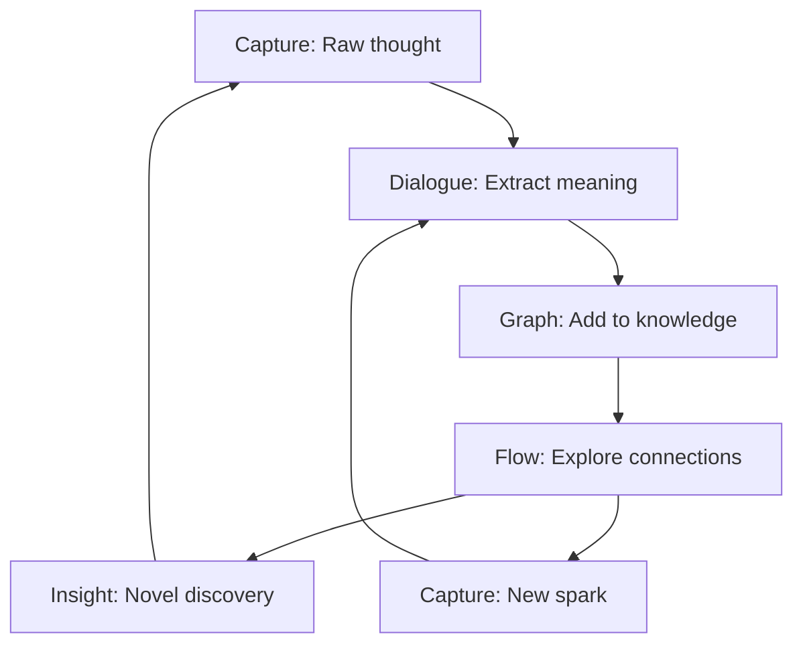

# 0.1 IES Overview

**Purpose:** This document defines the mission, philosophy, target users, and core architecture of the Intelligent Exploration System (IES).

**Date:** December 5, 2025
**Status:** Phase 2c Complete

---

## Mission and Purpose

The **Intelligent Exploration System (IES)** is a domain-agnostic thinking partnership tool that helps people explore complex knowledge domains with an AI partner that adapts to their unique cognitive patterns.

### The Core Insight

> "Instead of reading one book, you're reading a concept."

IES enables users to:
- **Navigate knowledge non-linearly** — Follow threads of interest across sources rather than sequential reading
- **Think WITH an AI partner** — Receive questions and guidance tailored to how YOU think, not generic prompts
- **Generate novel insights** — Surface new conceptualizations through guided exploration
- **Build personal knowledge** — Transform ephemeral thoughts into structured, connected understanding

### What Makes IES Different

**Traditional PKM Tools:**
- Linear reading and note-taking
- Manual tagging and organization
- Generic AI chat interfaces
- User does all the connecting

**IES:**
- Graph-based concept navigation
- ADHD-friendly capture and retrieval
- Personalized thinking partner questions
- System reveals patterns and connections
- Breadcrumb trails show your thinking journey
- Knowledge emerges through guided exploration

---

## Target User Cognitive Profile

IES is specifically designed for people with:

### ADHD and Executive Function Challenges
- **Interest-based nervous system** — Energy follows resonance, not importance
- **Context-dependent retrieval** — Need multiple entry points (mood, question, serendipity)
- **Low-friction capture** — If capture takes work, it won't happen
- **Visible progress** — Need to see the journey, not just the destination
- **Non-judgmental lifecycle** — Growth metaphor over productivity metrics

### Nonlinear Thinking Patterns
- **Associative exploration** — Connections emerge through browsing, not planning
- **Pattern recognition** — See relationships others miss
- **Deep dives** — Follow threads wherever they lead
- **Context switching** — Jump between topics without losing coherence

### Multiple Entry-Point Navigation
- **Mood-based access** — "Show me something exciting" or "Show me something calming"
- **Question-based access** — "What addresses this problem?"
- **Energy-based access** — Filter by energy level (low/medium/high)
- **Resonance-based access** — Find by emotional signal (curious, moved, unclear, etc.)
- **Recency-based access** — Recent visits bubble up

---

## System Philosophy: The Knowledge Lifecycle

IES uses a growth metaphor for knowledge development:

```
Ephemeral → Seed → Concept → Notebook → Graph → Synthesis
```

### 1. Ephemeral Capture (Raw Thoughts)
**Where:** Quick Capture in SiYuan or Readest
**State:** `raw` (just landed)
**Friction:** Zero — capture first, process later
**Storage:** `/Daily/` or `00_Inbox/`

### 2. Seed (Atomic Ideas)
**Where:** Seedlings folder with 7 subcategories
**State:** `classified` (AI added metadata)
**Types:** question, observation, moment, schema, contradiction, what_if, insight
**Storage:** `/Seedlings/{type}/`

### 3. Concept (Formalized Knowledge)
**Where:** Concepts folder or structured thinking session
**State:** `processed` (user decided placement)
**Integration:** Linked to domain graph, extractable to Neo4j
**Storage:** `/Concepts/` or `/Sessions/{mode}/`

### 4. Notebook (Structured Exploration)
**Where:** SiYuan documents with frontmatter
**Metadata:** `be_type`, `be_id`, `status`, `resonance`, `energy`
**Templates:** Mode-specific (Learning, Articulating, Planning, Ideating, Reflecting)

### 5. Graph (Connected Knowledge)
**Where:** Neo4j domain graph + personal graph
**Relationships:** MENTIONS, supports, contrasts_with, sparked_by, led_to_discovery
**Queries:** Entity search, relationship traversal, source lookup

### 6. Synthesis (Emergent Understanding)
**Where:** Journey analysis, pattern recognition
**Outcome:** Novel insights from exploration patterns
**Enrichment:** Concepts flow back into graph for next cycle

---

## The Three Modes: Capture → Dialogue → Flow

IES orchestrates three interlocking modes that form a virtuous cycle:

### Capture Mode (Ephemeral → Persistent)

**Purpose:** Zero-friction thought capture without derailing current task

**Entry Points:**
- Quick Capture button in SiYuan
- Highlight text in Readest → capture
- Voice notes (future)
- Browser extension (future)

**AI Role:**
- Extract entities and themes
- Suggest placements
- Add metadata automatically

**Output:**
- CaptureItem in queue with `raw` status
- Auto-linked to related concepts
- Ready for processing when user has time

**Status Flow:**
```
raw → classified → processed
```

### Dialogue Mode (Structured Thinking)

**Purpose:** AI-guided meaning extraction through personalized questions

**Entry Points:**
- ForgeMode in SiYuan
- 5 thinking modes: Learning, Articulating, Planning, Ideating, Reflecting
- Template-driven with section-by-section flow

**AI Role:**
- Ask mode-specific questions
- Adapt to user's 6-dimension cognitive profile
- Guide without directing
- Track question-response exchanges

**Output:**
- ThinkingSession with angles and breadcrumbs
- Session document in `/Sessions/{mode}/`
- Extracted entities ready for graph
- Transcript for later review

**Question Classes (9 types):**
- Schema-Probe, Boundary, Dimensional, Causal
- Counterfactual, Anchor, Perspective-Shift
- Meta-Cognitive, Reflective-Synthesis

### Flow Mode (Visual Graph Exploration)

**Purpose:** Non-linear knowledge navigation with thinking partner

**Entry Points:**
- Click entity in Readest overlay
- Search in SiYuan Flow Mode
- Dashboard suggestions
- Resume journey from breadcrumbs

**AI Role:**
- Generate thinking partner questions at decision points
- Surface unexpected connections
- Explain concepts via reframes (metaphors, analogies)
- Track exploration path as breadcrumbs

**Output:**
- FlowSession with visited nodes/edges
- Journey breadcrumbs with dwell time
- Synthesis of insights from path
- Suggestions for next exploration

**Data Flow:**
```
User browses → AI asks questions → User responds
→ Journey captured → Patterns emerge → Suggestions improve
```

---

## How the Modes Interlock



**The Virtuous Cycle:**

1. **Capture** surfaces raw thoughts with minimal friction
2. **Dialogue** extracts structured meaning through guided questions
3. Structured thoughts become **concepts** in the graph
4. **Flow** exploration reveals unexpected connections
5. Connections spark **new insights**
6. Insights get **captured**, restarting the cycle at a deeper level

**Personalization Layer:**
- User's cognitive profile informs Dialogue questions
- Journey patterns inform Flow suggestions
- Resonance signals prioritize Capture queue
- Energy levels determine appropriate entry points

---

## The Four-Layer Architecture

IES is built as four interconnected layers, each enabling the others:

```
┌─────────────────────────────────────────────────────────────┐
│  LAYER 4: READEST (Reading Interface)                       │
│  • E-book reader with Flow mode toggle                      │
│  • Entity overlay highlighting (click to explore)           │
│  • Calibre library browser (179 books)                      │
│  • Breadcrumb journey tracking                              │
│  STATUS: Production Ready (Dec 5)                           │
└─────────────────────────────────────────────────────────────┘
                          │
                          ▼
┌─────────────────────────────────────────────────────────────┐
│  LAYER 3: SIYUAN PLUGIN (Processing Hub)                    │
│  • Dashboard with stats and suggestions                     │
│  • ForgeMode: 5 structured thinking modes                   │
│  • Flow Mode: graph exploration                             │
│  • Quick Capture with entity extraction                     │
│  STATUS: Production Ready (Dec 5)                           │
└─────────────────────────────────────────────────────────────┘
                          │
                          ▼
┌─────────────────────────────────────────────────────────────┐
│  LAYER 2: BACKEND (API Services)                            │
│  • Graph API, Books API, Entity API                         │
│  • Reframe API, Template API, Personal Graph API            │
│  • Session API, Journey API, Capture API                    │
│  • 94/94 tests passing                                      │
│  STATUS: Production Ready (Dec 5)                           │
└─────────────────────────────────────────────────────────────┘
                          │
                          ▼
┌─────────────────────────────────────────────────────────────┐
│  LAYER 1: KNOWLEDGE GRAPH (Foundation)                      │
│  • Calibre library: 179 books (single source of truth)      │
│  • Neo4j: 291 entities, 338 relationships                   │
│  • Qdrant: Vector embeddings for semantic search            │
│  • Auto-ingestion daemon processing books                   │
│  STATUS: Operational (Dec 5)                                │
└─────────────────────────────────────────────────────────────┘
```

### Layer 1: Knowledge Graph Creation
**Purpose:** Pre-process domain materials into rich, interconnected graph

**Components:**
- **Calibre library** — Single source of truth for books (179 books)
- **Neo4j** — Graph database with entities and relationships
- **Qdrant** — Vector store for semantic search
- **Auto-ingestion daemon** — Background book processing

**Entity Types:**
- Domain: concept, framework, theory, mechanism, pattern, person, book, assessment
- Personal: spark, insight, thread, favorite_problem

**Status:** ✅ Fully operational with auto-ingestion running

### Layer 2: Backend Services
**Purpose:** APIs for graph access, dialogue, journey tracking, content capture

**8 API Routers:**
1. **Graph API** — entity search, exploration, sources, stats
2. **Books API** — Calibre catalog, covers, file serving
3. **Entity API** — by-book and by-calibre-id lookup
4. **Reframe API** — Claude-generated metaphors/analogies
5. **Template API** — thinking templates for structured sessions
6. **Personal Graph API** — ADHD-friendly spark/insight capture
7. **Session API** — structured thinking dialogue
8. **Journey API** — breadcrumb tracking and retrieval

**Status:** ✅ 94/94 tests passing, production ready

### Layer 3: SiYuan Plugin (Processing Hub)
**Purpose:** Dashboard and structured thinking modes

**5 Thinking Modes:**
1. **Learning** — understand new mechanisms (template: mechanism-map)
2. **Articulating** — clarify vague intuitions (template: clarify-intuition)
3. **Planning** — develop action strategies
4. **Ideating** — generate creative options
5. **Reflecting** — personal insight extraction

**Features:**
- Dashboard with stats, suggestions, recent journeys
- ForgeMode with interactive question-response system
- Flow Mode for graph exploration
- Quick Capture with AI entity extraction
- Energy/resonance-based navigation

**Status:** ✅ Remediation complete (Dec 5)

### Layer 4: Readest Integration (Reading Interface)
**Purpose:** E-book reader with flow exploration

**Features:**
- Entity overlay highlighting (type-specific colors)
- Click entity → Flow Panel opens
- Calibre library browser (search, covers, open books)
- Split-panel view (text + entity relationships)
- Breadcrumb journey capture
- Thinking partner questions during reading

**Status:** ✅ Remediation complete (Dec 5-6)

---

## System Principles

### 1. Domain-Agnostic Design
IES works across ANY knowledge domain:
- Scientific research
- Legal analysis
- Creative projects
- Business strategy
- Learning any subject

**Current validation domains:**
- Psychology (ADHD, therapy, neuroscience)
- Productivity and learning
- Philosophy and systems thinking

### 2. ADHD-Friendly by Design
- **Zero-friction capture** — Capture now, process later
- **Multiple entry points** — Mood, question, energy, resonance, recency
- **Visible progress** — Breadcrumb trails show journey
- **Non-judgmental lifecycle** — Growth metaphor over productivity
- **Energy-aware** — Navigate by current energy level

### 3. Personalization Through Observation
- **6-dimension cognitive profile** — structure, pace, ambiguity, abstraction, verification, novelty
- **Pattern recognition** — System learns how you think by observing
- **Adaptive questions** — Questions match your thinking style
- **Journey analysis** — Exploration patterns inform suggestions

### 4. Thinking Partnership, Not Chatbot
- **AI as thinking partner** — Asks clarifying questions, surfaces connections
- **User-driven navigation** — You choose where to go
- **Guidance without direction** — System suggests, never dictates
- **Breadcrumb documentation** — System captures your thinking path

### 5. Knowledge Emergence
- **Novel insights surface** — From structure, not just content
- **Connections reveal meaning** — Graph relationships generate understanding
- **Cycles deepen understanding** — Each pass enriches the next
- **Personal + domain knowledge** — Both graphs enrich each other

---

## System Status (December 5, 2025)

### Phase Completion
- ✅ **Phase 0:** Configuration stabilization (40% → <5% overhead)
- ✅ **Phase 1:** Core hypothesis validated (10 sessions, 11 concepts)
- ✅ **Phase 2a:** CLI validation complete (5 explorations)
- ✅ **Phase 2b:** Visual interfaces complete (Readest + SiYuan MVPs)
- ✅ **Phase 2c:** Integration features complete (Calibre, entity overlay, reframes, templates)

### Current Capabilities
- ✅ All 4 layers built and integrated
- ✅ 291 entities, 338 relationships in graph
- ✅ 94/94 backend tests passing
- ✅ Auto-ingestion processing 179 books
- ✅ Entity overlay with click-to-flow
- ✅ Interactive question-response system
- ✅ Journey breadcrumb visualization
- ✅ Unified design system across interfaces

### Ready For
- User testing with complete flow
- Real-world usage validation
- Phase 3 features (cross-app sync, journey analysis)

---

## Key Differentiators

| Traditional Tools | IES |
|------------------|-----|
| Linear reading | Graph-based concept navigation |
| Manual tagging | AI entity extraction |
| Generic chat | Personalized thinking partner |
| Isolated notes | Connected knowledge graph |
| Productivity metrics | Growth metaphor |
| One entry point | Multiple entry points (mood, energy, question) |
| User does connecting | System reveals connections |
| Static knowledge | Emergent insights |

---

## References

**Architecture Documents:**
- `docs/SYSTEM-DESIGN.md` — Complete operational reference
- `docs/PROJECT-OVERVIEW.md` — Original vision and rationale
- `docs/COMPREHENSIVE-PROJECT-STATUS.md` — Technical status

**Implementation:**
- `ies/backend/` — Layer 2 FastAPI services
- `.worktrees/siyuan/ies/plugin/` — Layer 3 SiYuan plugin
- `.worktrees/readest/` — Layer 4 Readest integration
- `library/graph/` — Layer 1 graph infrastructure

**Design Specifications:**
- `docs/IES_SiYuan_Architecture/` — Complete 7-layer structure reference
- `docs/plans/UNIFIED-DESIGN-SYSTEM.md` — Design system specification
- `docs/ARCHITECTURE-COMPARISON.md` — Architecture analysis

---

*This document provides the high-level overview of IES. For operational details, see `docs/SYSTEM-DESIGN.md`. For implementation status, see `docs/COMPREHENSIVE-PROJECT-STATUS.md`.*
