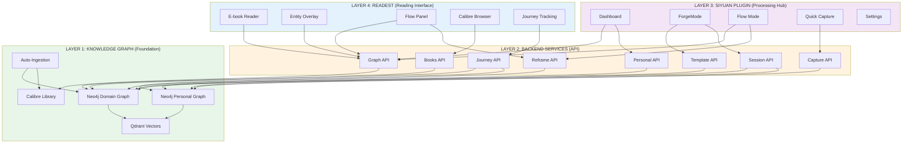
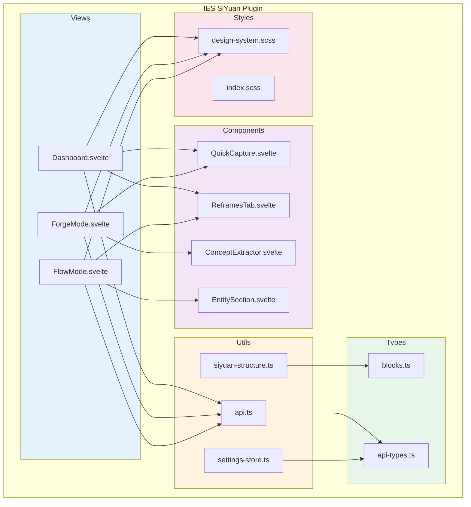
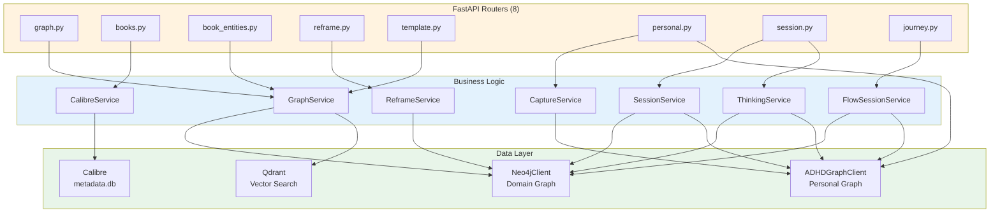
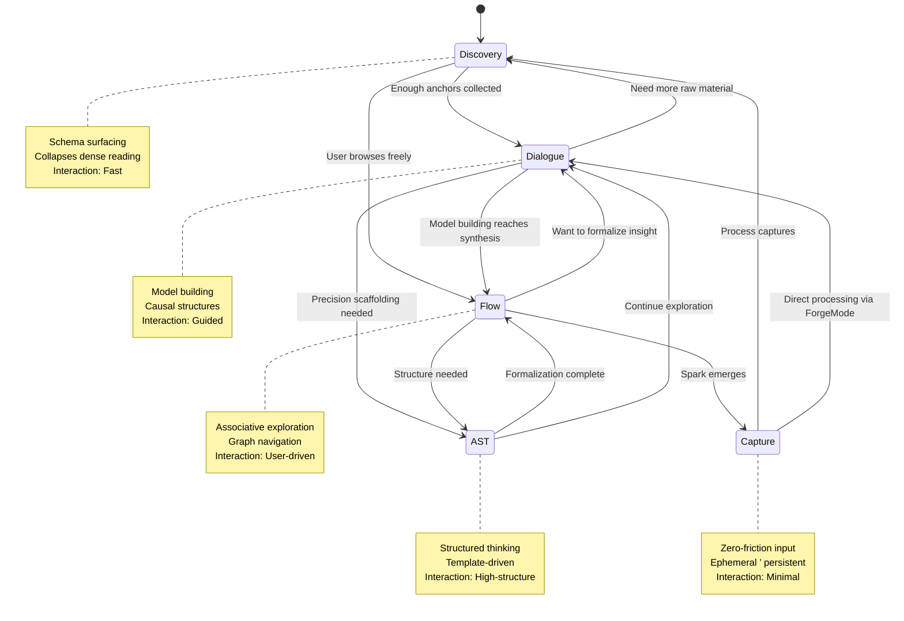
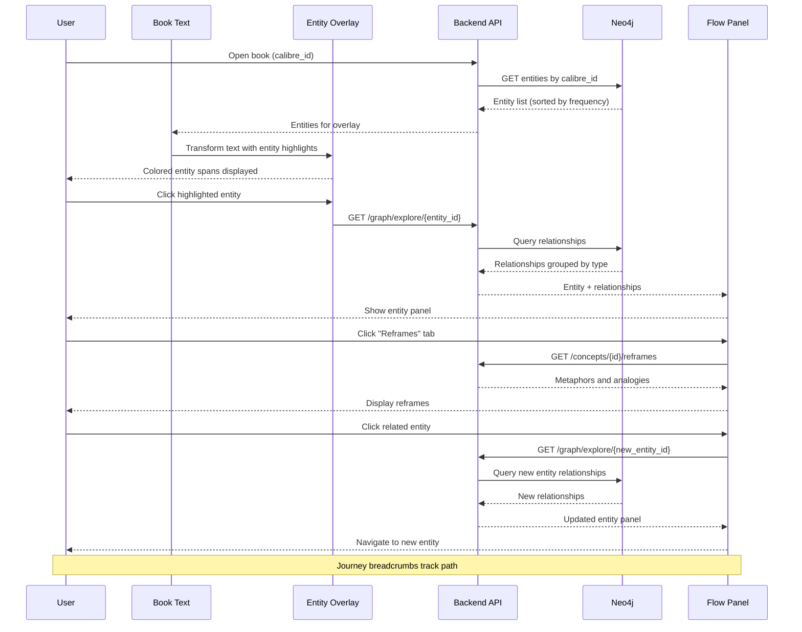
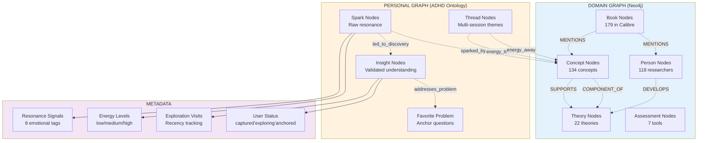
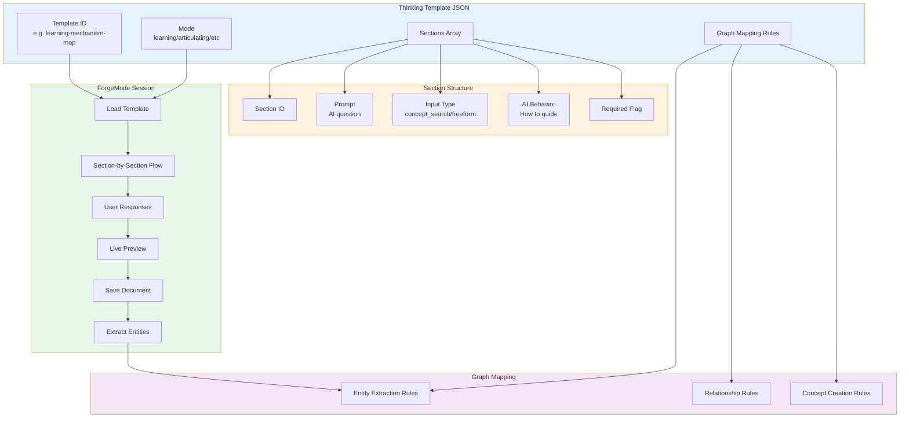

# 0.3 Architecture Diagrams

**Purpose:** Visual reference for IES system architecture with mermaid diagrams showing layers, data flow, components, and mode transitions.

**Last Updated:** 2025-12-06

---

## 1. Four-Layer Architecture

The complete IES system stack from knowledge graph foundation to reading interface:

**Explanation:**

- **Layer 4 (Readest):** User-facing reading interface with entity highlighting and flow exploration
- **Layer 3 (SiYuan):** Processing hub for structured thinking, capture, and dashboard navigation
- **Layer 2 (Backend):** API layer providing intelligence, data access, and orchestration
- **Layer 1 (Foundation):** Knowledge graphs (domain + personal), vector search, book catalog

**Data Flow:** User actions in L4/L3 ’ API calls to L2 ’ Graph queries/updates in L1 ’ Results flow back up

**Implementation Files:**
- L4: `.worktrees/readest/readest/apps/readest-app/src/`
- L3: `.worktrees/siyuan/ies/plugin/src/`
- L2: `ies/backend/src/ies_backend/`
- L1: `library/graph/`, Calibre library, Docker services

---

## 2. Data Flow: Capture ’ Thinking ’ Flow ’ Synthesis

The three-layer loop showing how knowledge moves through the system:

```mermaid
graph LR
    subgraph Ephemeral["1. EPHEMERAL CAPTURE"]
        C1[Quick Capture]
        C2[CaptureItem: queued]
        C3[AI: Extract Entities]
    end

    subgraph Thinking["2. STRUCTURED THINKING"]
        T1[Start Session]
        T2[ThinkingSession]
        T3[Angles & Breadcrumbs]
        T4[Complete Session]
    end

    subgraph Flow["3. VISUAL FLOW"]
        F1[Open Flow from Session]
        F2[FlowSession]
        F3[Explore Graph]
        F4[Generate Synthesis]
    end

    subgraph Graph["4. GRAPH ENRICHMENT"]
        G1[Create Entities]
        G2[Map Relationships]
        G3[Update Personal Graph]
    end

    C1 --> C2
    C2 --> C3
    C3 --> T1
    T1 --> T2
    T2 --> T3
    T3 --> T4
    T4 --> F1
    F1 --> F2
    F2 --> F3
    F3 --> F4
    F4 --> G1
    G1 --> G2
    G2 --> G3
    G3 -.New Spark.-> C1

    style Ephemeral fill:#fff3e0
    style Thinking fill:#e3f2fd
    style Flow fill:#f3e5f5
    style Graph fill:#e8f5e9
```

**Explanation:**

**1. Ephemeral Capture:**
- User captures thought with minimal friction
- CaptureItem created with `queued` status
- AI extracts entities and themes automatically

**2. Structured Thinking:**
- User processes capture through ForgeMode template
- ThinkingSession tracks angles (perspectives) and breadcrumbs (thinking steps)
- Capture status updates: `queued` ’ `in_thinking` ’ `integrated`

**3. Visual Flow:**
- Completed session opens in Flow Mode
- FlowSession tracks visited nodes, edges, journey path
- AI generates synthesis from exploration patterns

**4. Graph Enrichment:**
- Entities extracted and added to graph
- Relationships mapped based on template rules
- Personal graph updated with new insights
- Cycle restarts: synthesis sparks new captures

**Implementation Files:**
- CaptureService: `ies/backend/src/ies_backend/services/capture_service.py`
- ThinkingService: `ies/backend/src/ies_backend/services/thinking_service.py`
- FlowSessionService: `ies/backend/src/ies_backend/services/flow_session_service.py`

---

## 3. SiYuan Plugin Structure

Component organization in Layer 3:

**Explanation:**

**Views (3 main screens):**
- **Dashboard**  Central hub with stats, suggestions, journeys
- **ForgeMode**  Template-driven structured thinking (5 modes)
- **FlowMode**  Graph exploration without books

**Components (reusable UI):**
- **QuickCapture**  Low-friction input with entity extraction
- **ReframesTab**  Displays metaphors/analogies for concepts
- **EntitySection**  Shows entity relationships in flow panel
- **ConceptExtractor**  Wizard for formalizing session entities

**Utils (shared logic):**
- **siyuan-structure.ts**  9-folder trellis, notebook resolution, backend API calls
- **api.ts**  HTTP client wrapping SiYuan's forwardProxy
- **settings-store.ts**  Svelte store for backend URL, preferred notebooks, Ollama config

**Types (TypeScript definitions):**
- **blocks.ts**  6 block types, 7 idea types, dual status systems, ADHD enums
- **api-types.ts**  API request/response schemas

**Styles (design system):**
- **design-system.scss**  Unified "Contemplative Knowledge Space" tokens
- **index.scss**  Plugin-specific overrides

**Location:** `.worktrees/siyuan/ies/plugin/src/`

---

## 4. Backend Service Architecture

Layer 2 service layer organization:

**Explanation:**

**API Routers (HTTP endpoints):**
- **graph.py**  Entity search, exploration, sources, stats
- **books.py**  Calibre catalog, covers, file serving
- **book_entities.py**  Entity lookup by book/calibre_id
- **reframe.py**  Generate metaphors/analogies via Claude
- **template.py**  Thinking templates for ForgeMode
- **personal.py**  Spark/insight CRUD, energy/resonance filtering
- **session.py**  Structured dialogue lifecycle
- **journey.py**  Breadcrumb tracking and retrieval

**Services (orchestration layer):**
- **GraphService**  Neo4j queries with relationship grouping
- **CalibreService**  SQLite queries on Calibre metadata.db
- **ReframeService**  Claude API calls with caching
- **SessionService**  Session extraction and template mapping
- **CaptureService**  Capture queue management
- **ThinkingService**  Structured thinking workflow
- **FlowSessionService**  Flow exploration lifecycle

**Data Layer (storage):**
- **Neo4jClient**  Domain graph (concepts, books, relationships)
- **ADHDGraphClient**  Personal graph (sparks, insights, threads)
- **Qdrant**  Vector embeddings for semantic search
- **Calibre**  Book metadata database

**Location:** `ies/backend/src/ies_backend/`

---

## 5. Mode Transition Engine State Machine

Automatic mode switching based on interaction signals (designed, not fully implemented):

**Explanation:**

**4 Main Modes + Capture:**
- **Discovery Mode**  Schema surfacing, fast mapping before deep dives
- **Dialogue Mode**  Model building with AI-guided questioning
- **Flow Mode**  Associative graph exploration
- **AST Mode**  Assisted structured thinking with templates
- **Capture Mode**  Zero-friction thought capture

**Transition Triggers:**
- **Interaction cadence**  Fast responses ’ Discovery, Slow ’ Dialogue
- **Cognitive load markers**  Stuckness ’ AST scaffolding, Clarity ’ Flow
- **Resonance hits**  Emotional engagement peaks ’ Capture

**3 Signal Streams Monitored:**
1. User response timing
2. Confidence/clarity markers in responses
3. Resonance signal patterns

**Manual Override:** User can always force mode switch via UI

**Implementation Status:** Designed in SiYuan notebook `/Modes/Mode Transition Engine`, not fully implemented in code

---

## 6. Knowledge Lifecycle Flow

How knowledge evolves through the system from ephemeral to formalized:

```mermaid
graph LR
    subgraph Ephemeral
        E1[Quick Capture<br/>Text/Voice/Highlight]
        E2[CaptureItem<br/>Status: raw]
    end

    subgraph Seed
        S1[AI Classification<br/>Status: classified]
        S2[Seedling Document<br/>/Seedlings/type/]
        S3[User Status:<br/>captured]
    end

    subgraph Concept
        C1[Structured Session<br/>ForgeMode]
        C2[Entity Extraction<br/>Template mapping]
        C3[Concept Document<br/>/Concepts/]
    end

    subgraph Notebook
        N1[Session Document<br/>/Sessions/mode/]
        N2[Frontmatter<br/>Metadata]
        N3[User Status:<br/>exploring]
    end

    subgraph Graph
        G1[Neo4j Entity<br/>+ Relationships]
        G2[Qdrant Embedding<br/>Semantic search]
        G3[User Status:<br/>anchored]
    end

    subgraph Synthesis
        SY1[Journey Analysis<br/>Pattern recognition]
        SY2[Novel Insight<br/>Emergent understanding]
        SY3[New Spark<br/>Cycle restarts]
    end

    E1 --> E2
    E2 --> S1
    S1 --> S2
    S2 --> S3
    S3 --> C1
    C1 --> C2
    C2 --> C3
    C3 --> N1
    N1 --> N2
    N2 --> N3
    N3 --> G1
    G1 --> G2
    G2 --> G3
    G3 --> SY1
    SY1 --> SY2
    SY2 --> SY3
    SY3 -.-> E1

    style Ephemeral fill:#fff3e0
    style Seed fill:#e1f5fe
    style Concept fill:#f3e5f5
    style Notebook fill:#e8f5e9
    style Graph fill:#fce4ec
    style Synthesis fill:#ede7f6
```

**Explanation:**

**1. Ephemeral (Raw Capture):**
- User captures thought via Quick Capture
- CaptureItem created with `raw` status
- No structure required

**2. Seed (Atomic Idea):**
- AI adds metadata: entities, themes, idea type
- Status: `raw` ’ `classified`
- Becomes Seedling document in `/Seedlings/{idea_type}/`
- User status: `captured`

**3. Concept (Formalized):**
- User processes via ForgeMode template
- AI extracts entities based on template rules
- Becomes Concept document in `/Concepts/`
- Status: `classified` ’ `processed`

**4. Notebook (Structured):**
- Session document saved in `/Sessions/{mode}/`
- Frontmatter includes metadata (be_type, be_id, mode, question_classes_used)
- User status: `captured` ’ `exploring`

**5. Graph (Connected):**
- Entities added to Neo4j with relationships
- Vector embeddings added to Qdrant for semantic search
- User status: `exploring` ’ `anchored`

**6. Synthesis (Emergent):**
- Journey patterns analyzed
- Novel insights surface from exploration
- Insights become new sparks
- Cycle restarts at deeper level

**Growth Metaphor:** Knowledge grows organically from seed ’ sapling ’ tree ’ forest ecosystem

---

## 7. Entity Overlay and Flow Panel Interaction

How users navigate from text to graph in Readest:

**Explanation:**

**1. Book Opening:**
- User opens book via Calibre ID
- Backend fetches all entities mentioned in book
- Entities sorted by frequency

**2. Entity Overlay:**
- Text transformer wraps entity names in styled `` elements
- Type-specific colors (Concept=blue, Person=green, Theory=purple, etc.)
- User sees concepts highlighted inline

**3. Click-to-Explore:**
- User clicks highlighted entity
- Backend queries Neo4j for relationships
- Relationships grouped by type (shows "3 SUPPORTS relationships", not just first)

**4. Flow Panel Display:**
- Entity definition and metadata
- Relationships grouped and expandable
- Sources showing other books discussing this entity
- Thinking partner questions

**5. Reframes:**
- User switches to Reframes tab
- Backend fetches cached metaphors/analogies
- Claude-generated explanations make concept accessible

**6. Navigation:**
- User clicks related entity
- Flow Panel updates to new entity
- Breadcrumb journey captures path
- Dwell time tracked for each visit

**Implementation Files:**
- Overlay: `.worktrees/readest/readest/apps/readest-app/src/services/transformers/entity.ts`
- Flow Panel: `.worktrees/readest/readest/apps/readest-app/src/app/reader/components/flowpanel/`
- Backend: `ies/backend/src/ies_backend/api/graph.py`

---

## 8. Dual Graph Architecture (Domain + Personal)

How domain knowledge and personal knowledge coexist and enrich each other:

**Explanation:**

**Domain Graph (Objective Knowledge):**
- **Books**  Source materials (179 Calibre books)
- **Concepts**  Domain ideas (executive function, cognitive load, etc.)
- **Persons**  Researchers and authors
- **Theories**  Frameworks and models
- **Assessments**  Evaluation tools

**Relationships:**
- MENTIONS (book ’ concept/person)
- SUPPORTS, CONTRADICTS (concept ’ concept)
- COMPONENT_OF, DEVELOPS (hierarchical)
- CITES (book ’ book)

**Personal Graph (Subjective Knowledge):**
- **Sparks**  Raw emotional resonance (unprocessed)
- **Insights**  Validated understanding (promoted sparks)
- **Threads**  Long-term exploration themes
- **Favorite Problems**  Anchor questions

**Relationships:**
- sparked_by (spark ’ domain concept)
- led_to_discovery (spark ’ insight)
- addresses_problem (insight ’ favorite problem)
- energy_toward, energy_away (thread ’ concept)

**ADHD Metadata:**
- **Resonance Signals**  WHY it matters (curious, excited, moved, etc.)
- **Energy Levels**  Current capacity state
- **Exploration Visits**  Recency-based prioritization
- **User Status**  Growth lifecycle (captured ’ exploring ’ anchored)

**Virtuous Cycle:**
- Domain concepts spark personal resonance
- Personal insights enrich domain understanding
- Both graphs grow together

**Implementation Files:**
- Domain: `library/graph/neo4j_client.py`
- Personal: `library/graph/adhd_graph_client.py`, `library/graph/adhd_ontology.py`

---

## 9. Thinking Template Structure

How ForgeMode templates drive structured thinking sessions:

**Explanation:**

**Template Components:**
- **Template ID**  Unique identifier (e.g., `learning-mechanism-map`)
- **Mode**  Which thinking mode (Learning, Articulating, Planning, Ideating, Reflecting)
- **Sections Array**  Ordered list of prompts and inputs
- **Graph Mapping Rules**  How to extract entities and relationships on completion

**Section Structure:**
- **Section ID**  Unique within template
- **Prompt**  Question AI asks user
- **Input Type**  concept_search (entity picker), freeform (textarea), selection (options)
- **AI Behavior**  How to guide without directing
- **Required**  Whether section must be completed

**Graph Mapping:**
- **Entity Extraction**  Which section responses become entities
- **Relationship Rules**  How to link extracted entities
- **Concept Creation**  When to create new domain concepts

**ForgeMode Workflow:**
1. User selects mode ’ template fetched from `/templates` API
2. Sections displayed one at a time
3. User responds to prompts
4. Live preview shows document building
5. Completion saves document to `/Sessions/{mode}/`
6. Entities extracted and added to graph

**Available Templates:**
- `learning-mechanism-map`  Understand how something works
- `articulating-clarify-intuition`  Formalize vague feelings

**Implementation Files:**
- Schema: `schemas/thinking-template.schema.json`
- Backend: `ies/backend/src/ies_backend/api/template.py`
- Frontend: `.worktrees/siyuan/ies/plugin/src/views/ForgeMode.svelte`

---

## 10. Auto-Ingestion Pipeline

How books flow from Calibre library to Neo4j graph:

```mermaid
graph LR
    subgraph Calibre["CALIBRE LIBRARY"]
        C1[179 Books<br/>EPUB/PDF]
        C2[metadata.db<br/>SQLite]
    end

    subgraph Daemon["AUTO-INGESTION DAEMON"]
        D1[Scan for<br/>pending books]
        D2[Check Status<br/>in Neo4j]
        D3[Process Queue<br/>One at a time]
    end

    subgraph Pass1["PASS 1: Structure"]
        P1[Extract Text<br/>ebooklib/PyPDF2]
        P2[Create Chunks<br/>Hierarchical]
        P3[Extract Entities<br/>OpenAI]
        P4[Create Book Node]
        P5[Create MENTIONS<br/>relationships]
    end

    subgraph Pass2["PASS 2: Relationships"]
        R1[Analyze Entity<br/>Co-occurrence]
        R2[Extract Relationships<br/>SUPPORTS/CONTRADICTS]
        R3[Map to Existing<br/>Entities]
    end

    subgraph Pass3["PASS 3: Enrichment"]
        E1[Generate Reframes<br/>Claude API]
        E2[Extract Mechanisms<br/>Causal patterns]
        E3[Add to Graph]
    end

    C1 --> D1
    C2 --> D1
    D1 --> D2
    D2 --> D3
    D3 --> P1

    P1 --> P2
    P2 --> P3
    P3 --> P4
    P4 --> P5
    P5 --> R1

    R1 --> R2
    R2 --> R3
    R3 --> E1

    E1 --> E2
    E2 --> E3

    style Calibre fill:#e3f2fd
    style Daemon fill:#fff3e0
    style Pass1 fill:#e8f5e9
    style Pass2 fill:#f3e5f5
    style Pass3 fill:#fce4ec
```

**Explanation:**

**Calibre Library:**
- 179 books in EPUB/PDF format
- `metadata.db` SQLite database with book metadata
- `calibre_id` as universal identifier

**Auto-Ingestion Daemon:**
- Runs every 5 minutes
- Scans Calibre library for unprocessed books
- Checks Neo4j Book node status
- Processes one book at a time (prevents resource exhaustion)

**Pass 1 (IMPLEMENTED):**
- Extract text from EPUB/PDF
- Create hierarchical chunks (parent/child structure)
- Extract entities using OpenAI API
- Create Book node in Neo4j
- Create MENTIONS relationships (Book ’ Entity)
- Status: `pending` ’ `entities_extracted`

**Pass 2 (PLANNED):**
- Analyze which entities co-occur in same chunks
- Extract typed relationships (SUPPORTS, CONTRADICTS, COMPONENT_OF)
- Map to existing entities in graph
- Status: `entities_extracted` ’ `relationships_mapped`

**Pass 3 (PLANNED):**
- Generate reframes (metaphors, analogies) for popular concepts
- Extract causal mechanisms from text
- Add enriched metadata to graph
- Status: `relationships_mapped` ’ `enriched`

**Current Progress:**
- 10/179 books processed through Pass 1
- 291 entities, 338 relationships in graph
- Auto-ingestion running in background

**Implementation Files:**
- Daemon: `scripts/auto_ingest_daemon.py`
- Manual CLI: `scripts/ingest_calibre.py`
- Status Check: `scripts/check_ingestion.py`

---

## Cross-References

**Related Documents:**
- **0.1 IES Overview**  System mission and philosophy
- **0.2 Glossary**  Term definitions
- **1.1 Layer 1 Foundation**  Knowledge graph implementation
- **2.1 Backend Services**  API endpoint specifications

**Implementation Verification:**
All diagrams verified against actual codebase in:
- `/home/chris/dev/projects/codex/brain_explore/`
- File paths referenced throughout document

---

**Document Version:** 1.0
**Generated:** 2025-12-06
**Source:** Verified against codebase and documentation
