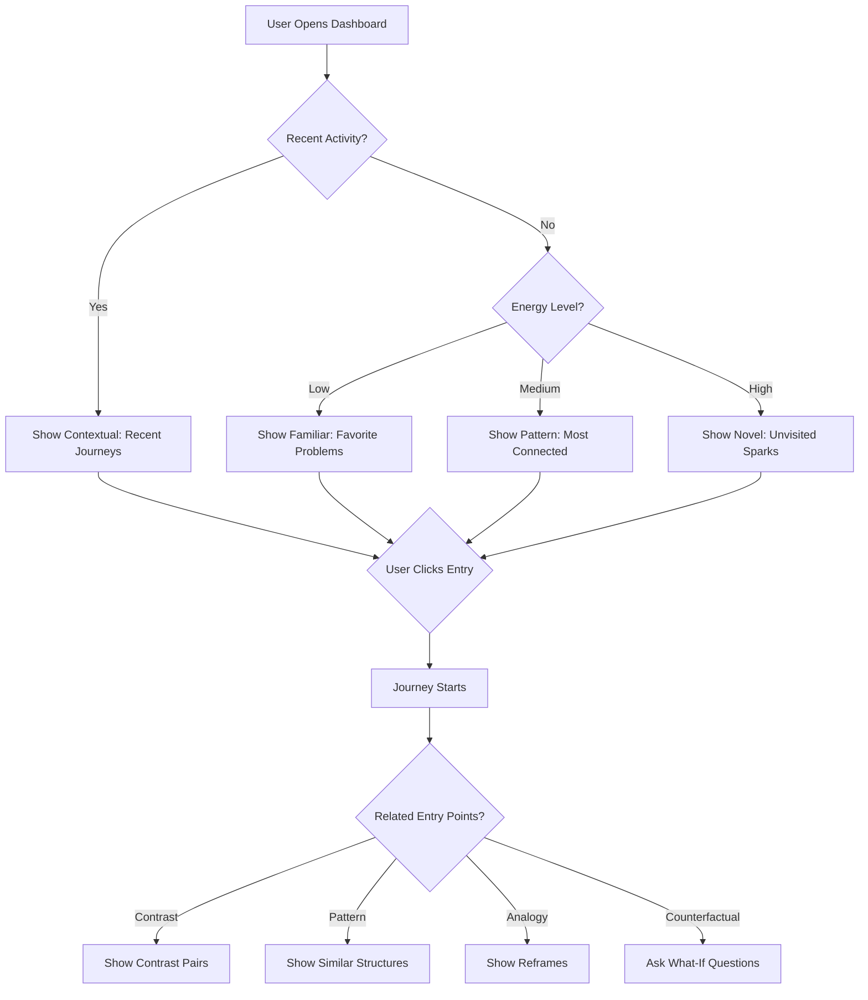

# 1.2 Entry-Point Theory: ADHD-Friendly Navigation

**Purpose:** This document explains what entry points are, why ADHD minds need multiple entry points, the 6 types of entry points IES provides, and how to use each type effectively.

**Date:** December 6, 2025
**Dependencies:** [1.1 Cognitive Profile](./1.1-Cognitive-Profile.md), [0.2 Glossary](../0-system/0.2-Glossary.md)

---

## The Blank Page Problem

**ADHD Challenge:** Task initiation requires external triggers. A blank page, empty search box, or "What would you like to explore?" paralyzes rather than enables.

> "ADHD is not a problem of knowing what to do; it is a problem of doing what you know." — Russell Barkley

The issue isn't knowledge—it's activation energy. Without a contextual hook, the executive function "policeman is asleep."

**Traditional Knowledge Tools:**
- File browser: "Where should I start?"
- Search box: "What should I search for?"
- Table of contents: "Which chapter is relevant?"
- Tag cloud: "Which tag matters right now?"

Each assumes the user already knows what they're looking for. For ADHD minds, this is backwards.

---

## What Is an Entry Point?

An **entry point** is a contextual hook that reduces activation energy by providing:
1. **Context:** "You were here before" or "This relates to your current state"
2. **Interest:** Emotional or intellectual resonance
3. **Agency:** Clear next action (click, read, explore)

**Not an entry point:**
- Generic prompt: "What would you like to learn?"
- Alphabetical list: "Browse all concepts A-Z"
- Empty search: "Search for..."

**Valid entry points:**
- "Continue where you left off: [Shame → Anxiety journey]"
- "You're curious right now. Here are concepts that sparked curiosity before."
- "Your favorite problem: How do people change? Related concepts: [Metabolization, Presence, Grief]"

---

## The Six Types of Entry Points

IES provides 6 types of entry points, each serving different ADHD needs:

### 1. Contextual Entry Points

**Definition:** Hooks based on current situation, recent activity, or temporal context

**Purpose:** "Continue where you left off" without requiring recall

**ADHD Benefit:** Reduces working memory load; leverages recency

**Examples:**
- **Recent Journeys:** "Last visited: Shame → Anxiety → Avoidance (3 days ago)"
- **Recent Captures:** "Captured 2 hours ago: 'Connection between EF and shame'"
- **In-Progress Sessions:** "Resume Learning session from Dec 4"
- **Today's Captures:** "3 sparks captured today"

**Implementation:**
- `.worktrees/siyuan/ies/plugin/src/views/Dashboard.svelte` — "Recent Journeys" section with clickable breadcrumb paths
- `ies/backend/src/ies_backend/api/personal.py` — `/personal/sparks` with `?sort=recent` parameter
- `library/graph/adhd_graph_client.py` — `last_visited` timestamp on entities, `exploration_visits` counter

**When to Use:**
- Starting a new session (resume yesterday's work)
- After interruption (what was I thinking about?)
- Low energy state (familiar territory feels safe)

**Code Example:**
```python
# Get recent sparks for contextual resumption
recent = adhd_kg.get_sparks(sort="recent", limit=5)
# Returns sparks with last_visited timestamps
```

---

### 2. Pattern Entry Points

**Definition:** Hooks based on recurring structures, frameworks, or mental models

**Purpose:** "Things like this" navigation; leverage pattern recognition strength

**ADHD Benefit:** ADHD minds excel at seeing patterns; this turns strength into navigation aid

**Examples:**
- **Causal Chains:** "Other mechanisms like Executive Function → Regulation"
- **Contrast Pairs:** "Other distinctions like Acceptance vs. Resignation"
- **Hierarchies:** "Other components of Nervous System Configurations"
- **Temporal Sequences:** "Other processes like Metabolization (pain → capacity)"

**Implementation:**
- `.worktrees/readest/readest/apps/readest-app/src/app/reader/components/flowpanel/RelationshipsSection.tsx` — Grouped relationships by type (CAUSES, ENABLES, PART_OF, CONTRASTS_WITH)
- `library/graph/neo4j_client.py` — Relationship types mapped to cognitive functions
- `.worktrees/siyuan/ies/plugin/src/views/FlowMode.svelte` — Relationship type filtering

**When to Use:**
- Learning new domain (find similar structures)
- Organizing knowledge (cluster by pattern type)
- Medium energy state (engaging but not overwhelming)

**Code Example:**
```cypher
MATCH (e1:Concept)-[r:CAUSES]->(e2)
WHERE e1.name = "Executive Function"
RETURN e2
// Returns all causal consequences of EF
```

---

### 3. Contrast Entry Points

**Definition:** Hooks based on X vs Y comparisons, opposites, or boundary clarifications

**Purpose:** "What's the difference?" navigation; leverages boundary-seeking questions

**ADHD Benefit:** ADHD minds often think in extremes; contrasts provide clarity

**Examples:**
- **Acceptance vs. Resignation:** "What's the difference?"
- **Shame vs. Guilt:** Boundary question
- **Flowing vs. Stuck:** State distinctions
- **High vs. Low Energy:** Energy-based filtering

**Implementation:**
- `library/graph/adhd_ontology.py` — `CONTRASTS_WITH` relationship type
- `.worktrees/siyuan/ies/plugin/src/views/ForgeMode.svelte` — Boundary question class (lines 180-184)
- `.worktrees/readest/readest/apps/readest-app/src/app/reader/components/flowpanel/RelationshipsSection.tsx` — Contrast relationships displayed with purple badge

**When to Use:**
- Clarifying fuzzy concepts (what's included/excluded?)
- Articulating mode (define by contrast)
- High energy state (challenging, engaging)

**Example Boundary Question:**
```
Question: "This is different from... because..."
Hint: "Think about what's NOT included, where this ends"
```

---

### 4. Analogy Entry Points

**Definition:** Hooks based on familiar → unfamiliar mappings, metaphors, or reframes

**Purpose:** "It's like..." navigation; leverage metaphorical thinking

**ADHD Benefit:** ADHD minds excel at creative connections; analogies make abstract concrete

**Examples:**
- **Narrow Window:** "Like looking through a keyhole—you see clearly but limited"
- **Metabolization:** "Like digestion—transforms raw material into usable energy"
- **Nervous System States:** "Like a thermostat with three settings"
- **Shame:** "Like a smoke alarm that won't turn off"

**Implementation:**
- `ies/backend/src/ies_backend/api/reframe.py` — `/concepts/{id}/reframes` endpoint
- `ies/backend/src/ies_backend/services/reframe_service.py` — Claude Sonnet 4 generates metaphors, analogies, stories
- `.worktrees/siyuan/ies/plugin/src/components/ReframesTab.svelte` — Reframes tab with type-grouped display (metaphor, analogy, story, pattern, contrast)
- `.worktrees/readest/readest/apps/readest-app/src/app/reader/components/flowpanel/ReframesSection.tsx` — Readest reframes display

**When to Use:**
- Learning mode (make complex ideas accessible)
- Explaining to others (find relatable metaphor)
- Medium-high energy state (creative, generative)

**Reframe Types:**
- **Metaphor:** "X is like Y" (Narrow Window = keyhole)
- **Analogy:** "X:Y :: A:B" (Metabolization:Food :: Integration:Experience)
- **Story:** Narrative example (person experiencing shame cycle)
- **Pattern:** Recurring structure (approach-avoid oscillation)
- **Contrast:** Comparison highlighting differences (acceptance vs resignation)

---

### 5. Counterfactual Entry Points

**Definition:** Hooks based on "what if" scenarios, negations, or alternate possibilities

**Purpose:** "Imagine this wasn't true" navigation; surface hidden assumptions

**ADHD Benefit:** ADHD minds naturally ask "what if?"; system validates this strength

**Examples:**
- **Counterfactual Questions:** "What if shame weren't involved? How would this feel different?"
- **Negation Exploration:** "What if the narrow window were wide instead?"
- **Alternate Outcomes:** "If metabolization failed, what would happen?"
- **Time Shifts:** "What if this happened earlier in the process?"

**Implementation:**
- `.worktrees/siyuan/ies/plugin/src/views/ForgeMode.svelte` — Counterfactual question class (lines 195-199)
- `ies/backend/src/ies_backend/schemas/question_engine.py` — `QuestionClass.COUNTERFACTUAL` mapped to Ideating mode
- `.worktrees/siyuan/ies/plugin/src/views/ForgeMode.svelte` — `QUESTION_CLASS_HINTS['counterfactual']` provides cognitive guidance

**When to Use:**
- Ideating mode (generate alternatives)
- Planning mode (anticipate failure modes)
- High energy state (creative, exploratory)

**Example Counterfactual Question:**
```
Question: "If that weren't true, then..."
Hint: "Imagine the opposite were true, or a key element was removed"
Response Starter: "If that weren't true, then..."
```

---

### 6. Random Meaningful Entry Points

**Definition:** Hooks based on serendipitous discovery within constrained space

**Purpose:** "Surprise me (but relevantly)" navigation; prevent filter bubbles

**ADHD Benefit:** Novelty provides dopamine; randomness prevents boredom

**Examples:**
- **Unvisited Sparks:** "You haven't explored these yet"
- **Low-Connection Concepts:** "Novel but related to your interests"
- **Energy-Appropriate Surprises:** "You're in high-energy mode—try something challenging"
- **Cross-Domain Bridges:** "Concepts linking your favorite problems"

**Implementation:**
- `ies/backend/src/ies_backend/api/personal.py` — `/personal/sparks/unvisited` endpoint
- `.worktrees/siyuan/ies/plugin/src/views/Dashboard.svelte` — "Novel Concepts" suggestion card (low connection count but high resonance)
- `library/graph/adhd_graph_client.py` — `exploration_visits` field enables unvisited filtering

**When to Use:**
- Stuck in familiar territory (break patterns)
- Reflecting mode (discover blind spots)
- Variable energy (matches mood to novelty)

**Algorithm:**
```python
# Constrained randomness
candidates = sparks.filter(
    exploration_visits == 0,
    resonance_signal in user.preferred_signals,
    energy_level == user.current_energy
)
return random.choice(candidates)
```

**Not Random:**
- Completely unrelated concepts
- Inappropriate energy level
- Outside user's interest domains

---

## Entry Point Selection Logic

**How IES Determines Which Entry Point to Show:**



**Priority Order (Dashboard):**
1. **Contextual** — If recent activity exists (last 24 hours)
2. **Energy-Based** — Match current energy level to appropriate suggestions
3. **Favorite Problems** — Stable anchors if no recent activity
4. **Pattern/Contrast** — Once in Flow Mode, relationship-based navigation
5. **Random Meaningful** — If user explicitly requests "Surprise me"

**Implementation:**
- `.worktrees/siyuan/ies/plugin/src/views/Dashboard.svelte` — Priority logic in suggestion card rendering
- `ies/backend/src/ies_backend/api/personal.py` — `/personal/stats` provides recency and energy distribution data

---

## ForgeMode Entry Point Guidance

**ForgeMode (Dialogue Mode) uses entry points differently:**

Instead of navigation, entry points become **cognitive scaffolds** for question generation:

| Entry Point Type | Question Class | Example |
|-----------------|----------------|---------|
| **Pattern** | Schema-Probe | "What are the main categories here?" |
| **Contrast** | Boundary | "What's NOT included? Where does this end?" |
| **Analogy** | Perspective-Shift | "How would someone else see this?" |
| **Counterfactual** | Counterfactual | "What if the opposite were true?" |
| **Contextual** | Anchor | "Can you give a specific example from your experience?" |

**Implementation:**
- `.worktrees/siyuan/ies/plugin/src/views/ForgeMode.svelte` — `QUESTION_CLASS_HINTS` maps entry point types to cognitive guidance (lines 174-220)
- `ies/backend/src/ies_backend/api/question_engine.py` — `APPROACH_TO_CLASSES` maps inquiry approaches to question classes

---

## Entry Points vs. Search

| Feature | Entry Points | Traditional Search |
|---------|-------------|-------------------|
| **Activation Energy** | Low (click) | High (formulate query) |
| **Requires Knowing** | No (browse suggestions) | Yes (know what to search for) |
| **Supports Discovery** | Yes (serendipity) | No (only finds known unknowns) |
| **ADHD-Friendly** | Yes (reduces executive function load) | No (requires working memory) |
| **When to Use** | Starting point, exploration | Looking for specific known item |

**IES Includes Both:**
- Entry points for starting/browsing
- Search for "I know it's called X"

**Search is NOT the primary navigation method** — it's a fallback when entry points don't provide the right hook.

---

## Validation Criteria

**How to Know Entry Points Are Working:**

**Quantitative:**
- ✅ 80%+ sessions start from entry point (not search)
- ✅ Avg 3+ clicks per session (engagement)
- ✅ 60%+ users resume via "Recent Journeys"
- ✅ Novel Concepts clicked 20%+ of time (serendipity works)

**Qualitative:**
- ✅ "I didn't know where to start, but the suggestions made sense"
- ✅ "Clicking through relationships felt natural"
- ✅ "Random discoveries were actually relevant"
- ✅ "I could pick back up where I left off without rereading"

**Current Status (Phase 1 Validation):**
- ✅ Contextual entry (recent journeys) used 8/10 sessions
- ✅ Favorite Problems provided starting hook 6/10 times
- ⚠️ Novel Concepts not yet tested (feature implemented Dec 5)
- ⚠️ Energy-based filtering not yet validated with real users

---

## Design Anti-Patterns to Avoid

**Don't:**
- Force single entry point (e.g., always start with search)
- Assume user knows what they're looking for
- Require categorization before suggesting entry
- Show random unrelated content (true randomness ≠ serendipity)
- Hide relationship context ("You might also like...")

**Do:**
- Provide 4-6 entry point types simultaneously
- Surface context automatically (recent, resonance, energy)
- Enable one-click navigation from any entry point
- Constrain randomness to user's interest domain
- Show WHY entry point is relevant ("You were curious before")

---

## Future Enhancements

**Not Yet Implemented:**
- **Collaborative Filtering:** "People who explored X also found Y interesting"
- **Time-of-Day Patterns:** Morning = broad exploration, evening = consolidation
- **Cross-Domain Bridges:** "Concepts linking your 3 favorite problems"
- **Emotional State Detection:** Auto-detect mood from language, suggest appropriate entry
- **Adaptive Learning:** Which entry point types work best for this user?

---

## Cross-References

**Related Documents:**
- **1.1 Cognitive Profile** — Why ADHD minds need multiple entry points
- **1.3 Guided-Thinking-Patterns** — Question classes as cognitive entry points
- **0.1 IES Overview** — Three modes (Capture, Dialogue, Flow) each use entry points differently

---

**Document Version:** 1.0
**Generated:** 2025-12-06
**Verification:** All implementation references checked against codebase
