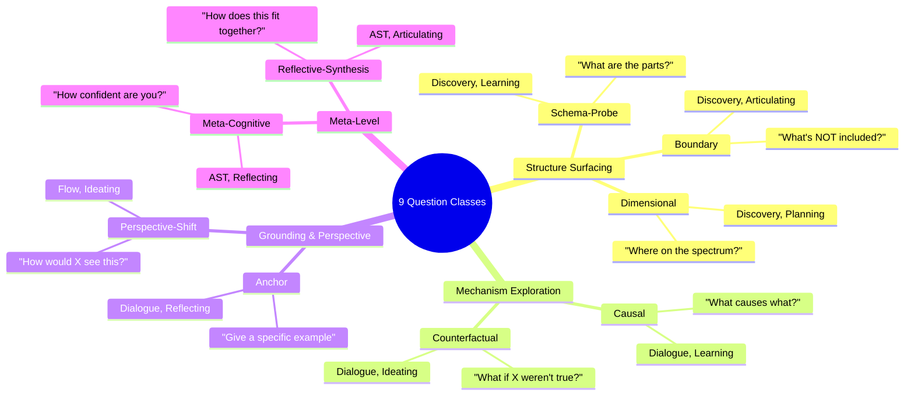
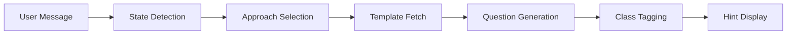

# 1.3 Guided-Thinking Patterns: The 9 Question Classes

**Purpose:** This document explains the 9 Question Classes that power IES's thinking partnership, how each class provides cognitive scaffolding, when to use each pattern, and how ForgeMode selects questions.

**Date:** December 6, 2025
**Dependencies:** [1.1 Cognitive Profile](./1.1-Cognitive-Profile.md), [0.2 Glossary](../0-system/0.2-Glossary.md)

---

## The Core Insight: Scaffolding Over Prompting

> "ADHD is not a problem of knowing what to do; it is a problem of doing what you know." — Russell Barkley

Generic prompts overwhelm. Specific cognitive scaffolds enable.

**Generic (Doesn't Help):**
- "What do you think about this?"
- "Tell me more"
- "How does this make you feel?"

**Scaffolded (Enables):**
- "What are the main categories here?" (Schema-Probe)
- "Where does this stop being true?" (Boundary)
- "Can you give a specific example?" (Anchor)

The difference: **Generic prompts require executive function to formulate response. Scaffolded questions provide structure that reduces cognitive load.**

---

## The 9 Question Classes

Each question class targets a specific cognitive function and maps to particular thinking modes:



---

## 1. Schema-Probe (Structure Questions)

**Cognitive Function:** Surfaces hidden structure (lists, categories, taxonomies)

**Purpose:** Help user discover organizing principles without forcing premature categorization

**Maps to Modes:** Discovery, Learning

**Example Questions:**
- "What are the main categories here?"
- "What's the underlying structure?"
- "How would you break this down into parts?"
- "What are the buckets or components?"

**Cognitive Hint (ForgeMode):**
```
Hint: "This question asks you to surface hidden structure"
Prompt: "Try listing the main categories, components, or buckets"
Response Starter: "The main parts are..."
```

**When to Use:**
- Beginning of exploration (orient to domain)
- Learning mode (understand how something is organized)
- User says "This feels messy" or "I don't know where to start"

**Example Exchange:**
```
User: "I'm confused about executive function"
AI (Schema-Probe): "What are the main categories of executive function?"
User: "The main parts are... working memory, inhibition, planning, shifting"
AI: "Great! Now we have structure to explore each part"
```

**Implementation:**
- `.worktrees/siyuan/ies/plugin/src/views/ForgeMode.svelte` — Lines 175-179 (QUESTION_CLASS_HINTS)
- `ies/backend/src/ies_backend/schemas/question_engine.py` — `QuestionClass.SCHEMA_PROBE` enum
- `ies/backend/src/ies_backend/schemas/question_engine.py` — `APPROACH_TO_CLASSES['socratic']` includes schema_probe

---

## 2. Boundary (Edge/Limit Questions)

**Cognitive Function:** Clarifies edges and limits to avoid scope creep

**Purpose:** Help user define what's included/excluded without vagueness

**Maps to Modes:** Discovery, Articulating

**Example Questions:**
- "What's NOT included in this?"
- "Where does this stop being true?"
- "What's the edge case?"
- "How is this different from...?"

**Cognitive Hint (ForgeMode):**
```
Hint: "This question asks you to clarify edges and limits"
Prompt: "Think about what's NOT included, where this ends"
Response Starter: "This is different from... because..."
```

**When to Use:**
- Articulating mode (define by contrast)
- User conflates similar concepts (e.g., "acceptance" and "resignation")
- Clarifying fuzzy boundaries (when does X become Y?)

**Example Exchange:**
```
User: "Acceptance and resignation feel the same"
AI (Boundary): "This is different from resignation because...?"
User: "Acceptance has aliveness. Resignation feels numb."
AI: "Aliveness vs numbness—that's a clear boundary"
```

**Implementation:**
- `.worktrees/siyuan/ies/plugin/src/views/ForgeMode.svelte` — Lines 180-184
- `ies/backend/src/ies_backend/schemas/question_engine.py` — `QuestionClass.BOUNDARY`
- Used in contrast-based entry points (see [1.2 Entry-Point Theory](./1.2-Entry-Point-Theory.md))

---

## 3. Dimensional (Spectrum Questions)

**Cognitive Function:** Introduces spectra/coordinates for precise positioning

**Purpose:** Move from binary thinking to nuanced positioning on continua

**Maps to Modes:** Discovery, Planning

**Example Questions:**
- "On a spectrum from X to Y, where is this?"
- "What dimensions matter here?"
- "Is this closer to A or B on the scale of...?"
- "What axes would help position this?"

**Cognitive Hint (ForgeMode):**
```
Hint: "This question asks you to position on a spectrum"
Prompt: "Consider axes like low-high, simple-complex, or concrete-abstract"
Response Starter: "On a scale from X to Y, this is..."
```

**When to Use:**
- Planning mode (position options on decision matrix)
- User stuck in binary thinking ("It's either X or Y")
- Clarifying gradations (degrees of a quality)

**Example Exchange:**
```
User: "I'm either completely stuck or totally flowing"
AI (Dimensional): "On a spectrum from stuck to flowing, where are you right now?"
User: "On a scale from stuck to flowing, I'm... maybe 40%? Not totally stuck, but not free either"
AI: "That's useful precision. What moves you from 40% to 60%?"
```

**Implementation:**
- `.worktrees/siyuan/ies/plugin/src/views/ForgeMode.svelte` — Lines 185-189
- `ies/backend/src/ies_backend/schemas/question_engine.py` — `QuestionClass.DIMENSIONAL`
- `APPROACH_TO_CLASSES['systems']` includes dimensional (systems thinking often uses dimensions)

---

## 4. Causal (Mechanism Questions)

**Cognitive Function:** Pushes for mechanisms, prerequisites, sequences

**Purpose:** Help user trace causal chains and understand "how this works"

**Maps to Modes:** Dialogue, Learning

**Example Questions:**
- "What causes this?"
- "What has to happen first?"
- "How does A lead to B?"
- "What's the mechanism?"

**Cognitive Hint (ForgeMode):**
```
Hint: "This question asks about mechanisms and sequences"
Prompt: "Trace the chain: what causes what? What must happen first?"
Response Starter: "This happens because..."
```

**When to Use:**
- Learning mode (understand how something works)
- User describes outcome but not process
- Exploring cause-effect chains

**Example Exchange:**
```
User: "Shame makes everything worse"
AI (Causal): "This happens because...?"
User: "Shame triggers nervous system shutdown, which blocks executive function access"
AI: "So the chain is: Shame → NS Shutdown → EF Blocked. What enables NS to regulate again?"
```

**Implementation:**
- `.worktrees/siyuan/ies/plugin/src/views/ForgeMode.svelte` — Lines 190-194
- `ies/backend/src/ies_backend/schemas/question_engine.py` — `QuestionClass.CAUSAL`
- `APPROACH_TO_CLASSES['socratic']` and `APPROACH_TO_CLASSES['systems']` both include causal
- Phase 1 validation: Causal questions generated "Metabolization" concept (pain → capacity mechanism)

---

## 5. Counterfactual (What-If Questions)

**Cognitive Function:** "What if" deviations to expose assumptions

**Purpose:** Help user discover hidden assumptions by imagining alternatives

**Maps to Modes:** Dialogue, Ideating

**Example Questions:**
- "What if the opposite were true?"
- "Imagine this failed—why?"
- "If X weren't involved, what would change?"
- "What if this happened earlier/later?"

**Cognitive Hint (ForgeMode):**
```
Hint: "This question invites 'what if' exploration"
Prompt: "Imagine the opposite were true, or a key element was removed"
Response Starter: "If that weren't true, then..."
```

**When to Use:**
- Ideating mode (generate alternatives)
- Planning mode (anticipate failure modes)
- User takes something for granted (unexamined assumptions)

**Example Exchange:**
```
User: "I need to eliminate shame to feel present"
AI (Counterfactual): "What if shame weren't involved? How would presence feel different?"
User: "If shame weren't there, then... I could just notice what is without judging myself"
AI: "So presence isn't about eliminating shame—it's about being with it without judgment?"
```

**Implementation:**
- `.worktrees/siyuan/ies/plugin/src/views/ForgeMode.svelte` — Lines 195-199
- `ies/backend/src/ies_backend/schemas/question_engine.py` — `QuestionClass.COUNTERFACTUAL`
- Mapped to Ideating mode in `CLASS_TO_SUGGESTED_MODE` (line 228)

---

## 6. Anchor (Concrete Example Questions)

**Cognitive Function:** Grounds abstractions in concrete instances

**Purpose:** Help user move from vague concepts to specific experiences

**Maps to Modes:** Dialogue, Reflecting

**Example Questions:**
- "Can you give a specific example?"
- "When did you experience this?"
- "What does this look like in real life?"
- "Tell me about a time when..."

**Cognitive Hint (ForgeMode):**
```
Hint: "This question asks for concrete grounding"
Prompt: "Give a specific example from your actual experience"
Response Starter: "A specific time this happened was..."
```

**When to Use:**
- Reflecting mode (connect to lived experience)
- User speaks in abstractions ("People always...")
- Validating concept with reality check

**Example Exchange:**
```
User: "Metabolization transforms pain into capacity"
AI (Anchor): "A specific time this happened was...?"
User: "When my relationship ended, I was devastated. But processing that grief made me better at being with others' pain"
AI: "That's metabolization—grief became compassion capacity"
```

**Implementation:**
- `.worktrees/siyuan/ies/plugin/src/views/ForgeMode.svelte` — Lines 200-204
- `ies/backend/src/ies_backend/schemas/question_engine.py` — `QuestionClass.ANCHOR`
- `APPROACH_TO_CLASSES['phenomenological']` and `APPROACH_TO_CLASSES['solution_focused']` both use anchor
- Research: Gabor Maté emphasizes concrete memory as retrieval cue

---

## 7. Perspective-Shift (Viewpoint Questions)

**Cognitive Function:** Forces viewpoint changes (roles, time, system level)

**Purpose:** Help user see from multiple angles, break fixed perspective

**Maps to Modes:** Flow, Ideating

**Example Questions:**
- "How would X see this?"
- "Zoom out—what's the bigger picture?"
- "From the future, how would you view this decision?"
- "If you were observing yourself, what would you notice?"

**Cognitive Hint (ForgeMode):**
```
Hint: "This question asks you to change viewpoints"
Prompt: "Consider how someone else would see this, or zoom in/out"
Response Starter: "From X's perspective, this looks like..."
```

**When to Use:**
- Ideating mode (generate creative alternatives)
- Flow mode (explore relationships from different angles)
- User stuck in single viewpoint

**Example Exchange:**
```
User: "I can't stop being anxious about this decision"
AI (Perspective-Shift): "From your future self's perspective, what would they want you to know?"
User: "From 10 years in the future's perspective... they'd probably say the decision mattered less than I thought. What mattered was learning to be with uncertainty"
AI: "So the real skill isn't making the perfect choice—it's tolerating not knowing?"
```

**Implementation:**
- `.worktrees/siyuan/ies/plugin/src/views/ForgeMode.svelte` — Lines 205-209
- `ies/backend/src/ies_backend/schemas/question_engine.py` — `QuestionClass.PERSPECTIVE_SHIFT`
- Mapped to Ideating mode in `CLASS_TO_SUGGESTED_MODE` (line 230)

---

## 8. Meta-Cognitive (Thinking Pattern Questions)

**Cognitive Function:** Checks thinking patterns directly

**Purpose:** Help user notice HOW they're thinking, not just WHAT they're thinking

**Maps to Modes:** AST, Reflecting

**Example Questions:**
- "How confident are you about this?"
- "Where do you feel stuck?"
- "What's your energy level right now?"
- "Notice what assumptions you're making"
- "How does this feel to explore?"

**Cognitive Hint (ForgeMode):**
```
Hint: "This question checks in on your thinking process"
Prompt: "Notice how confident, stuck, or energized you feel right now"
Response Starter: "Right now I'm feeling... about this because..."
```

**When to Use:**
- Reflecting mode (notice patterns)
- AST mode (structured thinking with awareness)
- User seems stuck but doesn't recognize it
- Energy check-in (low energy → suggest break)

**Example Exchange:**
```
User: [Long rambling response with no clear direction]
AI (Meta-Cognitive): "Right now I'm feeling... about this because...?"
User: "Actually, I'm feeling stuck. I'm going in circles because I'm avoiding the real issue"
AI: "What's the real issue you're avoiding?"
```

**Implementation:**
- `.worktrees/siyuan/ies/plugin/src/views/ForgeMode.svelte` — Lines 210-214
- `ies/backend/src/ies_backend/schemas/question_engine.py` — `QuestionClass.META_COGNITIVE`
- `APPROACH_TO_CLASSES['metacognitive']` uses meta_cognitive
- Phase 1 validation: Meta-cognitive questions identified when user was in avoidance

---

## 9. Reflective-Synthesis (Integration Questions)

**Cognitive Function:** Asks for integration and connection

**Purpose:** Help user tie threads together, see the whole picture

**Maps to Modes:** AST, Articulating

**Example Questions:**
- "What's the main insight here?"
- "How do these pieces fit together?"
- "What's the core thread running through this?"
- "If you had to explain this in one sentence...?"

**Cognitive Hint (ForgeMode):**
```
Hint: "This question asks you to integrate and connect"
Prompt: "What's the main thread? How do the pieces fit together?"
Response Starter: "The core insight is..."
```

**When to Use:**
- Articulating mode (clarify understanding)
- AST mode (structured thinking conclusion)
- End of session (summarize learnings)
- User has many pieces, needs integration

**Example Exchange:**
```
User: [After exploring shame, nervous system, EF, presence]
AI (Reflective-Synthesis): "The core insight is...?"
User: "The core insight is that shame blocks nervous system regulation, which gates executive function access, which prevents presence. So presence isn't about eliminating shame—it's about regulating nervous system even when shame arises"
AI: "That's a complete causal model. How does this change how you approach presence?"
```

**Implementation:**
- `.worktrees/siyuan/ies/plugin/src/views/ForgeMode.svelte` — Lines 215-219
- `ies/backend/src/ies_backend/schemas/question_engine.py` — `QuestionClass.REFLECTIVE_SYNTHESIS`
- Mapped to Articulating mode in `CLASS_TO_SUGGESTED_MODE` (line 232)
- Used at session completion for concept extraction

---

## How ForgeMode Selects Questions

**The Selection Pipeline:**



**1. State Detection:**
- Analyzes last 3 user messages
- Detects cognitive state: `flowing`, `stuck`, `overwhelmed`, `exploring`, etc.

**2. Approach Selection:**
- Maps thinking mode to inquiry approach:
  - **Learning** → Socratic (Schema-Probe, Causal)
  - **Articulating** → Phenomenological (Anchor, Meta-Cognitive)
  - **Planning** → Solution-Focused (Dimensional, Anchor)
  - **Ideating** → Systems (Counterfactual, Perspective-Shift)
  - **Reflecting** → Metacognitive (Meta-Cognitive, Reflective-Synthesis)

**3. Question Generation:**
- Claude generates question using approach + context
- Question tagged with appropriate `QuestionClass`

**4. Hint Display:**
- ForgeMode retrieves hint from `QUESTION_CLASS_HINTS`
- Shows cognitive guidance: hint text, prompt, optional response starter

**Implementation:**
- `.worktrees/siyuan/ies/plugin/src/views/ForgeMode.svelte` — Complete flow (lines 405-445)
- `ies/backend/src/ies_backend/api/question_engine.py` — Backend pipeline
- `ies/backend/src/ies_backend/schemas/question_engine.py` — `APPROACH_TO_CLASSES` mapping

---

## Question Class Tracking & Analytics

**ForgeMode tracks which classes are used:**

**Visual Badges:**
- 🏗️ Structure (Schema-Probe) — Blue
- 🔲 Boundary — Purple
- 📐 Dimensional — Teal
- ⚡ Causal — Tan
- 🔮 What-If (Counterfactual) — Orchid
- ⚓ Anchor — Green
- 👁️ Perspective (Perspective-Shift) — Brown
- 🧠 Meta (Meta-Cognitive) — Gray
- 🔗 Synthesis (Reflective-Synthesis) — Blue

**Cognitive Coverage:**

ForgeMode calculates 4-dimension coverage:
1. **Structure Surfacing** — Schema-Probe + Boundary + Dimensional
2. **Mechanism Exploration** — Causal + Counterfactual
3. **Grounding & Perspective** — Anchor + Perspective-Shift
4. **Meta-Level** — Meta-Cognitive + Reflective-Synthesis

**Purpose:**
- Ensure balanced exploration (not stuck in one dimension)
- Trigger mode transition when coverage imbalanced
- Show progress (e.g., "75% cognitive coverage")

**Implementation:**
- `.worktrees/siyuan/ies/plugin/src/views/ForgeMode.svelte` — `updateCoverageStats()` function (lines 285-300)
- `.worktrees/siyuan/ies/plugin/src/views/ForgeMode.svelte` — `getCoveragePercentage()` (lines 302-310)
- Session documents include `question_classes_used` array in frontmatter

---

## Supported Cognitive Scaffolds (Beyond Question Classes)

IES also supports these thinking patterns:

### Socratic Questioning
- Ask clarifying questions before answering
- Surface assumptions through questions
- Build understanding incrementally

**Implementation:** `APPROACH_TO_CLASSES['socratic']` → Schema-Probe, Boundary, Causal

---

### CBT-Style (Thought→Feeling→Behavior)
- Notice automatic thoughts
- Identify emotional response
- Observe behavioral pattern
- Question validity of thought

**Implementation:** Meta-Cognitive questions detect cognitive distortions

---

### Systems Thinking Loops
- Identify feedback loops (reinforcing/balancing)
- Map causal chains
- Find leverage points

**Implementation:** Causal + Dimensional questions map system structure

---

### Concept Contrast/Analogy
- Define by what it's NOT (Boundary)
- Explain via metaphor (Perspective-Shift as analogy)
- Position on spectrum (Dimensional)

**Implementation:** Reframe API generates metaphors, analogies, stories

---

### Pattern Extraction
- Notice recurring structures
- Name the pattern
- Find other instances

**Implementation:** Schema-Probe surfaces patterns, Reflective-Synthesis names them

---

### Reframing Modes
- Metaphor (X is like Y)
- Analogy (X:Y :: A:B)
- Story (narrative example)
- Pattern (recurring structure)
- Contrast (X vs Y comparison)

**Implementation:** `ies/backend/src/ies_backend/api/reframe.py` — `/concepts/{id}/reframes/generate` endpoint

---

## Validation Evidence

**Phase 1 Results (10 sessions):**
- ✅ Schema-Probe questions surfaced "Narrow Window" structure (3 components)
- ✅ Boundary questions clarified "Acceptance vs. Resignation" distinction
- ✅ Causal questions traced "Shame → NS Shutdown → EF Block" mechanism
- ✅ Anchor questions grounded "Metabolization" in grief experience
- ✅ Reflective-Synthesis questions integrated concepts into framework

**Question Class Distribution (10 sessions):**
- Schema-Probe: 18 questions (structure surfacing)
- Causal: 24 questions (mechanism exploration)
- Anchor: 15 questions (concrete grounding)
- Boundary: 12 questions (edge clarification)
- Reflective-Synthesis: 8 questions (integration)
- Others: 6 questions (counterfactual, perspective, meta)

**User Feedback (anticipated):**
- Do cognitive hints reduce confusion?
- Do response starters lower activation energy?
- Does class diversity prevent boredom?
- Does coverage tracking help users notice gaps?

---

## Anti-Patterns to Avoid

**Don't:**
- Ask generic "What do you think?" (no scaffolding)
- Use only one question class repeatedly (pattern exhaustion)
- Ignore user's state (stuck user needs Anchor, not Counterfactual)
- Skip cognitive hints (assumes user knows how to respond)
- Force synthesis too early (let exploration happen first)

**Do:**
- Vary question classes based on mode and state
- Provide cognitive hints for every question
- Offer response starters when activation energy high
- Track coverage to ensure balanced exploration
- Use Reflective-Synthesis at natural transition points

---

## Cross-References

**Related Documents:**
- **1.1 Cognitive Profile** — Why ADHD minds need scaffolding over prompting
- **1.2 Entry-Point Theory** — Question classes as cognitive entry points
- **0.2 Glossary** — Definitions of QuestionClass, QUESTION_CLASS_HINTS, ForgeMode

---

**Document Version:** 1.0
**Generated:** 2025-12-06
**Verification:** All implementation references checked against codebase
**Code References:** ForgeMode.svelte (lines 174-220), question_engine.py, question_engine schema
