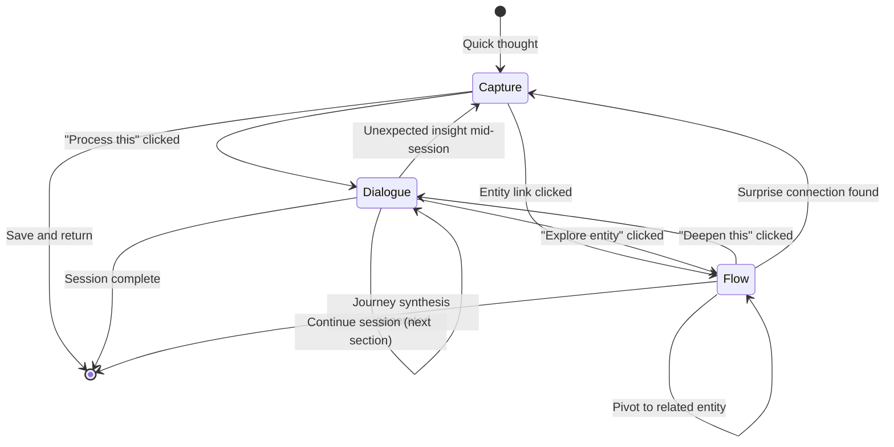

# 2.4 Mode Transition Engine Specification

**Purpose:** This document defines the Mode Transition Engine—the automatic mode switching system in IES that detects when users would benefit from changing modes based on interaction signals.

**Date:** December 6, 2025
**Status:** Designed (Not Fully Implemented)

---

## Mission and Purpose

The Mode Transition Engine is the **adaptive guidance** system in the IES knowledge lifecycle. It provides:

- **Automatic mode detection** — Recognize when current mode no longer fits user needs
- **Smooth transitions** — Preserve context when switching between Capture, Dialogue, and Flow
- **Non-intrusive suggestions** — Recommend mode switches without forcing them
- **State machine logic** — Clear rules for when each mode is appropriate
- **Data handoff** — Pass relevant context between modes for continuity

**Design Principle:** If thinking patterns change, the system should adapt. The Mode Transition Engine detects shifts in user needs and suggests mode changes without interrupting flow.

---

## The Three Modes: State Definitions

### Capture Mode (Ephemeral → Persistent)

**When Active:**
- User encounters unexpected insight during reading/browsing
- Quick thought needs capturing without derailing current task
- Resonance signal detected but no time for full processing

**Characteristics:**
- Zero friction — minimal fields required
- No forced classification — AI adds metadata later
- Quick entry/exit — return to previous context immediately

**Exit Triggers:**
- User saves capture → status: raw
- User clicks "Process" → transition to Dialogue
- User clicks entity link → transition to Flow

**Duration:** Seconds to 1 minute

---

### Dialogue Mode (Structured Thinking)

**When Active:**
- User has vague intuition needing clarification
- Concept requires deep understanding (mechanisms, frameworks)
- Planning or ideation requires structured scaffolding
- Reflecting on personal experience

**Characteristics:**
- Template-driven — sections guide progress
- Interactive questions — AI adapts to responses
- Session persistence — full transcript saved
- Entity extraction — concepts formalized at end

**Exit Triggers:**
- User completes all template sections → session ends
- User wants to explore extracted entity → transition to Flow
- User encounters new insight mid-session → transition to Capture (quick)

**Duration:** 10-45 minutes

---

### Flow Mode (Visual Graph Exploration)

**When Active:**
- User wants to browse relationships non-linearly
- Serendipitous discovery preferred over directed thinking
- Comparing multiple concepts or perspectives
- Following curiosity without specific goal

**Characteristics:**
- User-driven navigation — no prescribed path
- Relationship-first — connections visible immediately
- Thinking partner questions — optional, not required
- Journey tracking — breadcrumb trail captures path

**Exit Triggers:**
- User wants to process insight from journey → transition to Dialogue
- User encounters concept needing formalization → transition to Capture
- User completes exploration → generate synthesis

**Duration:** 5-30 minutes

---

## State Machine: Transition Rules

From `docs/ies-master-analysis/0-system/0.3-Architecture-Diagram.md` (lines 377-452):



**Transition Types:**

1. **User-initiated** — Explicit button clicks
   - Example: "Process this capture" → Capture to Dialogue
   - Example: "Explore entity" → Dialogue to Flow

2. **Signal-detected** — Automatic suggestions based on patterns
   - Example: 3+ unanswered questions → suggest Dialogue
   - Example: High cognitive load markers → suggest break
   - Example: Repetitive browsing → suggest synthesis

3. **Context-preserved** — Data passed between modes
   - Example: Capture → Dialogue (raw_text becomes topic)
   - Example: Dialogue → Flow (extracted entities become starting points)
   - Example: Flow → Capture (journey insights become new sparks)

---

## Transition Triggers (Detection Signals)

### Capture → Dialogue

**Trigger Conditions:**
- User clicks "Process" on capture item
- Capture status: raw → classified (AI has added metadata)
- User explicitly selects "Start Thinking Session"

**Data Passed:**

```typescript
interface CaptureToDialogueTransition {
    capture_id: string;
    raw_text: string;                    // Becomes session topic
    auto_extracted_entities: string[];   // Initial entities for dialogue
    auto_labels: string[];               // Suggested themes
    resonance_signal?: string;           // Emotional context
    energy_level?: string;               // Mood-appropriate mode selection
}
```

**Backend Flow:**

```
POST /thinking/start
{
    "capture_id": "capture_abc123"
}

→ ThinkingService.start_session(capture_id)
  → Fetch CaptureItem from Neo4j
  → Extract raw_text → session topic
  → Extract auto_extracted.entities → initial entities
  → Create ThinkingSession node
  → Update CaptureItem status: queued → in_thinking
  → Return session with suggested template
```

**UI Transition:**

```svelte
<!-- Dashboard.svelte capture queue -->
<button on:click={() => startThinkingFromCapture(capture.id)}>
    Start Thinking
</button>

<script>
async function startThinkingFromCapture(captureId: string) {
    try {
        const session = await apiPost('/thinking/start', { capture_id: captureId });

        // Switch to ForgeMode with pre-loaded session
        currentView = 'structured-thinking';
        selectedSessionId = session.session.id;

        // ForgeMode opens with:
        // - Topic: capture.raw_text
        // - Initial entities: capture.auto_extracted.entities
        // - Mode suggestion: based on capture.resonance_signal
    } catch (err) {
        showMessage('Failed to start session', 3000, 'error');
    }
}
</script>
```

---

### Dialogue → Flow

**Trigger Conditions:**
- User clicks entity in session results
- User completes template section and wants to explore mentioned concept
- Question response mentions entity not yet in session context

**Data Passed:**

```typescript
interface DialogueToFlowTransition {
    session_id: string;
    entity_id: string;                   // Entity to explore
    session_context: {
        topic: string;
        mode: ThinkingMode;
        entities_extracted: string[];
        breadcrumbs: Breadcrumb[];
    };
}
```

**Backend Flow:**

```
POST /flow/open-from-session
{
    "session_id": "session_abc123",
    "entity_id": "entity_xyz789"
}

→ FlowSessionService.open_from_thinking_session(session_id, entity_id)
  → Fetch ThinkingSession from Neo4j
  → Create FlowSession node with origin: THINKING_SESSION_NOTE
  → Link: (ThinkingSession)-[:TRANSITIONED_TO]->(FlowSession)
  → Fetch entity initial view (relationships, sources)
  → Return flow session with entity details
```

**UI Transition:**

```svelte
<!-- ForgeMode.svelte session results -->
{#if extractedEntities.length > 0}
    <div class="entity-list">
        {#each extractedEntities as entity}
            <button on:click={() => exploreEntity(entity.name)}>
                Explore {entity.name}
            </button>
        {/each}
    </div>
{/if}

<script>
async function exploreEntity(entityName: string) {
    try {
        const flowSession = await apiPost('/flow/open-from-session', {
            session_id: currentSessionId,
            entity_id: entityName
        });

        // Switch to FlowMode with pre-loaded entity
        currentView = 'flow';
        selectedEntity = entityName;
        flowSessionId = flowSession.session_id;

        // FlowMode opens with:
        // - Current entity: entityName
        // - Session context preserved in breadcrumb
        // - Journey origin: "From Thinking Session: {topic}"
    } catch (err) {
        showMessage('Failed to open flow', 3000, 'error');
    }
}
</script>
```

---

### Flow → Capture

**Trigger Conditions:**
- User encounters unexpected connection during exploration
- Insight emerges from relationship pattern
- User wants to save thought without leaving flow

**Data Passed:**

```typescript
interface FlowToCaptureTransition {
    flow_session_id: string;
    current_entity: string;              // Context entity
    journey_path: JourneyStep[];         // Breadcrumb trail
    insight_text: string;                // User's capture text
}
```

**Backend Flow:**

```
POST /capture
{
    "raw_text": "Connection between X and Y reveals Z",
    "source": "flow_session",
    "context_snippet": "Exploring: Executive Function → Working Memory",
    "auto_extracted": {
        "entities": ["Executive Function", "Working Memory"],
        "topics": ["adhd", "cognition"]
    },
    "spark": {
        "resonance_signal": "surprised",
        "energy_level": "medium"
    }
}

→ CaptureService.create_capture(...)
  → Create CaptureItem node in Neo4j
  → Link: (FlowSession)-[:SPARKED]->(CaptureItem)
  → Status: raw (user can process later)
  → Return capture item
```

**UI Transition:**

```svelte
<!-- FlowMode.svelte quick capture button -->
<button class="flow-quick-capture" on:click={openQuickCapture}>
    💡 Quick Capture
</button>

<script>
async function openQuickCapture() {
    // Open inline capture card (doesn't leave Flow Mode)
    showQuickCaptureCard = true;

    // Pre-fill context
    captureContext = {
        current_entity: currentEntity.name,
        journey_path: journeyPath.map(step => step.entity).join(' → ')
    };
}

async function submitQuickCapture(captureText: string) {
    try {
        const capture = await apiPost('/capture', {
            raw_text: captureText,
            source: 'flow_session',
            context_snippet: `Exploring: ${captureContext.journey_path}`,
            auto_extracted: {
                entities: [captureContext.current_entity],
                topics: []
            },
            spark: {
                resonance_signal: selectedResonance,
                energy_level: 'medium'
            }
        });

        showMessage('Capture saved!', 3000, 'info');
        showQuickCaptureCard = false;

        // User stays in Flow Mode, capture waits in queue
    } catch (err) {
        showMessage('Capture failed', 3000, 'error');
    }
}
</script>
```

---

### Flow → Dialogue

**Trigger Conditions:**
- User clicks "Deepen This" after synthesis
- Journey reveals concept needing structured thinking
- User explicitly selects "Start Thinking Session" from flow

**Data Passed:**

```typescript
interface FlowToDialogueTransition {
    flow_session_id: string;
    synthesis: {
        key_entities: string[];
        suggested_next_steps: string[];
        synthesis_text: string;
    };
    journey_context: {
        path: JourneyStep[];
        total_dwell_time: number;
        question_responses: QuestionResponse[];
    };
}
```

**Backend Flow:**

```
POST /thinking/start
{
    "flow_session_id": "flow_abc123",
    "topic": "How do EF components interact in ADHD?",
    "initial_context": {
        "key_entities": ["Executive Function", "Working Memory", "ADHD"],
        "journey_synthesis": "Exploration revealed interconnected system..."
    }
}

→ ThinkingService.start_session_from_flow(flow_session_id, topic)
  → Create ThinkingSession node
  → Link: (FlowSession)-[:LED_TO]->(ThinkingSession)
  → Suggest template based on topic
  → Return session with pre-loaded entities
```

**UI Transition:**

```svelte
<!-- FlowMode.svelte synthesis panel -->
{#if synthesis}
    <div class="synthesis-actions">
        <button on:click={() => startDialogueFromSynthesis()}>
            Start Dialogue Session
        </button>
    </div>
{/if}

<script>
async function startDialogueFromSynthesis() {
    try {
        const session = await apiPost('/thinking/start', {
            flow_session_id: flowSessionId,
            topic: synthesis.suggested_next_steps[0],  // User can edit
            initial_context: {
                key_entities: synthesis.key_entities,
                journey_synthesis: synthesis.synthesis
            }
        });

        // Switch to ForgeMode with synthesis as starting point
        currentView = 'structured-thinking';
        selectedSessionId = session.session.id;

        // ForgeMode opens with:
        // - Topic: From synthesis
        // - Initial entities: synthesis.key_entities
        // - Context: Journey breadcrumb preserved
    } catch (err) {
        showMessage('Failed to start session', 3000, 'error');
    }
}
</script>
```

---

## Automatic Transition Detection (Future)

**Design:** The Mode Transition Engine analyzes interaction patterns to suggest mode switches.

**Detection Signals:**

### Signal 1: Interaction Cadence

```typescript
interface InteractionCadence {
    avg_response_time: number;       // Seconds between user actions
    pause_count: number;              // Number of long pauses (>60s)
    rapid_clicks: number;             // Clicks within 2 seconds
}

function detectCadencePattern(cadence: InteractionCadence): ModeSignal {
    if (cadence.avg_response_time > 120) {
        return { signal: 'deep_thinking', suggested_mode: 'dialogue' };
    }
    if (cadence.rapid_clicks > 5) {
        return { signal: 'browsing', suggested_mode: 'flow' };
    }
    if (cadence.pause_count > 3) {
        return { signal: 'overwhelmed', suggested_mode: 'capture_break' };
    }
    return { signal: 'normal', suggested_mode: null };
}
```

**Thresholds:**
- **Deep thinking** (→ Dialogue): avg_response_time > 120s
- **Browsing** (→ Flow): rapid_clicks > 5 within 2s
- **Overwhelmed** (→ Capture break): pause_count > 3

---

### Signal 2: Cognitive Load Markers

```typescript
interface CognitiveLoadMarkers {
    repetition_detected: boolean;     // User asking similar questions
    uncertainty_phrases: number;      // "I don't know", "unclear", "maybe"
    question_density: number;         // Questions per message
}

function detectCognitiveLoad(markers: CognitiveLoadMarkers): ModeSignal {
    if (markers.repetition_detected) {
        return { signal: 'stuck', suggested_mode: 'flow', reason: 'Browse for new perspectives' };
    }
    if (markers.uncertainty_phrases > 2) {
        return { signal: 'needs_scaffolding', suggested_mode: 'dialogue', reason: 'Structured questions may help' };
    }
    if (markers.question_density > 0.5) {
        return { signal: 'seeking_clarity', suggested_mode: 'dialogue', reason: 'Template can guide thinking' };
    }
    return { signal: 'normal', suggested_mode: null };
}
```

**Markers:**
- **Repetition** (→ Flow): User asks similar questions 3+ times
- **Uncertainty** (→ Dialogue): "I don't know" phrases > 2 per session
- **Question density** (→ Dialogue): Questions per message > 0.5

---

### Signal 3: Resonance Hits

```typescript
interface ResonanceHit {
    resonance_signal: ResonanceSignal;   // 8 signals: curious, excited, surprised, etc.
    energy_shift: EnergyShift;           // energy_level change detected
    journey_length: number;              // Number of entities visited
}

function detectResonancePattern(hit: ResonanceHit): ModeSignal {
    if (hit.resonance_signal === 'surprised' || hit.resonance_signal === 'excited') {
        return { signal: 'insight_moment', suggested_mode: 'capture', reason: 'Save this before it fades' };
    }
    if (hit.energy_shift === 'rising' && hit.journey_length > 5) {
        return { signal: 'in_flow', suggested_mode: 'continue', reason: 'Keep exploring' };
    }
    if (hit.energy_shift === 'falling') {
        return { signal: 'fatigue', suggested_mode: 'synthesis', reason: 'Generate insights and take a break' };
    }
    return { signal: 'normal', suggested_mode: null };
}
```

**Patterns:**
- **Insight moment** (→ Capture): Resonance signal = surprised/excited
- **In flow** (→ Continue): Energy rising + journey_length > 5
- **Fatigue** (→ Synthesis): Energy falling → suggest synthesis

---

## Transition UX: Non-Intrusive Suggestions

**Design Principle:** Never force mode switches. Always suggest, never interrupt.

**UI Pattern:**

```svelte
<!-- Mode suggestion banner -->
{#if modeSuggestion}
    <div class="mode-suggestion-banner">
        <div class="suggestion-icon">💡</div>
        <div class="suggestion-text">
            <strong>{modeSuggestion.signal}:</strong>
            {modeSuggestion.reason}
        </div>
        <div class="suggestion-actions">
            <button class="suggestion-accept" on:click={() => acceptSuggestion()}>
                Switch to {modeSuggestion.suggested_mode}
            </button>
            <button class="suggestion-dismiss" on:click={() => dismissSuggestion()}>
                Dismiss
            </button>
        </div>
    </div>
{/if}
```

**Timing:**
- **Immediate suggestions** — When explicit trigger detected (user clicks "Explore")
- **Delayed suggestions** — Wait 10 seconds before suggesting automatic transitions
- **Dismissible** — User can always dismiss and continue current mode

**Persistence:**
- Dismissed suggestions don't reappear in same session
- Accepted suggestions tracked for pattern learning

---

## Context Preservation Across Modes

**Key Principle:** Switching modes should never lose context.

**Preserved Data:**

| From Mode | To Mode | Data Passed |
|-----------|---------|-------------|
| Capture | Dialogue | raw_text → topic, auto_extracted → initial entities |
| Dialogue | Flow | session entities → starting points, breadcrumbs → context |
| Flow | Capture | current_entity → context, journey_path → breadcrumb reference |
| Flow | Dialogue | synthesis → initial context, key_entities → entities |
| Dialogue | Capture | unexpected insight → capture text, session_id → source |
| Capture | Flow | auto_extracted.entities → starting entity |

**Backend Schema (Neo4j Relationships):**

```cypher
// Capture → Thinking transition
(CaptureItem)-[:TRANSITIONED_TO]->(ThinkingSession)

// Thinking → Flow transition
(ThinkingSession)-[:TRANSITIONED_TO]->(FlowSession)

// Flow → Capture (new insight)
(FlowSession)-[:SPARKED]->(CaptureItem)

// Flow → Thinking (deepen)
(FlowSession)-[:LED_TO]->(ThinkingSession)
```

**UI Breadcrumb Trail:**

```svelte
<!-- Show mode transition history -->
<div class="mode-history">
    <div class="history-step">
        <span class="step-mode">Capture</span>
        <span class="step-arrow">→</span>
        <span class="step-mode current">Dialogue</span>
        <span class="step-context">Topic: "{sessionTopic}"</span>
    </div>
</div>
```

---

## Implementation Status

| Component | Status | Notes |
|-----------|--------|-------|
| **User-Initiated Transitions** | ✅ Implemented | Buttons work in all modes |
| **Context Preservation** | ✅ Implemented | Data passed via backend APIs |
| **Capture → Dialogue** | ✅ Complete | "Start Thinking" button functional |
| **Dialogue → Flow** | ✅ Complete | "Explore entity" button functional |
| **Flow → Capture** | ✅ Complete | Quick Capture button functional |
| **Flow → Dialogue** | ✅ Complete | "Start Dialogue" from synthesis |
| **Automatic Detection** | 📋 Designed | Cadence/load/resonance signals defined |
| **Suggestion UI** | 📋 Designed | Banner pattern specified |
| **Pattern Learning** | 🔮 Future | ML-based suggestion improvement |

---

## Future Enhancements

### 1. Pattern Learning (ML-Based)

**Goal:** Learn which transitions are most valuable for each user

**Data Collection:**
- Track which suggested transitions user accepts/dismisses
- Measure session quality after transitions (time spent, entities extracted, synthesis quality)
- Build user-specific transition preference model

**ML Model:**
```
Input: [cadence_metrics, cognitive_load_markers, resonance_signals, user_profile]
Output: [suggested_mode, confidence_score]
```

### 2. Cross-App Continuity

**Goal:** Resume sessions across SiYuan and Readest

**Features:**
- Start dialogue in SiYuan → continue in Readest while reading
- Explore entities in Readest → save synthesis to SiYuan
- Unified journey breadcrumb across apps

**Implementation:**
- Shared session IDs via backend
- Real-time sync via WebSockets
- Conflict resolution for simultaneous edits

### 3. Voice-Activated Transitions

**Goal:** Hands-free mode switching during voice capture

**Examples:**
- "Switch to flow mode" → Open FlowMode
- "Start thinking about X" → Open ForgeMode with topic
- "Quick capture" → Open Capture card

**Implementation:**
- Speech-to-text via Whisper API
- Command parser with intent detection
- Voice confirmation before switch

---

## Key Differentiators

| Traditional Apps | IES Mode Transition Engine |
|------------------|----------------------------|
| Fixed UI mode | Adaptive mode suggestions |
| Manual navigation | Automatic detection of mode fit |
| Lost context on switch | Full context preservation |
| One entry point per mode | Multiple transition paths |
| Isolated modes | Virtuous cycle between modes |

---

## References

**Design Documents:**
- `docs/ies-master-analysis/0-system/0.3-Architecture-Diagram.md` — State machine diagrams
- `IES AST SiYuan structure.md` — Mode Transition Engine specifications

**Implementation Files:**
- Dashboard: `.worktrees/siyuan/ies/plugin/src/views/Dashboard.svelte`
- ForgeMode: `.worktrees/siyuan/ies/plugin/src/views/ForgeMode.svelte`
- FlowMode: `.worktrees/siyuan/ies/plugin/src/views/FlowMode.svelte`
- Backend Thinking API: `ies/backend/src/ies_backend/api/thinking.py`
- Backend Flow API: `ies/backend/src/ies_backend/api/flow_session.py`
- Backend Capture API: `ies/backend/src/ies_backend/api/capture.py`

**Related Docs:**
- `docs/ies-master-analysis/2-modes/2.1-Capture-Spec.md` — Capture Mode specification
- `docs/ies-master-analysis/2-modes/2.2-Dialogue-Spec.md` — Dialogue Mode specification
- `docs/ies-master-analysis/2-modes/2.3-Flow-Spec.md` — Flow Mode specification
- `docs/ies-master-analysis/0-system/0.1-IES-Overview.md` — System overview and knowledge lifecycle

---

*This document defines the Mode Transition Engine—the adaptive mode switching system in IES. For mode-specific details, see Capture-Spec.md, Dialogue-Spec.md, and Flow-Spec.md.*
