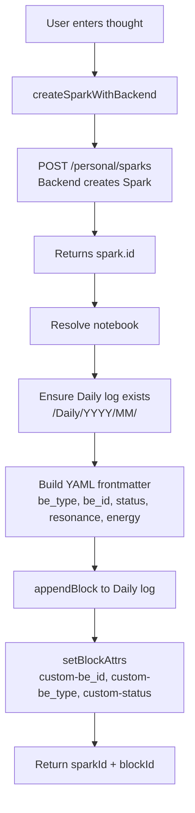

# 4.1 SiYuan Structure

**Purpose:** This document defines the complete SiYuan notebook folder hierarchy, block type system, frontmatter standards, and plugin lifecycle for the IES SiYuan plugin (Layer 3).

**Date:** December 6, 2025
**Implementation Status:** ✅ Complete (Phase 2c)

---

## Table of Contents

1. [10-Folder Structure](#10-folder-structure)
2. [Block Type System](#block-type-system)
3. [Frontmatter Standards](#frontmatter-standards)
4. [SiYuan Custom Attributes](#siyuan-custom-attributes)
5. [Plugin Lifecycle](#plugin-lifecycle)
6. [Domain-Agnostic Notebook Resolution](#domain-agnostic-notebook-resolution)
7. [Quick Capture Flow](#quick-capture-flow)

---

## 10-Folder Structure

The IES plugin creates a merged folder hierarchy combining the IES Architecture Package with ADHD-friendly features.

**Source:** `.worktrees/siyuan/ies/plugin/src/utils/siyuan-structure.ts` (lines 53-97)

```typescript
const STRUCTURE_FOLDERS = [
    // Daily quick captures (Package's 00_Inbox)
    { path: 'Daily', title: 'Daily' },

    // Seedlings - atomic ideas (Package's 01_Seedlings)
    { path: 'Seedlings', title: 'Seedlings' },
    { path: 'Seedlings/Questions', title: 'Seedlings – Questions' },
    { path: 'Seedlings/Observations', title: 'Seedlings – Observations' },
    { path: 'Seedlings/Moments', title: 'Seedlings – Moments' },
    { path: 'Seedlings/Schemas', title: 'Seedlings – Schemas' },
    { path: 'Seedlings/Contradictions', title: 'Seedlings – Contradictions' },
    { path: 'Seedlings/What_Ifs', title: 'Seedlings – What Ifs' },
    { path: 'Seedlings/Insights', title: 'Seedlings – Insights' },

    // Sessions by thinking mode (Package's 02_Shaping)
    { path: 'Sessions', title: 'Sessions' },
    { path: 'Sessions/Learning', title: 'Learning Sessions' },
    { path: 'Sessions/Articulating', title: 'Articulating Sessions' },
    { path: 'Sessions/Planning', title: 'Planning Sessions' },
    { path: 'Sessions/Ideating', title: 'Ideating Sessions' },
    { path: 'Sessions/Reflecting', title: 'Reflecting Sessions' },

    // Flow Maps - visual maps (Package's 03_Flow_Maps)
    { path: 'Flow_Maps', title: 'Flow Maps' },

    // Concepts - canonical concepts (Package's 04_Concepts)
    { path: 'Concepts', title: 'Concepts' },

    // Promoted/validated insights (current ADHD structure)
    { path: 'Insights', title: 'Insights' },

    // ADHD anchor questions (current structure)
    { path: 'Favorite_Problems', title: 'Favorite Problems' },

    // Projects - active work (Package's 05_Projects)
    { path: 'Projects', title: 'Projects' },

    // Archive - retired material (Package's 06_Archive)
    { path: 'Archive', title: 'Archive' },

    // System - meta-layer with templates, schemas, directives (Package's 07_System)
    { path: 'System', title: 'System' },
    { path: 'System/Templates', title: 'System – Templates' },
    { path: 'System/Example_Notes', title: 'System – Example Notes' },
];
```

### Folder Purposes

| Folder | Purpose | What Goes Here |
|--------|---------|----------------|
| `/Daily/` | **Quick Captures** (Package's 00_Inbox) | Zero-friction thought capture organized by date (YYYY/MM/DD). Raw captures before classification. |
| `/Seedlings/` | **Atomic Ideas** (Package's 01_Seedlings) | 7 categories of raw intellectual material. Smallest meaningful idea units. |
| `/Seedlings/Questions/` | Questions worth exploring | Unanswered questions, areas of curiosity |
| `/Seedlings/Observations/` | Noticed patterns or facts | Things you've seen or noticed |
| `/Seedlings/Moments/` | Emotionally significant experiences | Moments that resonated emotionally |
| `/Seedlings/Schemas/` | Mental models or frameworks | Structural patterns of thinking |
| `/Seedlings/Contradictions/` | Tensions or paradoxes | Things that don't fit together |
| `/Seedlings/What_Ifs/` | Hypothetical explorations | "What if" scenarios |
| `/Seedlings/Insights/` | Raw "aha" moments | Unvalidated insights (different from `/Insights/`) |
| `/Sessions/` | **Structured Thinking** (Package's 02_Shaping) | Mode-specific dialogue sessions with AI guidance |
| `/Sessions/Learning/` | Learning mode sessions | Understanding new mechanisms (mechanism-map template) |
| `/Sessions/Articulating/` | Articulating mode sessions | Clarifying vague intuitions (clarify-intuition template) |
| `/Sessions/Planning/` | Planning mode sessions | Developing action strategies |
| `/Sessions/Ideating/` | Ideating mode sessions | Generating creative options |
| `/Sessions/Reflecting/` | Reflecting mode sessions | Personal insight extraction |
| `/Flow_Maps/` | **Visual Maps** (Package's 03_Flow_Maps) | Non-linear exploration diagrams, concept clusters, timelines, system maps |
| `/Concepts/` | **Canonical Concepts** (Package's 04_Concepts) | Formalized, stable knowledge graph nodes extracted from sessions |
| `/Insights/` | **Promoted Insights** (ADHD extension) | Validated insights promoted from Seedlings or sessions |
| `/Favorite_Problems/` | **ADHD Anchor Questions** (ADHD extension) | Feynman-inspired stable navigation points for wandering minds |
| `/Projects/` | **Active Work** (Package's 05_Projects) | Ongoing projects with goals, decisions, plans, status |
| `/Archive/` | **Retired Material** (Package's 06_Archive) | Deprecated or completed content with archive reason and date |
| `/System/` | **Meta-Layer** (Package's 07_System) | Templates, example notes, schemas, AI directives |
| `/System/Templates/` | Note templates | Markdown templates for different note types |
| `/System/Example_Notes/` | Reference implementations | Example notes showing correct structure |

### Dual Insights Folders

**Important distinction:**

- **`/Seedlings/Insights/`** — Raw "aha" moments (unvalidated, fuzzy, exploratory)
- **`/Insights/`** — Promoted/validated insights (anchored, clear, formalized)

**Flow:** Raw insight captured → `/Seedlings/Insights/` → validated through exploration → promoted to `/Insights/`

---

## Block Type System

IES uses 6 formal block types from the Architecture Package plus ADHD extensions.

**Source:** `.worktrees/siyuan/ies/plugin/src/types/blocks.ts` (lines 78-84)

```typescript
export type BlockType =
    | 'seed'       // Atomic ideas (7 types)
    | 'shaping'    // Dialogue segments
    | 'map'        // Visual representations
    | 'concept'    // Canonical knowledge
    | 'decision'   // Project decisions
    | 'log_entry'; // Activity records
```

### Block Type Descriptions

| Block Type | Folder | Purpose | Metadata Interface |
|------------|--------|---------|-------------------|
| `seed` | `/Seedlings/{type}/` | Atomic idea units with 7 subcategories | `SeedBlockMeta` |
| `shaping` | `/Sessions/{mode}/` | Dialogue segments from structured thinking | `ShapingBlockMeta` |
| `map` | `/Flow_Maps/` | Visual maps, concept clusters, timelines | `MapBlockMeta` |
| `concept` | `/Concepts/` | Canonical concepts in knowledge graph | `ConceptBlockMeta` |
| `decision` | `/Projects/` | Project decisions with rationale | `DecisionBlockMeta` |
| `log_entry` | `/Daily/` or `/Projects/` | Activity log entries | `LogEntryMeta` |

### 7 Seedling/Idea Types

**Source:** `.worktrees/siyuan/ies/plugin/src/types/blocks.ts` (lines 45-53)

```typescript
export type IdeaType =
    | 'question'       // ❓ Questions worth exploring
    | 'insight'        // 💡 "Aha!" moments (raw, unvalidated)
    | 'observation'    // 👁️ Noticed patterns or facts
    | 'moment'         // ⏱️ Emotionally significant experiences
    | 'schema'         // 🏗️ Mental models or frameworks
    | 'contradiction'  // ⚡ Tensions or paradoxes
    | 'what_if'        // 🔮 Hypothetical explorations
    | 'other';         // 📝 Uncategorized
```

**Folder Mapping (`SEEDLING_FOLDER_MAP`):**

Seeds are automatically routed to subfolders based on `idea_type`.

---

## Frontmatter Standards

All IES documents use YAML frontmatter with standardized fields.

### General Format

```yaml
---
block_type: "seed"              # Block type (seed, shaping, concept, etc.)
be_type: "spark"                # Backend entity type (spark, session, concept)
be_id: "spark_abc123"           # Backend entity ID (for bidirectional linking)
status: "exploring"             # User engagement state (captured → exploring → anchored)
created_at: "2025-12-06T10:30:00Z"
last_touched_at: "2025-12-06T14:22:00Z"
---
```

### Two Status Systems

**1. Capture Status (AI Processing State):**

```typescript
export type CaptureStatus = 'raw' | 'classified' | 'processed';
```

- `raw` — Just landed in Quick Capture queue
- `classified` — AI has added metadata (auto_summary, auto_labels, linked_concepts)
- `processed` — User has decided placement (moved to folder, linked to project)

**2. User Status (Engagement State):**

```typescript
export type UserStatus = 'captured' | 'exploring' | 'anchored';
```

- `captured` — Exists but unexplored (seed planted)
- `exploring` — Being actively developed (edited, linked, visited)
- `anchored` — Formalized into concept/insight (stable knowledge)

### ADHD-Friendly Metadata

**Resonance Signals (Emotional Retrieval Cues):**

```typescript
export enum ResonanceSignal {
    Spark = 'spark',
    Curiosity = 'curiosity',
    Delight = 'delight',
    Concern = 'concern',
    Tension = 'tension',
    Dread = 'dread',
    Clarity = 'clarity',
    Stuck = 'stuck',
}
```

**Energy Levels (Mood-Appropriate Navigation):**

```typescript
export enum EnergyLevel {
    Low = 'low',
    Medium = 'medium',
    High = 'high',
}
```

### Example: Seed Block Frontmatter

```yaml
---
block_type: seed
idea_type: question
domain: ADHD
source: dialogue
clarity: partial                # fuzzy | partial | clear
confidence: medium              # low | medium | high
related_concepts:
  - Executive Function
  - Shame
related_seedlings:
  - seedling_xyz789
tags:
  - adhd
  - metabolization
  - question
status: exploring
energy_level: medium
resonance_signal: curiosity
exploration_visits: 3
created_at: "2025-12-06T10:30:00Z"
last_touched_at: "2025-12-06T14:22:00Z"
source_capture_id: capture_abc123
be_type: spark
be_id: spark_def456
---
```

### Example: Session Document Frontmatter

**Source:** `.worktrees/siyuan/ies/plugin/src/utils/siyuan-structure.ts` (lines 824-854)

```yaml
---
be_type: session
be_id: session_abc123
mode: learning
topic: Understanding executive function
status: completed
created: "2025-12-06T01:42:00Z"
template_id: learning-mechanism-map
template_name: Mechanism Map
entities_extracted: 12
graph_mapping_executed: true
question_classes_used:
  - schema_probe
  - causal
  - anchor
thinking_dialogues_count: 3
thinking_mode: learning
phase: exploration
---
```

### Example: Concept Block Frontmatter

```yaml
---
block_type: concept
concept_id: concept_abc123
concept_name: Executive Function
concept_type: concept           # concept | theory | framework | mechanism
domain: ADHD
concept_status: active          # active | draft | deprecated
version: 1.0
related_concepts:
  - Working Memory
  - Inhibitory Control
source_session_id: session_xyz789
created_by: user_123
status: anchored
be_type: concept
be_id: concept_abc123
---
```

---

## SiYuan Custom Attributes

In addition to YAML frontmatter, IES uses SiYuan's custom block attributes for backend linking and query support.

**Source:** `.worktrees/siyuan/ies/plugin/src/utils/siyuan-structure.ts` (lines 576-585, 662-670, 965-977)

### Attribute Naming Convention

All IES attributes use the `custom-` prefix:

- `custom-be_id` — Backend entity ID
- `custom-be_type` — Backend entity type
- `custom-status` — User engagement status
- `custom-capture_status` — AI processing status
- `custom-capture_channel` — How content was captured
- `custom-capture_source` — Source of the capture
- `custom-mode` — Thinking mode (for sessions)
- `custom-thinking_mode` — Thinking mode (for sessions)
- `custom-phase` — Session phase
- `custom-project_id` — Linked project ID
- `custom-archived_at` — Archive timestamp
- `custom-archive_reason` — Why archived
- `custom-last_touched_at` — Last interaction timestamp
- `custom-concept_type` — Concept type
- `custom-project_status` — Project status

### Example: Setting Block Attributes

```typescript
// Create spark with backend linking
await setBlockAttrs(blockId, {
    'custom-be_id': spark.id,
    'custom-be_type': 'spark',
    'custom-status': 'captured',
    'custom-capture_status': options.capture_status || 'raw',
    'custom-capture_channel': options.capture_channel,
    'custom-capture_source': options.capture_source,
});
```

### Example: Querying with SQL

SiYuan allows SQL queries against custom attributes:

```typescript
const query = `
    SELECT id, content, created, ial
    FROM blocks
    WHERE box = '${notebook.id}'
    AND hpath LIKE '/Projects/%'
    AND type = 'd'
    ORDER BY created DESC
`;
```

Attributes are stored in the `ial` column as JSON.

---

## Plugin Lifecycle

The IES plugin follows the standard SiYuan plugin lifecycle with initialization and cleanup phases.

**Source:** `.worktrees/siyuan/ies/plugin/src/index.ts` (lines 24-121)

### 1. Plugin Loading (`onload`)

Called when plugin is first loaded (before notebooks are ready).

```typescript
async onload() {
    // Set i18n plugin instance
    setPluginInstance(this);

    // Add custom icons (iconIESExplorer, iconForge, iconFlow)
    this.addIcons(`...`);

    // Add top bar button for easy access
    this.addTopBar({
        icon: "iconIESExplorer",
        title: "IES Explorer",
        position: "right",
        callback: () => {
            this.openIESTab();
        }
    });

    // Register IES tab type
    this.addTab({
        type: IES_TAB_TYPE,
        init() {
            // Create Dashboard in tab with plugin instance
            new Dashboard({
                target: element,
                props: {
                    plugin: pluginInstance
                }
            });
        },
        destroy() {
            // Svelte component auto-cleanup
        }
    });
}
```

**Key Actions:**
- Registers custom icons for UI
- Adds toolbar button
- Registers custom tab type for Dashboard view
- Sets up i18n localization

### 2. Layout Ready (`onLayoutReady`)

Called when SiYuan layout is ready and notebooks are accessible.

```typescript
async onLayoutReady() {
    // Create IES folder structure in the notebook
    try {
        await ensureNotebookStructure();
        console.log("[IES] Folder structure initialized");
    } catch (err) {
        console.warn("[IES] Failed to create folder structure:", err);
    }

    // Register IES sidebar dock
    this.addDock({
        config: {
            position: "RightBottom",
            size: { width: 400, height: 0 },
            icon: "iconIESExplorer",
            title: "IES Explorer",
        },
        type: IES_SIDEBAR_TYPE,
        init: (dock) => {
            this.dashboardApp = new Dashboard({
                target: dock.element,
                props: {
                    plugin: this
                }
            });
        },
        destroy: () => {
            if (this.dashboardApp) {
                this.dashboardApp.$destroy();
            }
        }
    });
}
```

**Key Actions:**
- Creates 10-folder structure via `ensureNotebookStructure()`
- Registers sidebar dock with Dashboard component
- Passes plugin instance to Dashboard for settings persistence

### 3. Plugin Unloading (`onunload`)

Called when plugin is disabled or SiYuan closes.

```typescript
async onunload() {
    console.log("IES Explorer plugin unloaded");
}
```

### 4. Plugin Uninstall (`uninstall`)

Called when plugin is permanently removed.

```typescript
async uninstall() {
    console.log("IES Explorer plugin uninstalled");
    // Remove plugin data
    await this.removeData(SETTINGS_FILE);
    await this.removeData("ies-sessions.json");
}
```

### Folder Structure Creation

**Function:** `ensureNotebookStructure()`

**Source:** `.worktrees/siyuan/ies/plugin/src/utils/siyuan-structure.ts` (lines 280-285)

```typescript
export async function ensureNotebookStructure(): Promise<void> {
    const notebook = await resolveStructureNotebook();
    for (const folder of STRUCTURE_FOLDERS) {
        await ensureDocument(notebook.id, folder.path, folder.title);
    }
}
```

**How It Works:**
1. Resolves which notebook to use (see next section)
2. Iterates through all 28 folders in `STRUCTURE_FOLDERS`
3. Checks if each folder exists via SQL query
4. Creates missing folders with `createDocWithMd()`

**Note:** Currently disabled in production (line 77 commented out) to allow user manual notebook reorganization before auto-creation runs.

---

## Domain-Agnostic Notebook Resolution

The plugin is domain-agnostic and works across any knowledge domain by using user-configurable notebook preferences.

**Source:** `.worktrees/siyuan/ies/plugin/src/utils/siyuan-structure.ts` (lines 30-36, 215-274)

### Default Notebook Names

```typescript
const DEFAULT_NOTEBOOK_NAMES = [
    'IES',
    'Personal',
    'Knowledge',
    'Notes',
    'Intelligent Exploration System',
];
```

**No therapy-specific hardcoding** — defaults are domain-agnostic.

### User Configuration

Users can customize preferred notebooks via:

1. **Settings store** (workspace-persisted, primary)
2. **localStorage** (`ies.preferredNotebooks` as JSON array, fallback)

**Function:** `getPreferredNotebookNames()`

```typescript
export function getPreferredNotebookNames(): string[] {
    // Primary: Settings store (workspace-persisted)
    const settings = getSettingsSync();
    if (settings?.preferredNotebooks && Array.isArray(settings.preferredNotebooks)) {
        return settings.preferredNotebooks;
    }

    // Fallback: localStorage (backward compatibility)
    if (typeof window !== 'undefined' && window?.localStorage) {
        try {
            const stored = window.localStorage.getItem('ies.preferredNotebooks');
            if (stored) {
                const parsed = JSON.parse(stored);
                if (Array.isArray(parsed) && parsed.length > 0) {
                    return parsed;
                }
            }
        } catch (err) {
            console.warn('[IES] Unable to read preferred notebooks:', err);
        }
    }

    return DEFAULT_NOTEBOOK_NAMES;
}
```

### Notebook Resolution Logic

**Function:** `resolveStructureNotebook()`

```typescript
export async function resolveStructureNotebook(): Promise<any> {
    if (cachedNotebook) return cachedNotebook;

    const result = await lsNotebooks();
    const notebooks = result?.notebooks || [];

    if (notebooks.length === 0) {
        throw new Error('No notebooks found in SiYuan');
    }

    const openNotebooks = notebooks.filter((nb: any) => !nb.closed);
    if (openNotebooks.length === 0) {
        throw new Error('No open notebooks found');
    }

    // Get preferred names (supports dynamic configuration)
    const preferredNames = getPreferredNotebookNames();

    // Find first matching preferred notebook
    for (const name of preferredNames) {
        const match = openNotebooks.find((nb: any) => nb.name === name);
        if (match) {
            cachedNotebook = match;
            return match;
        }
    }

    // Fallback: Use first available open notebook
    cachedNotebook = openNotebooks[0];
    return openNotebooks[0];
}
```

**Resolution Strategy:**
1. Check cached notebook (performance optimization)
2. List all notebooks in SiYuan
3. Filter to open notebooks only
4. Get user's preferred notebook names
5. Try to match first preference → second → third, etc.
6. Fallback to first available open notebook if no match

**Result:** IES works with any notebook name, making it domain-agnostic.

---

## Quick Capture Flow

Quick Capture provides zero-friction thought capture with automatic entity extraction and backend integration.

### Flow Diagram



### Implementation

**Function:** `createSparkWithBackend()`

**Source:** `.worktrees/siyuan/ies/plugin/src/utils/siyuan-structure.ts` (lines 518-588)

```typescript
export async function createSparkWithBackend(options: SparkOptions): Promise<{ sparkId: string; blockId: string } | null> {
    if (!options.content || !options.content.trim()) {
        throw new Error('Content is required to create a spark');
    }

    // 1. Create spark in backend
    const spark = await callBackendApi<SparkResponse>('POST', '/personal/sparks', {
        content: options.content,
        title: options.title,
        resonance_signal: options.resonance_signal,
        energy_level: options.energy_level,
        source_entity: options.source_entity,
    });

    if (!spark || !spark.id) {
        console.error('[IES] Failed to create spark in backend');
        return null;
    }

    // 2. Create a daily log entry in SiYuan
    const notebook = await resolveStructureNotebook();
    await ensureNotebookStructure();

    const dateValue = new Date();
    const relativePath = sanitizePath(getDailyLogPath(dateValue));
    const docId = await ensureDocument(notebook.id, relativePath, formatDailyTitle(dateValue));

    // 3. Build frontmatter with capture metadata
    const frontmatter: Record<string, any> = {
        be_type: 'spark',
        be_id: spark.id,
        status: 'captured',
        created: spark.created_at,
    };
    if (options.resonance_signal) {
        frontmatter.resonance_signal = options.resonance_signal;
    }
    if (options.energy_level) {
        frontmatter.energy_level = options.energy_level;
    }
    if (options.capture_status) {
        frontmatter.capture_status = options.capture_status;
    }
    if (options.capture_channel) {
        frontmatter.capture_channel = options.capture_channel;
    }
    if (options.capture_source) {
        frontmatter.capture_source = options.capture_source;
    }

    const fm = serializeFrontmatter(frontmatter);
    const yamlBlock = fm ? `---\n${fm}\n---\n` : '';
    const title = options.title || 'Spark';
    const entry = `${yamlBlock}## ${title}\n\n${options.content.trim()}\n\n`;

    // 4. Append block to Daily log
    const blockId = await appendBlock('markdown', entry, docId);

    // 5. Update SiYuan block with backend ID and capture status
    if (spark?.id && blockId) {
        await setBlockAttrs(blockId, {
            'custom-be_id': spark.id,
            'custom-be_type': 'spark',
            'custom-status': 'captured',
            'custom-capture_status': options.capture_status || 'raw',
            ...(options.capture_channel && { 'custom-capture_channel': options.capture_channel }),
            ...(options.capture_source && { 'custom-capture_source': options.capture_source }),
        });
    }

    return spark ? { sparkId: spark.id, blockId } : null;
}
```

### Key Features

1. **Backend Integration** — Creates Spark in Neo4j personal graph
2. **Bidirectional Linking** — `be_id` links SiYuan block to backend entity
3. **Daily Log Organization** — Auto-creates `/Daily/YYYY/MM/` structure
4. **Dual Storage** — Metadata in both YAML frontmatter AND SiYuan attributes
5. **Capture Metadata** — Tracks channel, source, status for processing workflow
6. **ADHD Extensions** — Resonance signals and energy levels for retrieval

### Daily Log Path Generation

**Source:** `.worktrees/siyuan/ies/plugin/src/utils/siyuan-structure.ts` (lines 391-396)

```typescript
function getDailyLogPath(date: Date): string {
    return `Daily/${date.getFullYear()}/${pad2(date.getMonth() + 1)}`;
}

function formatDailyTitle(date: Date): string {
    return `${date.getFullYear()}-${pad2(date.getMonth() + 1)}-${pad2(date.getDate())}`;
}
```

**Result:** `/Daily/2025/12/` with document title `2025-12-06`

### YAML Frontmatter Serialization

**Function:** `serializeFrontmatter()`

**Source:** `.worktrees/siyuan/ies/plugin/src/utils/siyuan-structure.ts` (lines 407-452)

```typescript
function serializeFrontmatter(obj: Record<string, any>): string {
    const lines: string[] = [];

    for (const [key, value] of Object.entries(obj)) {
        if (value === null || value === undefined) {
            continue; // Skip null/undefined values
        }

        if (Array.isArray(value)) {
            if (value.length === 0) {
                lines.push(`${key}: []`);
            } else {
                lines.push(`${key}:`);
                for (const item of value) {
                    if (typeof item === 'object' && item !== null && !Array.isArray(item)) {
                        // Nested object in array
                        lines.push(`  - ${JSON.stringify(item)}`);
                    } else {
                        lines.push(`  - ${item}`);
                    }
                }
            }
        } else if (typeof value === 'object' && !(value instanceof Date)) {
            // Nested object (not Date)
            lines.push(`${key}:`);
            for (const [subKey, subValue] of Object.entries(value)) {
                if (subValue !== null && subValue !== undefined) {
                    lines.push(`  ${subKey}: ${subValue}`);
                }
            }
        } else if (value instanceof Date) {
            lines.push(`${key}: ${value.toISOString()}`);
        } else if (typeof value === 'string' && value.includes('\n')) {
            // Multi-line string (block scalar)
            lines.push(`${key}: |`);
            const subLines = value.split('\n');
            for (const subLine of subLines) {
                lines.push(`  ${subLine}`);
            }
        } else {
            lines.push(`${key}: ${value}`);
        }
    }

    return lines.join('\n');
}
```

**Handles:**
- Arrays (empty, simple items, nested objects)
- Nested objects
- Dates (ISO 8601 format)
- Multi-line strings (block scalar syntax)
- Null/undefined (skipped)

---

## References

**Implementation Files:**
- `.worktrees/siyuan/ies/plugin/src/utils/siyuan-structure.ts` — Complete structure implementation (1147 lines)
- `.worktrees/siyuan/ies/plugin/src/types/blocks.ts` — Block type definitions (272 lines)
- `.worktrees/siyuan/ies/plugin/src/index.ts` — Plugin lifecycle (161 lines)

**Design Documents:**
- `docs/IES_SiYuan_Architecture/` — Reference architecture (7-layer structure)
- `docs/ARCHITECTURE-COMPARISON.md` — Architecture analysis (556 lines)
- `docs/plans/2025-12-05-siyuan-architecture-merge-design.md` — Merge strategy (301 lines)

**Related Schemas:**
- `3.1-Seed-Schema.md` — Seed block metadata
- `3.2-Block-Schema.md` — Complete block type system
- `3.3-Session-Schema.md` — Session document structure

---

*This document provides the complete SiYuan structure specification. For backend integration details, see `4.2-Backend-Pipeline.md`. For API reference, see `4.4-APIs-MCP-Integration.md`.*
