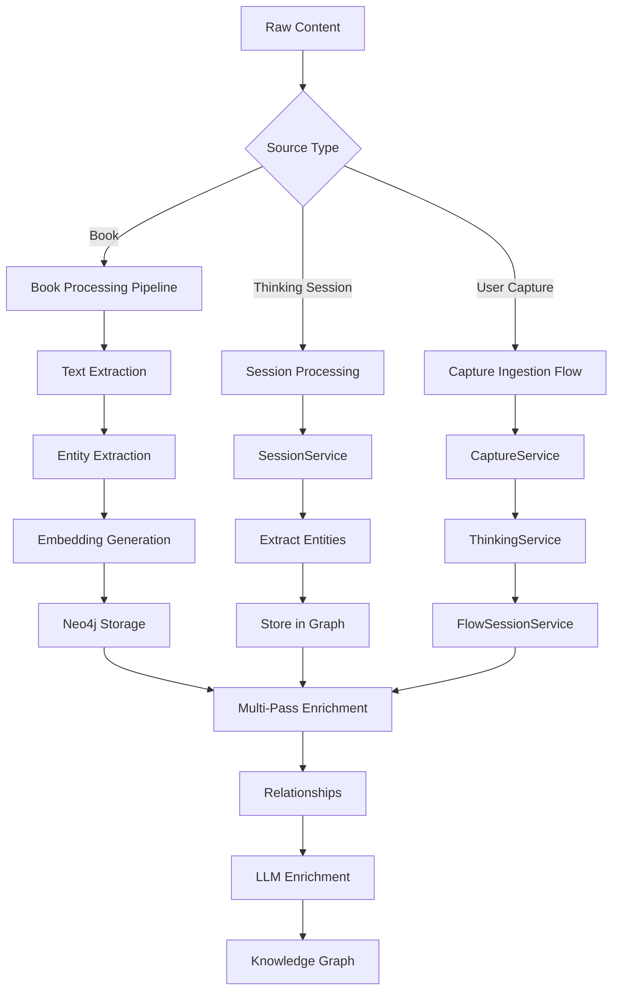
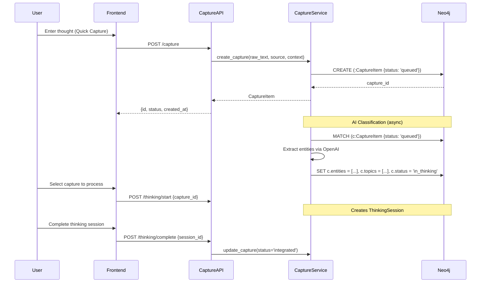
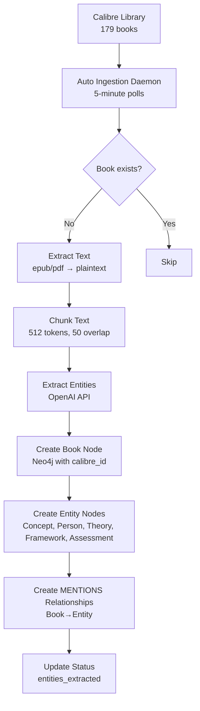
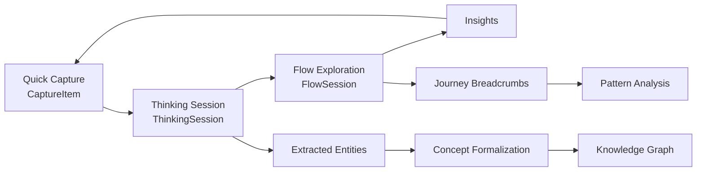
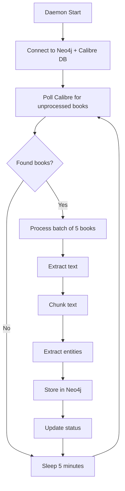

# 4.2 Backend Pipeline

**Purpose:** This document defines the complete backend processing pipeline for capturing, ingesting, extracting, enriching, and storing knowledge in the IES system.

**Date:** December 6, 2025
**Implementation Status:** ✅ Production Ready (94/94 tests passing)

---

## Table of Contents

1. [Pipeline Overview](#pipeline-overview)
2. [Capture Ingestion Flow](#capture-ingestion-flow)
3. [Book Processing Pipeline](#book-processing-pipeline)
4. [Multi-Pass Enrichment](#multi-pass-enrichment)
5. [Three-Layer Loop (Capture → Thinking → Flow)](#three-layer-loop-capture--thinking--flow)
6. [Error Handling and Retry Logic](#error-handling-and-retry-logic)
7. [Auto-Ingestion Daemon](#auto-ingestion-daemon)

---

## Pipeline Overview

The IES backend orchestrates multiple processing pipelines to transform raw content into structured, connected knowledge.



**Key Pipelines:**
1. **Book Processing** — Calibre books → chunks → entities → graph
2. **Capture Flow** — Quick captures → thinking sessions → flow exploration
3. **Session Processing** — Dialogue → entity extraction → concept formalization
4. **Multi-Pass Enrichment** — Structure → relationships → LLM insights

---

## Capture Ingestion Flow

User captures flow through a three-stage pipeline: capture → classify → process.

### Flow Diagram



### Implementation

**1. Capture Creation**

**API:** `POST /capture`

**Service:** `ies/backend/src/ies_backend/services/capture_service.py` (lines 30-60)

```python
async def create_capture(
    self,
    raw_text: str,
    source: CaptureSource,
    context_snippet: str | None = None,
    user_id: str = "default_user"
) -> CaptureItem:
    """Create new capture item in Neo4j with queued status."""

    capture_id = f"capture_{uuid.uuid4().hex[:12]}"
    timestamp = datetime.utcnow().isoformat()

    query = """
    CREATE (c:CaptureItem {
        id: $id,
        user_id: $user_id,
        raw_text: $raw_text,
        source: $source,
        context_snippet: $context_snippet,
        status: $status,
        created_at: $created_at,
        updated_at: $updated_at
    })
    RETURN c
    """

    result = self.kg.execute_query(
        query,
        id=capture_id,
        user_id=user_id,
        raw_text=raw_text,
        source=source.value,
        context_snippet=context_snippet,
        status=CaptureStatus.QUEUED.value,
        created_at=timestamp,
        updated_at=timestamp
    )

    return CaptureItem(
        id=capture_id,
        user_id=user_id,
        raw_text=raw_text,
        source=source,
        context_snippet=context_snippet,
        status=CaptureStatus.QUEUED,
        created_at=timestamp,
        updated_at=timestamp,
        entities=[],
        topics=[]
    )
```

**2. Entity Extraction (Classification)**

**Service:** `CaptureService.update_capture()` (lines 100-140)

```python
async def update_capture(
    self,
    capture_id: str,
    status: CaptureStatus | None = None,
    entities: list[str] | None = None,
    topics: list[str] | None = None
) -> CaptureItem | None:
    """Update capture with AI-extracted metadata."""

    updates = []
    params = {"id": capture_id}

    if status:
        updates.append("c.status = $status")
        params["status"] = status.value

    if entities is not None:
        updates.append("c.entities = $entities")
        params["entities"] = entities

    if topics is not None:
        updates.append("c.topics = $topics")
        params["topics"] = topics

    updates.append("c.updated_at = $updated_at")
    params["updated_at"] = datetime.utcnow().isoformat()

    query = f"""
    MATCH (c:CaptureItem {{id: $id}})
    SET {', '.join(updates)}
    RETURN c
    """

    result = self.kg.execute_query(query, **params)
    # ... return updated CaptureItem
```

**3. Status Lifecycle**

```python
class CaptureStatus(str, Enum):
    QUEUED = "queued"          # Just created, awaiting processing
    IN_THINKING = "in_thinking"  # Linked to ThinkingSession
    INTEGRATED = "integrated"    # Session complete, entities extracted
```

**Flow:**
- User creates capture → `queued`
- AI extracts entities → still `queued` (or updated separately)
- User starts thinking session → `in_thinking`
- User completes session → `integrated`

---

## Book Processing Pipeline

Books from the Calibre library flow through a three-pass ingestion pipeline.

### Pass 1: Structure (IMPLEMENTED)

**Script:** `scripts/ingest_calibre.py` (263 lines)

**Daemon:** `scripts/auto_ingest_daemon.py` (272 lines)



#### Text Extraction

**Service:** `scripts/ingest_calibre.py` (lines 50-80)

```python
def extract_text_from_book(file_path: str) -> str:
    """Extract plaintext from epub or pdf."""
    if file_path.endswith('.epub'):
        book = epub.read_epub(file_path)
        text = []
        for item in book.get_items():
            if item.get_type() == ebooklib.ITEM_DOCUMENT:
                content = item.get_content()
                soup = BeautifulSoup(content, 'html.parser')
                text.append(soup.get_text())
        return '\n'.join(text)

    elif file_path.endswith('.pdf'):
        with open(file_path, 'rb') as f:
            reader = PyPDF2.PdfReader(f)
            text = []
            for page in reader.pages:
                text.append(page.extract_text())
        return '\n'.join(text)

    else:
        raise ValueError(f"Unsupported format: {file_path}")
```

#### Chunking

**Service:** `scripts/ingest_calibre.py` (lines 85-110)

```python
def chunk_text(text: str, max_tokens: int = 512, overlap: int = 50) -> list[str]:
    """Split text into overlapping chunks."""
    # Split into sentences
    sentences = text.split('. ')

    chunks = []
    current_chunk = []
    current_tokens = 0

    for sentence in sentences:
        # Rough token count (words * 1.3)
        sentence_tokens = len(sentence.split()) * 1.3

        if current_tokens + sentence_tokens > max_tokens and current_chunk:
            # Save current chunk
            chunks.append('. '.join(current_chunk) + '.')

            # Start new chunk with overlap
            overlap_sentences = current_chunk[-overlap:] if len(current_chunk) > overlap else current_chunk
            current_chunk = overlap_sentences + [sentence]
            current_tokens = sum(len(s.split()) * 1.3 for s in current_chunk)
        else:
            current_chunk.append(sentence)
            current_tokens += sentence_tokens

    # Add final chunk
    if current_chunk:
        chunks.append('. '.join(current_chunk) + '.')

    return chunks
```

**Settings:**
- Max tokens: 512 (fits OpenAI context window)
- Overlap: 50 tokens (preserves context across chunks)
- Result: ~200-500 chunks per book

#### Entity Extraction

**Service:** `library/graph/entities.py` (using `EntityExtractor`)

```python
class EntityExtractor:
    """Extract entities from text using OpenAI API."""

    async def extract_entities(self, text: str) -> ExtractionResult:
        """Extract entities from text chunk."""

        prompt = f"""
        Extract key entities from this text. Return a JSON array of entities.

        Entity types:
        - concept: Abstract ideas, theories, principles
        - person: Named individuals (authors, researchers)
        - theory: Formal theories or frameworks
        - framework: Methodologies or approaches
        - assessment: Diagnostic tools or measures

        Text:
        {text}

        Format:
        [
            {{"name": "Executive Function", "type": "concept"}},
            {{"name": "Russell Barkley", "type": "person"}},
            ...
        ]
        """

        response = await openai.ChatCompletion.create(
            model="gpt-4",
            messages=[{"role": "user", "content": prompt}],
            temperature=0.3
        )

        entities_json = response.choices[0].message.content
        entities = json.loads(entities_json)

        return ExtractionResult(entities=entities)
```

**OpenAI Settings:**
- Model: GPT-4 (better entity recognition than 3.5)
- Temperature: 0.3 (balance creativity and consistency)
- Max tokens: Auto (typically 200-500 per response)

#### Neo4j Storage

**Service:** `scripts/ingest_calibre.py` (lines 130-180)

```python
def ingest_book(kg: KnowledgeGraph, book: CalibreBook, extractor: EntityExtractor):
    """Process single book: extract → chunk → extract entities → store."""

    # 1. Create Book node
    kg.add_book(
        title=book.title,
        author=book.author,
        path=book.path,
        calibre_id=book.calibre_id,
        processing_status="pending"
    )

    # 2. Extract and chunk text
    text = extract_text_from_book(book.path)
    chunks = chunk_text(text, max_tokens=512, overlap=50)

    kg.update_book_status(book.calibre_id, "chunked")

    # 3. Extract entities from chunks (limit 50 chunks to avoid API overload)
    all_entities = []
    for chunk in chunks[:50]:
        result = extractor.extract_entities(chunk)
        all_entities.extend(result.entities)

    # Deduplicate entities by name
    unique_entities = deduplicate_entities(all_entities)

    # 4. Create Entity nodes in Neo4j
    for entity in unique_entities:
        kg.add_entity(
            name=entity.name,
            entity_type=entity.type,
            description=entity.description or ""
        )

    # 5. Create MENTIONS relationships (Book→Entity)
    for entity in unique_entities:
        query = """
        MATCH (b:Book {calibre_id: $calibre_id})
        MATCH (e) WHERE e.name = $entity_name
        MERGE (b)-[:MENTIONS]->(e)
        """
        kg.execute_query(query, calibre_id=book.calibre_id, entity_name=entity.name)

    # 6. Update status
    kg.update_book_status(book.calibre_id, "entities_extracted")

    return {
        "chunks": len(chunks),
        "entities": len(unique_entities)
    }
```

**Graph Structure After Pass 1:**

```cypher
(:Book {
  calibre_id: 42,
  title: "Driven to Distraction",
  author: "Hallowell, Edward M.",
  path: "/calibre-library/...",
  processing_status: "entities_extracted",
  has_entities: true
})-[:MENTIONS]->(:Concept {name: "Executive Function"})

(:Book)-[:MENTIONS]->(:Person {name: "Russell Barkley"})

(:Book)-[:MENTIONS]->(:Theory {name: "Executive Function Theory"})
```

### Pass 2: Relationships (PLANNED)

**Not yet implemented** — Will extract relationships between entities.

**Planned Queries:**

```cypher
// Causal relationships
MATCH (b:Book)-[:MENTIONS]->(e1:Concept)
MATCH (b)-[:MENTIONS]->(e2:Concept)
WHERE /* LLM detects causality */
MERGE (e1)-[:CAUSES]->(e2)

// Component relationships
MATCH (b:Book)-[:MENTIONS]->(e1:Framework)
MATCH (b)-[:MENTIONS]->(e2:Concept)
WHERE /* LLM detects part-of */
MERGE (e2)-[:PART_OF]->(e1)

// Contrast relationships
MATCH (b:Book)-[:MENTIONS]->(e1:Concept)
MATCH (b)-[:MENTIONS]->(e2:Concept)
WHERE /* LLM detects contrast */
MERGE (e1)-[:CONTRASTS_WITH]->(e2)
```

### Pass 3: LLM Enrichment (PLANNED)

**Not yet implemented** — Will generate reframes, mechanisms, patterns.

**Planned Pipeline:**
1. For each popular concept (>5 mentions)
2. Call Reframe API to generate metaphors/analogies
3. Extract mechanisms via LLM
4. Identify patterns across books
5. Add rich descriptions

**Integration with Reframe API:**

```python
async def enrich_concept(concept_name: str):
    """Generate reframes and descriptions for concept."""

    # Generate reframes
    reframes = await reframe_service.generate_reframes(
        concept_id=concept_name,
        count=5
    )

    # Extract mechanisms via LLM
    mechanisms = await extract_mechanisms(concept_name)

    # Update concept node with enrichment
    query = """
    MATCH (c:Concept {name: $name})
    SET c.reframes = $reframes,
        c.mechanisms = $mechanisms,
        c.enriched = true
    """
    kg.execute_query(query, name=concept_name, reframes=reframes, mechanisms=mechanisms)
```

---

## Multi-Pass Enrichment

The backend uses a multi-pass strategy to progressively enrich the knowledge graph.

### Status Lifecycle

```python
class ProcessingStatus(str, Enum):
    PENDING = "pending"                    # Just added to system
    CHUNKED = "chunked"                    # Text extracted and chunked
    ENTITIES_EXTRACTED = "entities_extracted"  # Pass 1 complete
    RELATIONSHIPS_MAPPED = "relationships_mapped"  # Pass 2 complete
    ENRICHED = "enriched"                  # Pass 3 complete (LLM insights)
```

### Pass Progression

| Pass | Status After | Actions | Estimated Time |
|------|--------------|---------|----------------|
| **Pass 1** | `entities_extracted` | Text extraction, chunking, entity extraction, MENTIONS relationships | 2-5 min per book |
| **Pass 2** | `relationships_mapped` | Causal, component, contrast relationship extraction | 5-10 min per book |
| **Pass 3** | `enriched` | Reframe generation, mechanism extraction, pattern identification | 10-15 min per book |

### Graph Evolution

**After Pass 1:**
```cypher
(:Book)-[:MENTIONS]->(:Concept)
(:Book)-[:MENTIONS]->(:Person)
```

**After Pass 2:**
```cypher
(:Concept)-[:CAUSES]->(:Concept)
(:Concept)-[:PART_OF]->(:Framework)
(:Concept)-[:CONTRASTS_WITH]->(:Concept)
```

**After Pass 3:**
```cypher
(:Concept {
  name: "Executive Function",
  reframes: ["The brain's CEO", "Mental air traffic control"],
  mechanisms: ["Working memory capacity determines EF availability"],
  enriched: true
})
```

---

## Three-Layer Loop (Capture → Thinking → Flow)

The backend orchestrates a three-stage pipeline for user-driven knowledge creation.

### Pipeline Architecture



### 1. Capture Service

**Purpose:** Zero-friction thought capture with entity extraction.

**API:** `POST /capture`

**Service:** `ies/backend/src/ies_backend/services/capture_service.py` (220 lines)

**Schema:** `ies/backend/src/ies_backend/schemas/capture.py`

```python
@dataclass
class CaptureItem:
    id: str
    user_id: str
    raw_text: str
    source: CaptureSource  # ios_shortcut, readest, browser, mcp, manual
    context_snippet: str | None
    status: CaptureStatus  # queued → in_thinking → integrated
    created_at: str
    updated_at: str
    entities: list[str]
    topics: list[str]
```

**Key Methods:**
- `create_capture()` — Creates CaptureItem node with status `queued`
- `list_captures(status)` — Retrieves captures filtered by status
- `update_capture()` — Updates entities, topics, status
- `delete_capture()` — Removes capture from queue

### 2. Thinking Service

**Purpose:** Structured thinking sessions with AI guidance.

**API:** `POST /thinking/start`, `POST /thinking/step`, `POST /thinking/complete`

**Service:** `ies/backend/src/ies_backend/services/thinking_service.py` (215 lines)

**Schema:** `ies/backend/src/ies_backend/schemas/thinking.py`

```python
@dataclass
class ThinkingSession:
    id: str
    user_id: str
    capture_id: str  # Link back to CaptureItem
    siyuan_note_id: str | None
    angles: list[Angle]
    entities: list[str]
    breadcrumbs: list[Breadcrumb]
    status: ThinkingStatus  # active → completed
    created_at: str
    completed_at: str | None
```

**Key Methods:**
- `start_session(capture_id)` — Creates ThinkingSession, updates capture status to `in_thinking`
- `record_breadcrumb(session_id, breadcrumb)` — Tracks user thinking steps
- `complete_session(session_id)` — Marks session complete, updates capture to `integrated`

**Integration:**
- Links to CaptureItem via `capture_id`
- Updates capture status: `queued` → `in_thinking`
- On completion: `in_thinking` → `integrated`

### 3. Flow Session Service

**Purpose:** Visual graph exploration with journey synthesis.

**API:** `POST /flow/open-from-session`, `POST /flow/step`, `POST /flow/synthesize`

**Service:** `ies/backend/src/ies_backend/services/flow_session_service.py` (342 lines)

**Schema:** `ies/backend/src/ies_backend/schemas/flow_session.py`

```python
@dataclass
class FlowSession:
    id: str
    user_id: str
    origin: FlowOrigin  # thinking_session, entity_search, bookmark
    visited_nodes: list[str]  # Entity IDs
    visited_edges: list[tuple[str, str]]  # (from_id, to_id)
    breadcrumbs: list[Breadcrumb]
    insights: list[str]
    created_at: str
    completed_at: str | None
```

**Key Methods:**
- `open_from_thinking_session(session_id)` — Creates FlowSession linked to ThinkingSession
- `record_step(flow_id, node_id, edge)` — Updates visited nodes/edges, breadcrumbs
- `generate_synthesis(flow_id)` — Uses Claude Sonnet 4 to synthesize insights from journey

**Integration:**
- Links to ThinkingSession via `FROM_THINKING` relationship
- Fetches initial graph view centered on session entities
- Generates synthesis using Claude Sonnet 4

### Data Flow Example

```python
# 1. User captures thought
capture = await capture_service.create_capture(
    raw_text="Does shame block executive function?",
    source=CaptureSource.IOS_SHORTCUT
)
# Result: CaptureItem with status="queued"

# 2. AI extracts entities (background)
await capture_service.update_capture(
    capture_id=capture.id,
    entities=["Executive Function", "Shame"],
    topics=["ADHD", "emotion regulation"]
)

# 3. User starts thinking session
session = await thinking_service.start_session(
    capture_id=capture.id
)
# Result: ThinkingSession created, capture status="in_thinking"

# 4. User explores angles, records breadcrumbs
await thinking_service.record_breadcrumb(
    session_id=session.id,
    breadcrumb=Breadcrumb(
        type="angle",
        content="Shame prevents nervous system regulation",
        timestamp=datetime.utcnow()
    )
)

# 5. User completes session
await thinking_service.complete_session(session_id=session.id)
# Result: Capture status="integrated"

# 6. User opens flow exploration
flow = await flow_service.open_from_thinking_session(
    session_id=session.id
)
# Result: FlowSession with initial graph view

# 7. User explores connections, records journey
await flow_service.record_step(
    flow_id=flow.id,
    node_id="concept_executive_function",
    edge=("concept_shame", "concept_executive_function")
)

# 8. User requests synthesis
synthesis = await flow_service.generate_synthesis(flow_id=flow.id)
# Result: Claude-generated insights from journey
```

---

## Error Handling and Retry Logic

The backend uses comprehensive error handling and retry strategies.

### Retry Decorator

**Service:** `ies/backend/src/ies_backend/services/entity_storage_service.py` (lines 20-45)

```python
def retry_on_failure(max_retries: int = 3, delay: float = 1.0):
    """Retry decorator for database operations."""
    def decorator(func):
        @wraps(func)
        async def wrapper(*args, **kwargs):
            last_exception = None
            for attempt in range(max_retries):
                try:
                    return await func(*args, **kwargs)
                except Exception as e:
                    last_exception = e
                    if attempt < max_retries - 1:
                        await asyncio.sleep(delay * (attempt + 1))
                        logger.warning(f"Retry {attempt + 1}/{max_retries} for {func.__name__}: {e}")
                    else:
                        logger.error(f"Failed after {max_retries} attempts: {func.__name__}: {e}")
            raise last_exception
        return wrapper
    return decorator
```

**Usage:**

```python
@retry_on_failure(max_retries=3, delay=1.0)
async def store_entity_in_neo4j(entity: Entity) -> str:
    """Store entity with automatic retry on failure."""
    # ... Neo4j operations
```

### Error Response Format

**Schema:** `ies/backend/src/ies_backend/schemas/error.py`

```python
class ErrorResponse(BaseModel):
    error: str
    detail: str | None = None
    status_code: int
    timestamp: str
```

**Example:**

```json
{
  "error": "EntityNotFound",
  "detail": "No entity found with name 'Executive Function'",
  "status_code": 404,
  "timestamp": "2025-12-06T10:30:00Z"
}
```

### Exception Hierarchy

```python
class IESError(Exception):
    """Base exception for IES backend."""
    pass

class EntityNotFoundError(IESError):
    """Entity does not exist in graph."""
    pass

class BookNotFoundError(IESError):
    """Book does not exist in Calibre library."""
    pass

class SessionNotFoundError(IESError):
    """Session does not exist."""
    pass

class ValidationError(IESError):
    """Input validation failed."""
    pass
```

### Graceful Degradation

**Fallback strategies:**

1. **Entity extraction failure** → Return empty list, continue processing
2. **OpenAI API timeout** → Retry with exponential backoff (3 attempts)
3. **Neo4j connection lost** → Queue operations, retry on reconnect
4. **Calibre book missing** → Skip book, log warning, continue batch

---

## Auto-Ingestion Daemon

The auto-ingestion daemon continuously processes new books in the background.

**Script:** `scripts/auto_ingest_daemon.py` (272 lines)

### Daemon Architecture



### Implementation

**Main Loop:**

```python
async def run_daemon(once: bool = False):
    """Main daemon loop."""
    logger.info("Starting auto-ingestion daemon")

    # Initialize services
    kg = KnowledgeGraph()
    extractor = EntityExtractor()

    while True:
        try:
            # Get unprocessed books
            books = get_calibre_books(kg, limit=BATCH_SIZE)

            if not books:
                logger.info("No unprocessed books found")
                if once:
                    break
                await asyncio.sleep(POLL_INTERVAL)
                continue

            logger.info(f"Processing {len(books)} books")

            # Process each book
            for book in books:
                try:
                    result = ingest_book(kg, book, extractor)
                    logger.info(f"✓ {book.title}: {result['entities']} entities extracted")
                except Exception as e:
                    logger.error(f"✗ {book.title}: {e}")
                    continue

            if once:
                break

            # Sleep before next poll
            await asyncio.sleep(POLL_INTERVAL)

        except KeyboardInterrupt:
            logger.info("Daemon stopped by user")
            break
        except Exception as e:
            logger.error(f"Daemon error: {e}")
            if once:
                break
            await asyncio.sleep(POLL_INTERVAL)
```

### Configuration

**Script:** `scripts/auto_ingest_daemon.py` (lines 30-48)

```python
# Configuration
CALIBRE_DB = Path("./calibre/library/metadata.db")
CALIBRE_LIBRARY = Path("./calibre/library")
POLL_INTERVAL = 300  # 5 minutes
BATCH_SIZE = 5  # Process 5 books per batch
LOG_FILE = Path("logs/auto_ingest.log")
```

### Logging

**Format:**

```
2025-12-06 10:30:00 - INFO - Starting auto-ingestion daemon
2025-12-06 10:30:05 - INFO - Processing 5 books
2025-12-06 10:32:15 - INFO - ✓ Driven to Distraction: 42 entities extracted
2025-12-06 10:34:22 - INFO - ✓ Executive Functions: 38 entities extracted
2025-12-06 10:36:30 - ERROR - ✗ ADHD 2.0: File not found
2025-12-06 10:38:45 - INFO - ✓ Delivered from Distraction: 51 entities extracted
2025-12-06 10:40:52 - INFO - ✓ The ADHD Effect: 29 entities extracted
2025-12-06 10:41:00 - INFO - No unprocessed books found
2025-12-06 10:46:00 - INFO - Processing 3 books
```

### Usage

```bash
# Run daemon in background
python scripts/auto_ingest_daemon.py &

# Run once (for testing)
python scripts/auto_ingest_daemon.py --once

# View logs
tail -f logs/auto_ingest.log
```

### Status Tracking

The daemon updates book processing status in Neo4j:

```cypher
MATCH (b:Book {calibre_id: 42})
SET b.processing_status = 'entities_extracted',
    b.processed_at = datetime(),
    b.entity_count = 42
```

**Status progression:**
- `pending` → Book exists but not processed
- `chunked` → Text extracted and chunked
- `entities_extracted` → Pass 1 complete
- `relationships_mapped` → Pass 2 complete (future)
- `enriched` → Pass 3 complete (future)

---

## References

**Implementation Files:**
- `ies/backend/src/ies_backend/services/capture_service.py` (220 lines)
- `ies/backend/src/ies_backend/services/thinking_service.py` (215 lines)
- `ies/backend/src/ies_backend/services/flow_session_service.py` (342 lines)
- `scripts/ingest_calibre.py` (263 lines)
- `scripts/auto_ingest_daemon.py` (272 lines)
- `library/graph/entities.py` (entity extraction logic)

**Schemas:**
- `ies/backend/src/ies_backend/schemas/capture.py` (CaptureItem, CaptureSource, CaptureStatus)
- `ies/backend/src/ies_backend/schemas/thinking.py` (ThinkingSession, Angle, Breadcrumb)
- `ies/backend/src/ies_backend/schemas/flow_session.py` (FlowSession, FlowOrigin)

**Tests:**
- `ies/backend/tests/test_thinking_and_flow.py` (265 lines, 5 tests)
- `ies/backend/tests/test_capture.py` (capture service tests)

**Related:**
- `4.1-SiYuan-Structure.md` — Frontend integration
- `4.4-APIs-MCP-Integration.md` — API endpoint reference

---

*This document provides the complete backend processing pipeline specification. For agent architecture, see `4.3-Agent-Architecture.md`. For API details, see `4.4-APIs-MCP-Integration.md`.*
