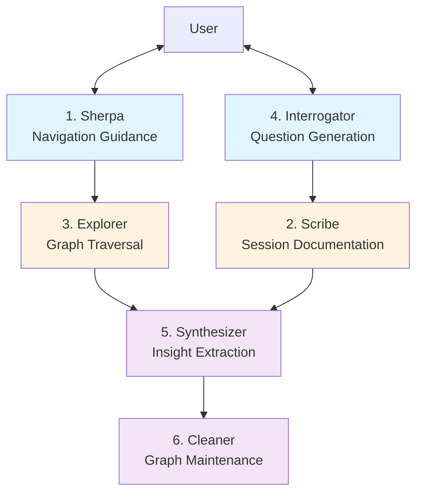
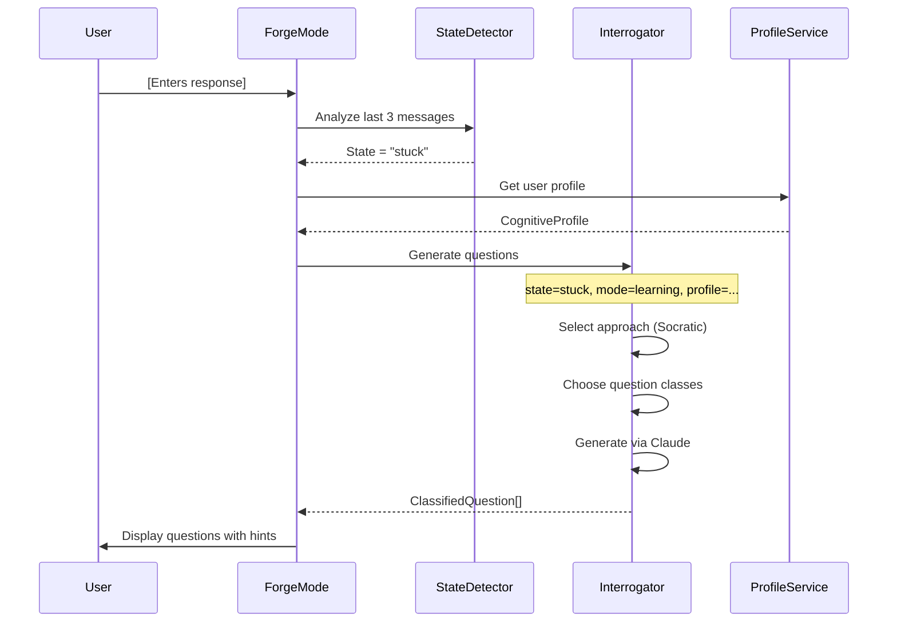

# 4.3 Agent Architecture

**Purpose:** This document defines the conceptual agent roles, their responsibilities, and current implementation status in the IES system. Agents are specialized subsystems with defined inputs, outputs, and boundaries.

**Date:** December 6, 2025
**Implementation Status:** ⚠️ Partial (Question Engine and Synthesizer implemented, others conceptual)

---

## Table of Contents

1. [Agent Philosophy](#agent-philosophy)
2. [The Six Agent Roles](#the-six-agent-roles)
3. [Implemented Agents](#implemented-agents)
4. [Future Agent Implementations](#future-agent-implementations)
5. [Agent Communication Protocol](#agent-communication-protocol)

---

## Agent Philosophy

The IES system uses **single-responsibility agents** to create a distributed thinking partnership. Each agent has a narrow, well-defined role and communicates through clear interfaces.

### Design Principles

**1. Single Responsibility**
- Each agent does ONE thing well
- Clear boundaries prevent scope creep
- Easy to test, debug, and improve

**2. Composability**
- Agents combine to create complex behaviors
- Orchestration layer coordinates multi-agent workflows
- New agents can be added without disrupting existing ones

**3. Observable Behavior**
- Inputs and outputs are explicit and typed
- All agent decisions are logged
- Users can see what each agent contributed

**4. Graceful Degradation**
- If one agent fails, others continue working
- Fallback behaviors for missing agents
- No single point of failure

### Agent vs. Service

| Aspect | Agent | Service |
|--------|-------|---------|
| **Purpose** | Specialized cognitive function | General data operations |
| **Behavior** | Adaptive, context-aware | Deterministic, CRUD |
| **State** | Maintains conversation context | Stateless or session-scoped |
| **Decision-Making** | Uses LLM reasoning | Rule-based logic |
| **Examples** | Interrogator (questions), Synthesizer (insights) | GraphService (queries), CaptureService (storage) |

**Rule:** If it requires AI reasoning or adapts to user patterns, it's an agent. If it's CRUD operations or data transformation, it's a service.

---

## The Six Agent Roles

IES defines six conceptual agents, each with a distinct cognitive function:



**Legend:**
- **Blue:** User-facing agents (direct interaction)
- **Orange:** Processing agents (background operations)
- **Purple:** Analysis agents (pattern recognition)

---

### 1. Sherpa (Navigation Guidance)

**Role:** Guide user through knowledge exploration with contextual suggestions.

**Inputs:**
- User's current location in graph
- Exploration history (breadcrumbs)
- User's cognitive profile
- User's energy level and resonance state

**Outputs:**
- Suggested next entities to explore
- Explanation of why each suggestion is relevant
- Different paths based on user state (high energy → challenging, low energy → familiar)

**Guarantees:**
- Always provides 3-5 suggestions
- Suggestions ranked by relevance score
- Includes rationale for each suggestion
- Respects user's energy and mood filters

**Tools:**
- GraphService (relationship queries)
- Personal graph (visit history, resonance)
- Profile service (cognitive dimensions)

**Boundaries:**
- Does NOT make decisions for user
- Does NOT force specific paths
- Does NOT judge user's choices

**Current Status:** ⚠️ **Conceptual** (Dashboard suggestions exist but not agent-based)

**Example Interaction:**

```
User: [Viewing "Executive Function" entity, energy: low]

Sherpa: Based on your recent journey, here are 3 gentle explorations:

1. Working Memory (80% relevance)
   Why: You've visited this 3 times, suggesting it resonates. Low cognitive load.

2. Russell Barkley (70% relevance)
   Why: Expert on Executive Function. Concrete examples might clarify concepts.

3. ADHD Diagnosis (65% relevance)
   Why: Related to current focus. Recent visit suggests active interest.

All paths are low-energy appropriate. Would you like more challenging options?
```

---

### 2. Scribe (Session Documentation)

**Role:** Capture and structure thinking sessions into persistent documents.

**Inputs:**
- Session transcript (user/AI messages)
- Thinking mode (learning, articulating, planning, ideating, reflecting)
- Template ID (if template-driven)
- Entities extracted during session
- Question classes used

**Outputs:**
- Structured session document (SiYuan markdown)
- YAML frontmatter with metadata
- Organized sections (responses, conversation, results)
- SiYuan block attributes for backend linking

**Guarantees:**
- Session always saved to correct `/Sessions/{mode}/` folder
- Transcript preserved verbatim
- Metadata includes all question classes and entity counts
- Document title includes date, time, and topic

**Tools:**
- SiYuan API (createDocWithMd, setBlockAttrs)
- SessionService (session data retrieval)
- Template service (template structure)

**Boundaries:**
- Does NOT edit or summarize user responses
- Does NOT add content beyond what user provided
- Does NOT make judgments about session quality

**Current Status:** ✅ **Implemented** (as `createSessionDocument()` function)

**Implementation:** `.worktrees/siyuan/ies/plugin/src/utils/siyuan-structure.ts` (lines 794-984)

**Example Output:**

```markdown
---
be_type: session
be_id: session_abc123
mode: learning
topic: Understanding executive function
status: completed
created: "2025-12-06T01:42:00Z"
template_id: learning-mechanism-map
entities_extracted: 12
question_classes_used:
  - schema_probe
  - causal
  - anchor
---

# Understanding executive function

**Mode:** Learning (Mechanism Map)
**Date:** 2025-12-06

## Section Responses

### Understanding Prerequisites
[User's response to this section]

### Core Mechanisms
[User's response to this section]

## Thinking Dialogues

### Dialogue 1 (🏗️ Structure)
> What are the main components of executive function?

**Response:** Working memory, inhibitory control, cognitive flexibility...

---

## Conversation

**You:**
I want to understand how executive function works...

**AI:**
Let's explore the mechanisms step by step...

---

## Session Results

- Entities extracted: 12
- Graph mapping executed: ✓
- Thinking dialogues: 3 answered
- Question types used: Structure, Causal, Anchor
```

---

### 3. Explorer (Graph Traversal)

**Role:** Navigate knowledge graph to find relevant entities and paths.

**Inputs:**
- Starting entity/entities
- Relationship types to follow
- Max depth (1-3 hops)
- Entity type filters (concept, person, theory, etc.)

**Outputs:**
- List of connected entities with relationship types
- Mention counts (frequency in source books)
- Shortest paths between entities
- Clustering suggestions (related concept groups)

**Guarantees:**
- Results sorted by relevance (mention count or distance)
- Always includes relationship type labels
- Handles cycles gracefully (no infinite loops)
- Returns empty list if no connections found

**Tools:**
- GraphService (Neo4j Cypher queries)
- Graph algorithms (shortest path, clustering)

**Boundaries:**
- Does NOT generate new content
- Does NOT interpret relationships (labels only)
- Does NOT filter based on user state (Sherpa's job)

**Current Status:** ✅ **Implemented** (as GraphService methods)

**Implementation:** `ies/backend/src/ies_backend/services/graph_service.py`

**Example Query:**

```python
# Find related entities 1-2 hops from "Executive Function"
entities = await explorer.traverse(
    start_entity="Executive Function",
    relationship_types=["PART_OF", "CAUSES", "RELATED_TO"],
    max_depth=2,
    entity_types=["concept", "theory"]
)

# Returns:
[
    {
        "name": "Working Memory",
        "type": "concept",
        "relationship": "PART_OF",
        "distance": 1,
        "mention_count": 142
    },
    {
        "name": "Inhibitory Control",
        "type": "concept",
        "relationship": "PART_OF",
        "distance": 1,
        "mention_count": 98
    },
    {
        "name": "Cognitive Flexibility",
        "type": "concept",
        "relationship": "PART_OF",
        "distance": 1,
        "mention_count": 85
    }
]
```

---

### 4. Interrogator (Question Generation)

**Role:** Ask thinking partner questions at decision points to deepen user's understanding.

**Inputs:**
- User's current state (flowing, stuck, overwhelmed, exploring)
- User's cognitive profile (6 dimensions)
- Recent conversation history (last 3 messages)
- Thinking mode (learning, articulating, planning, etc.)
- Current topic/entity

**Outputs:**
- 1-3 classified questions with question class labels
- Cognitive hints for each question (scaffolding)
- Optional response starters to reduce friction

**Guarantees:**
- Questions match user's cognitive profile
- Question classes appropriate for thinking mode
- Never asks more than 3 questions at once
- Questions are specific, not generic

**Tools:**
- StateDetectionService (analyze user state)
- ApproachSelectionService (map state → inquiry approach)
- QuestionTemplatesService (template library)
- Claude API (generate custom questions)

**Boundaries:**
- Does NOT answer questions for user
- Does NOT judge user responses
- Does NOT force specific reasoning patterns

**Current Status:** ✅ **Implemented** (as Question Engine API)

**Implementation:** `ies/backend/src/ies_backend/api/question_engine.py` (400 lines)

**Question Class System:**

```typescript
enum QuestionClass {
    SCHEMA_PROBE      // 🏗️ Structure questions
    BOUNDARY          // 🔲 Edge/limit questions
    DIMENSIONAL       // 📐 Spectrum questions
    CAUSAL            // ⚡ Mechanism questions
    COUNTERFACTUAL    // 🔮 What-if questions
    ANCHOR            // ⚓ Concrete example questions
    PERSPECTIVE_SHIFT // 👁️ Viewpoint change questions
    META_COGNITIVE    // 🧠 Thinking pattern questions
    REFLECTIVE_SYNTHESIS // 🔗 Integration questions
}
```

**Example Generation:**

```python
# User is stuck while learning about executive function
questions = await interrogator.generate_questions(
    user_state="stuck",
    mode="learning",
    topic="Executive Function",
    profile=user_profile,
    recent_messages=last_3_messages
)

# Returns:
[
    {
        "question": "What are the main parts of executive function?",
        "question_class": "schema_probe",
        "hint": "Try listing the main categories, components, or buckets. Think of it like organizing a toolbox.",
        "response_starter": "The main parts are..."
    },
    {
        "question": "Can you think of a time when your executive function worked well?",
        "question_class": "anchor",
        "hint": "Ground the concept in a specific moment. What were you doing? What made it work?",
        "response_starter": "I remember when..."
    }
]
```

**Integration with ForgeMode:**

`.worktrees/siyuan/ies/plugin/src/views/ForgeMode.svelte` uses Interrogator via Question Engine API to generate thinking partner questions during dialogue sessions.

---

### 5. Synthesizer (Insight Extraction)

**Role:** Analyze exploration journeys to extract novel insights and patterns.

**Inputs:**
- FlowSession breadcrumbs (visited nodes, edges, timestamps)
- Dwell times (how long user spent on each entity)
- User responses to thinking partner questions
- Entities visited in order

**Outputs:**
- 3-5 synthesized insights from journey
- Explanation of what pattern led to each insight
- Suggested next explorations based on gaps
- Connections user might have missed

**Guarantees:**
- Insights reference specific journey steps
- Always provides evidence (which entities, what pattern)
- Insights are novel (not just summaries)
- Respects user's dwell time (focus indicates importance)

**Tools:**
- Claude Sonnet 4 (synthesis generation)
- Journey analysis (pattern detection)
- Graph structure (identify gaps)

**Boundaries:**
- Does NOT invent facts not in graph
- Does NOT make clinical/medical claims
- Does NOT override user interpretations

**Current Status:** ✅ **Implemented** (as `generate_synthesis()` method)

**Implementation:** `ies/backend/src/ies_backend/services/flow_session_service.py` (lines 180-250)

**Example Synthesis:**

```python
# User explored: Executive Function → Shame → Nervous System → Working Memory
synthesis = await synthesizer.generate_synthesis(flow_session_id)

# Returns:
{
    "insights": [
        {
            "insight": "Shame may block access to existing executive function capacity by dysregulating the nervous system.",
            "evidence": "You spent 3 minutes on 'Shame' and 'Nervous System', then returned to 'Working Memory'. This suggests you're connecting emotional regulation to cognitive capacity.",
            "pattern": "Bridge pattern: emotional state → physiological state → cognitive availability"
        },
        {
            "insight": "Executive function might not be a fixed capacity but a dynamically accessible resource.",
            "evidence": "Your path suggests EF varies with nervous system state, not just innate ability.",
            "pattern": "State-dependent access pattern"
        },
        {
            "insight": "The connection between shame and EF hasn't been explored in your graph yet.",
            "evidence": "No direct relationship exists between 'Shame' and 'Executive Function' nodes. Your journey created this bridge.",
            "pattern": "Novel connection (gap-bridging insight)"
        }
    ],
    "suggested_explorations": [
        "Explore 'Shame' → 'Metabolization' to see if processing shame improves EF access",
        "Investigate 'Nervous System Configurations' to understand state-dependent capacity"
    ]
}
```

**Integration:**

Flow Mode calls `generate_synthesis()` at end of exploration session to provide journey insights.

---

### 6. Cleaner (Graph Maintenance)

**Role:** Maintain graph health through deduplication, validation, and cleanup.

**Inputs:**
- Entire knowledge graph (periodic batch processing)
- Duplicate detection threshold (similarity score)
- Orphaned node detection (nodes with no relationships)
- Stale node detection (not visited in 90+ days)

**Outputs:**
- List of duplicate entity candidates with similarity scores
- Orphaned nodes list
- Suggested merges (with user confirmation)
- Cleanup report (nodes merged, relationships updated)

**Guarantees:**
- Never auto-deletes user-created content
- Always requires confirmation for merges
- Preserves all relationships during merges
- Logs all cleanup operations

**Tools:**
- String similarity algorithms (fuzzy matching)
- Graph analysis (orphan detection)
- Neo4j batch operations (merge nodes)

**Boundaries:**
- Does NOT merge without user approval
- Does NOT delete journey history
- Does NOT alter session transcripts

**Current Status:** ❌ **Not Implemented** (planned for Phase 3)

**Future Implementation:**

```python
class Cleaner:
    """Graph maintenance agent."""

    async def detect_duplicates(self, threshold: float = 0.85) -> list[DuplicateCandidate]:
        """Find potential duplicate entities."""

        # Get all entities
        entities = await self.graph.get_all_entities()

        duplicates = []
        for i, e1 in enumerate(entities):
            for e2 in entities[i+1:]:
                # Calculate similarity score
                score = similarity(e1.name, e2.name)
                if score >= threshold:
                    duplicates.append(DuplicateCandidate(
                        entity1=e1,
                        entity2=e2,
                        similarity_score=score,
                        suggested_merge=e1.name if len(e1.name) < len(e2.name) else e2.name
                    ))

        return duplicates

    async def merge_entities(self, keep_id: str, merge_id: str, user_confirmed: bool = False):
        """Merge two entities, preserving all relationships."""

        if not user_confirmed:
            raise ValueError("User confirmation required for merges")

        # Transfer all relationships to kept entity
        query = """
        MATCH (merge:Entity {id: $merge_id})
        MATCH (keep:Entity {id: $keep_id})
        MATCH (merge)-[r]->(other)
        MERGE (keep)-[r2:SAME_TYPE]->(other)
        SET r2 = properties(r)
        DELETE r
        WITH merge, keep
        MATCH (other)-[r]->(merge)
        MERGE (other)-[r2:SAME_TYPE]->(keep)
        SET r2 = properties(r)
        DELETE r, merge
        """
        await self.graph.execute_query(query, keep_id=keep_id, merge_id=merge_id)

        return {"merged": merge_id, "into": keep_id}
```

---

## Implemented Agents

### Question Engine (Interrogator)

**Status:** ✅ **Production Ready**

**Implementation:** `ies/backend/src/ies_backend/api/question_engine.py` (400 lines)

**Capabilities:**
- 9 question classes with cognitive function labels
- State detection (flowing, stuck, overwhelmed, exploring, confused, drifting)
- Approach selection (Socratic, Solution-Focused, Phenomenological, Systems, Metacognitive)
- Profile-adapted questions
- Template library with 50+ question patterns

**Endpoints:**
- `POST /question-engine/detect-state` → Analyze user state from messages
- `POST /question-engine/select-approach` → Map state to inquiry approach
- `GET /question-engine/templates/{approach}` → Get question templates
- `POST /question-engine/generate-questions` → Full pipeline (state → approach → questions)
- `GET /question-engine/question-classes` → List all 9 classes with descriptions
- `GET /question-engine/approach-classes` → Show approach→class mappings

**Example Integration:**

```typescript
// ForgeMode uses Question Engine for thinking partner questions
const response = await apiPost('/question-engine/generate-questions', {
    user_state: detectedState,
    mode: currentMode,
    topic: sessionTopic,
    profile: userProfile,
    recent_messages: conversation.slice(-3)
});

// Returns classified questions with hints
const questions = response.classified_questions;
for (const q of questions) {
    displayQuestion(q.question, q.question_class, q.hint);
}
```

### Synthesizer

**Status:** ✅ **Production Ready**

**Implementation:** `ies/backend/src/ies_backend/services/flow_session_service.py` (lines 180-250)

**Capabilities:**
- Journey analysis from breadcrumbs
- Pattern recognition (bridge, gap-bridging, clustering)
- Insight generation via Claude Sonnet 4
- Dwell time weighting (longer = more important)
- Suggested next explorations

**Integration:**

```python
# Generate synthesis at end of flow session
synthesis = await flow_service.generate_synthesis(flow_id)

# Returns:
{
    "insights": ["...", "...", "..."],
    "suggested_explorations": ["...", "..."]
}
```

### Scribe

**Status:** ✅ **Production Ready**

**Implementation:** `.worktrees/siyuan/ies/plugin/src/utils/siyuan-structure.ts` (`createSessionDocument()`)

**Capabilities:**
- Session document creation in correct `/Sessions/{mode}/` folder
- YAML frontmatter with metadata
- Organized sections (responses, dialogues, conversation, results)
- Question-response exchange capture with class labels
- SiYuan block attribute syncing

**Integration:**

```typescript
// Save session on completion
const docId = await createSessionDocument({
    sessionId: session.id,
    mode: currentMode,
    topic: sessionTopic,
    sectionResponses: responses,
    transcript: conversation,
    entitiesExtracted: extractedCount,
    questionClassesUsed: usedClasses,
    questionResponseHistory: exchanges
});
```

---

## Future Agent Implementations

### Sherpa (Phase 3)

**Planned Features:**
- Energy-aware suggestions (high/medium/low)
- Resonance-based filtering (8 emotional signals)
- Visit history analysis (recency weighting)
- Profile-adapted complexity levels
- Path diversity (avoid repetition)

**Implementation Sketch:**

```python
class Sherpa:
    """Navigation guidance agent."""

    async def suggest_next_entities(
        self,
        current_entity: str,
        user_profile: CognitiveProfile,
        energy_level: EnergyLevel,
        visit_history: list[str]
    ) -> list[Suggestion]:
        """Generate contextual navigation suggestions."""

        # Get connected entities
        connected = await self.graph.get_related_entities(current_entity, max_depth=2)

        # Score by relevance
        suggestions = []
        for entity in connected:
            score = self._calculate_relevance(entity, user_profile, visit_history)

            # Adjust for energy level
            if energy_level == EnergyLevel.LOW and entity.complexity > 0.7:
                score *= 0.5  # Penalize high complexity for low energy

            # Generate rationale
            rationale = self._generate_rationale(entity, visit_history)

            suggestions.append(Suggestion(
                entity=entity.name,
                relevance_score=score,
                rationale=rationale
            ))

        # Sort and return top 5
        return sorted(suggestions, key=lambda s: s.relevance_score, reverse=True)[:5]
```

### Cleaner (Phase 3+)

**Planned Features:**
- Duplicate entity detection (fuzzy matching)
- Orphaned node cleanup (no relationships)
- Stale node archiving (not visited in 90+ days)
- User-confirmed merges only
- Cleanup operation logging

---

## Agent Communication Protocol

Agents communicate through typed messages and shared state.

### Message Format

```python
@dataclass
class AgentMessage:
    sender: str          # Agent name (e.g., "Interrogator", "Synthesizer")
    receiver: str        # Target agent or "User"
    message_type: str    # "question", "insight", "suggestion", "result"
    payload: dict        # Type-specific data
    timestamp: str       # ISO 8601
    correlation_id: str  # Links related messages
```

### Example: Question Generation Flow



### Orchestration

**Current:** Services called directly by API endpoints

**Future (Phase 3):** Agent orchestrator coordinates multi-agent workflows

```python
class AgentOrchestrator:
    """Coordinate multi-agent workflows."""

    async def process_flow_session(self, flow_id: str):
        """Multi-agent flow processing."""

        # 1. Explorer finds connections
        entities = await self.explorer.traverse(start_entity, max_depth=2)

        # 2. Sherpa generates suggestions
        suggestions = await self.sherpa.suggest_next_entities(
            current_entity,
            user_profile,
            energy_level,
            visit_history
        )

        # 3. Interrogator asks questions at decision points
        if len(suggestions) > 5:
            questions = await self.interrogator.generate_questions(
                user_state="overwhelmed",
                mode="flow",
                topic=current_entity
            )

        # 4. Synthesizer analyzes journey
        if session_complete:
            synthesis = await self.synthesizer.generate_synthesis(flow_id)

        # 5. Scribe documents session
        doc_id = await self.scribe.create_session_document(session_data)

        return {
            "entities": entities,
            "suggestions": suggestions,
            "questions": questions,
            "synthesis": synthesis,
            "document_id": doc_id
        }
```

---

## References

**Implemented Agents:**
- `ies/backend/src/ies_backend/api/question_engine.py` (Interrogator, 400 lines)
- `ies/backend/src/ies_backend/services/flow_session_service.py` (Synthesizer, 342 lines)
- `.worktrees/siyuan/ies/plugin/src/utils/siyuan-structure.ts` (Scribe, lines 794-984)

**Services (Not Agents):**
- `ies/backend/src/ies_backend/services/graph_service.py` (Explorer functionality)
- `ies/backend/src/ies_backend/services/state_detection_service.py` (used by Interrogator)
- `ies/backend/src/ies_backend/services/approach_selection_service.py` (used by Interrogator)

**Design Documents:**
- `0.1-IES-Overview.md` — Three modes (Capture → Dialogue → Flow)
- `docs/IES question engine expansion.md` — Question Engine specification

**Related:**
- `4.2-Backend-Pipeline.md` — Processing pipelines
- `4.4-APIs-MCP-Integration.md` — API endpoints

---

*This document provides the conceptual agent architecture. For implementation details, see backend service files. For future development, prioritize Sherpa (navigation) and Cleaner (maintenance).*
