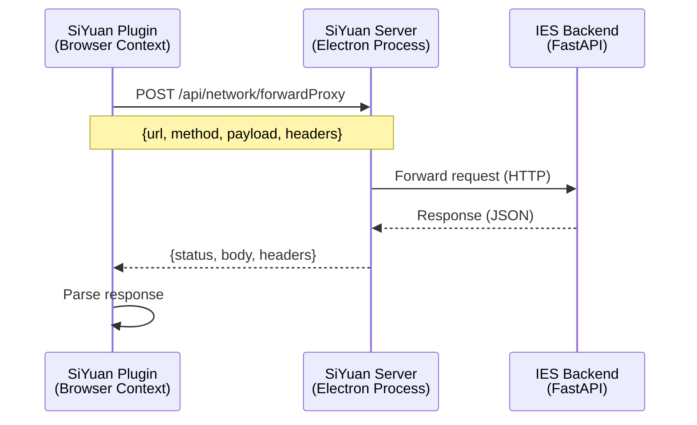
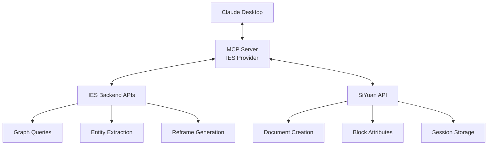

# 4.4 APIs and MCP Integration

**Purpose:** This document provides a complete API endpoint inventory across all backend routers, request/response schemas, SiYuan forwardProxy integration, and MCP integration patterns.

**Date:** December 6, 2025
**Implementation Status:** ✅ Backend APIs Production Ready | ⚠️ MCP Integration Planned

---

## Table of Contents

1. [API Overview](#api-overview)
2. [Complete Endpoint Inventory](#complete-endpoint-inventory)
3. [Request/Response Schemas](#requestresponse-schemas)
4. [SiYuan forwardProxy Integration](#siyuan-forwardproxy-integration)
5. [MCP Integration (Planned)](#mcp-integration-planned)
6. [Multi-Model Consultation](#multi-model-consultation)

---

## API Overview

The IES backend exposes 10 FastAPI routers providing access to knowledge graph, capture, thinking, flow, reframes, personal graph, templates, books, and question engine.

### Service Architecture

```mermaid
graph TD
    A[FastAPI Application] --> B[/profile - Profile API]
    A --> C[/session - Session API]
    A --> D[/question-engine - Question Engine API]
    A --> E[/graph - Graph API]
    A --> F[/books - Books API]
    A --> G[/capture - Capture API]
    A --> H[/thinking - Thinking API]
    A --> I[/flow - Flow Session API]
    A --> J[/reframes - Reframe API]
    A --> K[/personal - Personal Graph API]
    A --> L[/templates - Template API]

    E --> M[book_entities router - Entity by Book]
```

**Router Registration:** `ies/backend/src/ies_backend/main.py` (lines 37-50)

```python
# Include routers
app.include_router(profile.router, prefix="/profile", tags=["profile"])
app.include_router(session.router, prefix="/session", tags=["session"])
app.include_router(question_engine.router, prefix="/question-engine", tags=["question-engine"])
app.include_router(graph.router, prefix="/graph", tags=["graph"])
app.include_router(book_entities.router, prefix="/graph", tags=["graph"])
app.include_router(journey.router, tags=["journeys"])
app.include_router(capture.router, tags=["capture"])
app.include_router(thinking.router, tags=["thinking"])
app.include_router(flow_session.router, tags=["flow"])
app.include_router(reframe.router, prefix="/reframes", tags=["reframes"])
app.include_router(personal.router, tags=["personal"])
app.include_router(books.router, tags=["books"])
app.include_router(template.router, tags=["templates"])
```

### Health Check

```
GET /health
```

**Response:**
```json
{
  "status": "healthy"
}
```

---

## Complete Endpoint Inventory

### 1. Capture API (`/capture`)

**Purpose:** Quick capture queue management

| Method | Endpoint | Purpose | Request | Response |
|--------|----------|---------|---------|----------|
| POST | `/capture` | Create capture | `CaptureCreateRequest` | `CaptureItem` |
| GET | `/capture` | List captures | `?status=queued&limit=50` | `CaptureItem[]` |
| PUT | `/capture/{id}` | Update capture | `CaptureUpdateRequest` | `CaptureItem` |
| DELETE | `/capture/{id}` | Delete capture | — | `{success: bool}` |
| POST | `/capture/{id}/process` | Process capture (legacy) | — | `ProcessingResult` |

**Source:** `ies/backend/src/ies_backend/api/capture.py`

---

### 2. Thinking API (`/thinking`)

**Purpose:** Thinking session lifecycle

| Method | Endpoint | Purpose | Request | Response |
|--------|----------|---------|---------|----------|
| POST | `/thinking/start` | Start session | `{capture_id: str}` | `ThinkingSession` |
| POST | `/thinking/{id}/step` | Record breadcrumb | `Breadcrumb` | `ThinkingSession` |
| POST | `/thinking/{id}/complete` | Complete session | — | `ThinkingSession` |

**Source:** `ies/backend/src/ies_backend/api/thinking.py`

---

### 3. Flow Session API (`/flow`)

**Purpose:** Flow session lifecycle and synthesis

| Method | Endpoint | Purpose | Request | Response |
|--------|----------|---------|---------|----------|
| POST | `/flow/open-from-session` | Create from thinking session | `{session_id: str}` | `FlowSession` |
| POST | `/flow/{id}/step` | Record exploration step | `{node_id: str, edge: tuple}` | `FlowSession` |
| POST | `/flow/{id}/synthesize` | Generate insights | — | `SynthesisResult` |
| GET | `/flow/{id}/journey` | Get breadcrumbs | — | `Breadcrumb[]` |

**Source:** `ies/backend/src/ies_backend/api/flow_session.py`

---

### 4. Graph API (`/graph`)

**Purpose:** Entity search, exploration, and stats

| Method | Endpoint | Purpose | Request | Response |
|--------|----------|---------|---------|----------|
| GET | `/graph/entities` | Search entities | `?search=term&type=concept&limit=20` | `Entity[]` |
| GET | `/graph/entities/{name}` | Get entity details | — | `EntityDetail` |
| GET | `/graph/entities/{name}/relationships` | Get relationships | `?type=PART_OF` | `Relationship[]` |
| GET | `/graph/entities/{name}/sources` | Get source books | — | `Book[]` |
| GET | `/graph/stats` | Graph statistics | — | `{total_entities, total_books, ...}` |
| GET | `/graph/entities/by-book/{hash}` | Entities by book hash | `?title=...&types=...&limit=500` | `BookEntitiesResponse` |
| GET | `/graph/entities/by-calibre-id/{id}` | Entities by Calibre ID | — | `CalibreEntitiesResponse` |

**Source:** `ies/backend/src/ies_backend/api/graph.py`, `book_entities.py`

---

### 5. Books API (`/books`)

**Purpose:** Calibre library catalog access

| Method | Endpoint | Purpose | Request | Response |
|--------|----------|---------|---------|----------|
| GET | `/books` | List books | `?search=ADHD&limit=100` | `{books: Book[], total: int}` |
| GET | `/books/{calibre_id}` | Get single book | — | `Book` |
| GET | `/books/{calibre_id}/cover` | Get cover image | — | JPEG binary |
| HEAD | `/books/{calibre_id}/file` | Get file metadata | — | Headers (size, type) |
| GET | `/books/{calibre_id}/file` | Serve book file | — | epub or pdf binary |

**Source:** `ies/backend/src/ies_backend/api/books.py`

---

### 6. Reframe API (`/reframes`)

**Purpose:** Claude-generated metaphors and analogies

| Method | Endpoint | Purpose | Request | Response |
|--------|----------|---------|---------|----------|
| GET | `/reframes/concepts/{id}/reframes` | Get cached reframes | — | `Reframe[]` |
| POST | `/reframes/concepts/{id}/reframes/generate` | Generate reframes | `{count: int, types: str[]}` | `Reframe[]` |
| POST | `/reframes/{id}/feedback` | Vote on reframe | `{helpful: bool}` | `{success: bool}` |

**Source:** `ies/backend/src/ies_backend/api/reframe.py`

---

### 7. Personal Graph API (`/personal`)

**Purpose:** ADHD-friendly spark/insight capture

| Method | Endpoint | Purpose | Request | Response |
|--------|----------|---------|---------|----------|
| POST | `/personal/sparks` | Create spark | `SparkCreateRequest` | `Spark` |
| GET | `/personal/sparks/{id}` | Get spark | — | `Spark` |
| POST | `/personal/sparks/{id}/visit` | Record visit | — | `{success: bool}` |
| POST | `/personal/sparks/{id}/promote` | Promote to insight | `{insight_title?: str}` | `Insight` |
| GET | `/personal/sparks/by-resonance/{signal}` | Find by resonance | — | `Spark[]` |
| GET | `/personal/sparks/by-energy/{level}` | Find by energy | — | `Spark[]` |
| GET | `/personal/sparks/unvisited` | Get unvisited | — | `Spark[]` |
| GET | `/personal/stats` | Personal stats | — | `PersonalStats` |

**Source:** `ies/backend/src/ies_backend/api/personal.py`

---

### 8. Template API (`/templates`)

**Purpose:** Thinking templates for structured sessions

| Method | Endpoint | Purpose | Request | Response |
|--------|----------|---------|---------|----------|
| GET | `/templates/{template_id}` | Get template | — | `ThinkingTemplate` |

**Available Templates:**
- `learning-mechanism-map` — Learning mode: understand mechanisms
- `articulating-clarify-intuition` — Articulating mode: clarify vague thoughts

**Source:** `ies/backend/src/ies_backend/api/template.py`

---

### 9. Session API (`/session`)

**Purpose:** Structured thinking dialogue

| Method | Endpoint | Purpose | Request | Response |
|--------|----------|---------|---------|----------|
| POST | `/session/start` | Start session | `{mode: str, topic: str, profile_id?: str}` | `SessionResponse` |
| POST | `/session/message` | Send message | `{session_id: str, content: str}` | `SessionResponse` |
| POST | `/session/end` | End session | `{session_id: str}` | `SessionEndResponse` |

**Source:** `ies/backend/src/ies_backend/api/session.py`

---

### 10. Question Engine API (`/question-engine`)

**Purpose:** Adaptive question generation

| Method | Endpoint | Purpose | Request | Response |
|--------|----------|---------|---------|----------|
| POST | `/question-engine/detect-state` | Detect user state | `{messages: Message[]}` | `{state: str, confidence: float}` |
| POST | `/question-engine/select-approach` | Select approach | `{state: str, mode?: str}` | `{approach: str, rationale: str}` |
| GET | `/question-engine/templates/{approach}` | Get templates | — | `QuestionTemplate[]` |
| POST | `/question-engine/generate-questions` | Full pipeline | `QuestionGenerationRequest` | `QuestionGenerationResponse` |
| GET | `/question-engine/question-classes` | List classes | — | `{classes: QuestionClassInfo[]}` |
| GET | `/question-engine/approach-classes` | Approach mappings | — | `{mappings: dict}` |

**Source:** `ies/backend/src/ies_backend/api/question_engine.py` (400 lines)

---

### 11. Profile API (`/profile`)

**Purpose:** User cognitive profile management

| Method | Endpoint | Purpose | Request | Response |
|--------|----------|---------|---------|----------|
| GET | `/profile/{user_id}` | Get profile | — | `CognitiveProfile` |
| PUT | `/profile/{user_id}` | Update profile | `CognitiveProfile` | `CognitiveProfile` |

**Source:** `ies/backend/src/ies_backend/api/profile.py`

---

### 12. Journey API (`/journeys`)

**Purpose:** Breadcrumb tracking and retrieval

| Method | Endpoint | Purpose | Request | Response |
|--------|----------|---------|---------|----------|
| POST | `/journeys` | Create journey | `JourneyCreateRequest` | `Journey` |
| GET | `/journeys/{id}` | Get journey | — | `Journey` |
| POST | `/journeys/{id}/breadcrumbs` | Add breadcrumb | `Breadcrumb` | `Journey` |

**Source:** `ies/backend/src/ies_backend/api/journey.py`

---

## Request/Response Schemas

### Key Schemas

#### CaptureCreateRequest

```python
class CaptureCreateRequest(BaseModel):
    raw_text: str
    source: CaptureSource  # ios_shortcut, readest, browser, mcp, manual, other
    context_snippet: str | None = None
    user_id: str = "default_user"
```

#### CaptureItem

```python
class CaptureItem(BaseModel):
    id: str
    user_id: str
    raw_text: str
    source: CaptureSource
    context_snippet: str | None
    status: CaptureStatus  # queued, in_thinking, integrated
    created_at: str
    updated_at: str
    entities: list[str]
    topics: list[str]
```

#### ThinkingSession

```python
class ThinkingSession(BaseModel):
    id: str
    user_id: str
    capture_id: str
    siyuan_note_id: str | None
    angles: list[Angle]
    entities: list[str]
    breadcrumbs: list[Breadcrumb]
    status: ThinkingStatus  # active, completed
    created_at: str
    completed_at: str | None
```

#### FlowSession

```python
class FlowSession(BaseModel):
    id: str
    user_id: str
    origin: FlowOrigin  # thinking_session, entity_search, bookmark
    visited_nodes: list[str]
    visited_edges: list[tuple[str, str]]
    breadcrumbs: list[Breadcrumb]
    insights: list[str]
    created_at: str
    completed_at: str | None
```

#### QuestionGenerationRequest

```python
class QuestionGenerationRequest(BaseModel):
    user_state: str  # flowing, stuck, overwhelmed, exploring, confused, drifting
    mode: str  # learning, articulating, planning, ideating, reflecting
    topic: str
    profile: CognitiveProfile | None = None
    recent_messages: list[Message] = []
```

#### QuestionGenerationResponse

```python
class QuestionGenerationResponse(BaseModel):
    classified_questions: list[ClassifiedQuestion]
    approach: str  # Socratic, Solution-Focused, etc.
    state_detected: str
```

#### ClassifiedQuestion

```python
class ClassifiedQuestion(BaseModel):
    question: str
    question_class: QuestionClass  # schema_probe, causal, anchor, etc.
    hint: str | None  # Cognitive scaffolding
    response_starter: str | None  # Optional sentence starter
    related_entities: list[str] = []
```

#### Book

```python
class Book(BaseModel):
    calibre_id: int
    title: str
    author: str
    path: str
```

#### BookEntitiesResponse

```python
class BookEntitiesResponse(BaseModel):
    book_hash: str
    entities: list[EntityMention]
    total: int
```

#### CalibreEntitiesResponse

```python
class CalibreEntitiesResponse(BaseModel):
    calibre_id: int
    entities: list[EntityMention]
    total: int
```

#### EntityMention

```python
class EntityMention(BaseModel):
    name: str
    type: str  # concept, person, theory, framework, assessment
    mention_count: int
```

#### Reframe

```python
class Reframe(BaseModel):
    id: str
    concept_id: str
    type: ReframeType  # metaphor, analogy, story, pattern, contrast
    content: str
    helpful_votes: int
    confusing_votes: int
    created_at: str
```

#### ThinkingTemplate

```python
class ThinkingTemplate(BaseModel):
    id: str
    name: str
    mode: str  # learning, articulating, planning, ideating, reflecting
    description: str
    sections: list[TemplateSection]
    graph_mapping: GraphMapping
    ai_behavior: AIBehavior
```

#### SessionEndResponse

```python
class SessionEndResponse(BaseModel):
    doc_id: str
    entities_created: int
    entities_updated: int
    key_insights: list[str]
    open_questions: list[str]
    summary: str
```

---

## SiYuan forwardProxy Integration

The SiYuan plugin cannot directly call external APIs due to browser sandboxing. Instead, it uses SiYuan's `forwardProxy` feature to make backend API calls.

### Architecture



### Implementation

**Function:** `callBackendApi()`

**Source:** `.worktrees/siyuan/ies/plugin/src/utils/siyuan-structure.ts` (lines 334-383)

```typescript
export async function callBackendApi<T = any>(
    method: string,
    endpoint: string,
    body?: any
): Promise<T | null> {
    const backendUrl = getBackendUrl();  // http://192.168.86.60:8081
    const url = `${backendUrl}${endpoint}`;

    console.log('[IES] callBackendApi:', method, url);

    const payload: any = {
        url: url,
        method: method.toUpperCase(),
        timeout: 30000,
        contentType: 'application/json',
        headers: [],
    };

    if (body) {
        payload.payload = body;
    }

    try {
        const response = await fetchSyncPost('/api/network/forwardProxy', payload);
        console.log('[IES] forwardProxy response:', JSON.stringify(response));

        if (response.code !== 0) {
            console.error('[IES] Proxy error:', response.code, response.msg);
            throw new Error(`Proxy error: ${response.msg}`);
        }

        const proxyData = response.data;
        if (!proxyData) {
            console.error('[IES] Proxy returned empty data');
            throw new Error('Proxy returned empty data');
        }

        if (proxyData.status < 200 || proxyData.status >= 300) {
            console.error('[IES] Backend error:', proxyData.status, proxyData.body);
            throw new Error(`Backend returned ${proxyData.status}`);
        }

        const result = typeof proxyData.body === 'string' ? JSON.parse(proxyData.body) : proxyData.body;
        console.log('[IES] Backend result:', result);
        return result as T;
    } catch (err) {
        console.error('[IES] callBackendApi failed:', err);
        throw err;
    }
}
```

### Usage Examples

**Create Spark:**

```typescript
const spark = await callBackendApi<SparkResponse>('POST', '/personal/sparks', {
    content: "Does shame block executive function?",
    title: "EF and Shame Connection",
    resonance_signal: "curiosity",
    energy_level: "medium"
});
// Returns: {id: "spark_abc123", content: "...", created_at: "..."}
```

**Fetch Template:**

```typescript
const template = await callBackendApi<ThinkingTemplate>('GET', '/templates/learning-mechanism-map');
// Returns: {id: "learning-mechanism-map", sections: [...], ...}
```

**Generate Reframes:**

```typescript
const reframes = await callBackendApi<Reframe[]>('POST', '/reframes/concepts/executive-function/reframes/generate', {
    count: 5,
    types: ["metaphor", "analogy"]
});
// Returns: [{type: "metaphor", content: "The brain's CEO"}, ...]
```

### Backend URL Configuration

**Default:** `http://192.168.86.60:8081` (host IP, since SiYuan runs in Docker)

**User-Configurable:**
- Settings store (workspace-persisted, primary)
- localStorage (`ies.backendUrl`, fallback)

**Function:** `getBackendUrl()`

**Source:** `.worktrees/siyuan/ies/plugin/src/utils/siyuan-structure.ts` (lines 121-141)

```typescript
export function getBackendUrl(): string {
    // Primary: Settings store (workspace-persisted)
    const settings = getSettingsSync();
    if (settings?.backendUrl) {
        return settings.backendUrl;
    }

    // Fallback: localStorage (backward compatibility)
    if (typeof window !== 'undefined' && window?.localStorage) {
        try {
            const stored = window.localStorage.getItem('ies.backendUrl');
            if (stored) {
                return stored;
            }
        } catch (err) {
            console.warn('[IES] Unable to read backend URL from localStorage:', err);
        }
    }

    return DEFAULT_BACKEND_URL;  // http://192.168.86.60:8081
}
```

### Health Check

**Purpose:** Verify backend connectivity before making requests

**Source:** `.worktrees/siyuan/ies/plugin/src/utils/siyuan-structure.ts` (lines 174-205)

```typescript
export async function checkBackendHealth(options: { force?: boolean } = {}): Promise<BackendHealth> {
    const force = options.force ?? false;
    const now = Date.now();
    const backendUrl = getBackendUrl();

    // Use cached result if within TTL (30 seconds)
    if (!force && cachedHealthStatus && (now - cachedHealthTimestamp < HEALTH_CACHE_TTL_MS)) {
        return cachedHealthStatus;
    }

    try {
        const response = await callBackendApi<{ status: string }>('GET', '/health');
        const result: BackendHealth = {
            ok: response?.status === 'healthy',
            backendUrl,
            checkedAt: now,
            message: response?.status === 'healthy' ? 'Backend reachable' : 'Unexpected response'
        };
        cachedHealthStatus = result;
        cachedHealthTimestamp = now;
        return result;
    } catch (err) {
        const result: BackendHealth = {
            ok: false,
            backendUrl,
            checkedAt: now,
            message: err?.message || 'No response from backend'
        };
        cachedHealthStatus = result;
        cachedHealthTimestamp = now;
        return result;
    }
}
```

**Dashboard Integration:**

Dashboard checks backend health on mount and displays status indicator.

---

## MCP Integration (Planned)

Model Context Protocol (MCP) will enable Claude Desktop to access IES as a tool provider.

### Planned Architecture



### Planned MCP Tools

**1. Graph Search Tool**

```python
@mcp_tool("ies_graph_search")
async def graph_search(query: str, entity_types: list[str] = None) -> list[Entity]:
    """Search IES knowledge graph for entities matching query."""
    return await graph_service.search_entities(query, types=entity_types)
```

**Example Usage (Claude Desktop):**

```
User: Find concepts related to executive function

Claude: <use_tool name="ies_graph_search">
          {"query": "executive function", "entity_types": ["concept"]}
        </use_tool>

Result: [
  {"name": "Working Memory", "type": "concept", "mention_count": 142},
  {"name": "Inhibitory Control", "type": "concept", "mention_count": 98},
  ...
]

Claude: I found 12 concepts related to executive function. The most frequently mentioned are:
1. Working Memory (142 mentions)
2. Inhibitory Control (98 mentions)
...
```

**2. Capture Tool**

```python
@mcp_tool("ies_capture")
async def capture(content: str, source: str = "mcp_tool") -> CaptureItem:
    """Capture thought to IES quick capture queue."""
    return await capture_service.create_capture(
        raw_text=content,
        source=CaptureSource.MCP_TOOL
    )
```

**3. Generate Reframe Tool**

```python
@mcp_tool("ies_reframe")
async def generate_reframe(concept: str, reframe_type: str = "metaphor") -> Reframe:
    """Generate metaphor or analogy for concept."""
    reframes = await reframe_service.generate_reframes(
        concept_id=concept,
        count=1,
        types=[reframe_type]
    )
    return reframes[0]
```

**4. Journey Synthesis Tool**

```python
@mcp_tool("ies_synthesize_journey")
async def synthesize_journey(flow_session_id: str) -> SynthesisResult:
    """Generate insights from exploration journey."""
    return await flow_service.generate_synthesis(flow_session_id)
```

### MCP Server Implementation (Future)

**Planned File:** `ies/mcp_server/ies_provider.py`

```python
from mcp import MCPServer, Tool, ToolResult

class IESMCPProvider(MCPServer):
    """MCP server providing IES tools to Claude Desktop."""

    def __init__(self):
        super().__init__(name="IES", version="0.1.0")
        self.graph_service = GraphService()
        self.capture_service = CaptureService()
        self.reframe_service = ReframeService()
        self.flow_service = FlowSessionService()

        # Register tools
        self.register_tool(Tool(
            name="ies_graph_search",
            description="Search IES knowledge graph",
            handler=self.graph_search
        ))
        self.register_tool(Tool(
            name="ies_capture",
            description="Capture thought to quick capture queue",
            handler=self.capture
        ))
        # ... register other tools

    async def graph_search(self, query: str, entity_types: list[str] = None) -> ToolResult:
        """Search graph for entities."""
        entities = await self.graph_service.search_entities(query, types=entity_types)
        return ToolResult(content=entities, success=True)

    async def capture(self, content: str, source: str = "mcp_tool") -> ToolResult:
        """Create capture item."""
        capture = await self.capture_service.create_capture(
            raw_text=content,
            source=CaptureSource.MCP_TOOL
        )
        return ToolResult(content=capture, success=True)

# Start server
if __name__ == "__main__":
    server = IESMCPProvider()
    server.run()
```

### MCP Configuration

**File:** `~/.config/claude/mcp.json`

```json
{
  "mcpServers": {
    "ies": {
      "command": "python",
      "args": ["/path/to/ies/mcp_server/ies_provider.py"],
      "env": {
        "NEO4J_URI": "bolt://localhost:7687",
        "NEO4J_USER": "neo4j",
        "NEO4J_PASSWORD": "brainexplore"
      }
    }
  }
}
```

---

## Multi-Model Consultation

IES supports consulting multiple AI models for different tasks.

### Current Model Usage

| Task | Model | Rationale |
|------|-------|-----------|
| **Entity Extraction** | GPT-4 | Better entity recognition than GPT-3.5 |
| **Reframe Generation** | Claude Sonnet 4 | More creative metaphors and analogies |
| **Question Generation** | Claude Sonnet 4 | Better at adaptive questioning |
| **Journey Synthesis** | Claude Sonnet 4 | Superior insight extraction from patterns |
| **State Detection** | GPT-3.5 Turbo | Faster, cheaper for simple classification |

### Planned: Local Ollama Integration

**Purpose:** Allow users to run local models for privacy and cost savings.

**Configuration:** SiYuan Settings panel (planned)

```typescript
interface ModelConfig {
    provider: 'openai' | 'anthropic' | 'ollama';
    model: string;
    apiKey?: string;  // Not needed for Ollama
    ollamaUrl?: string;  // e.g., http://localhost:11434
}

interface IESSettings {
    chatModel: ModelConfig;
    embeddingModel: ModelConfig;
    extractionModel: ModelConfig;
    backendUrl: string;
    preferredNotebooks: string[];
}
```

**Usage:**

```typescript
// User configures in Settings panel
const settings: IESSettings = {
    chatModel: {
        provider: 'ollama',
        model: 'llama3:70b',
        ollamaUrl: 'http://localhost:11434'
    },
    embeddingModel: {
        provider: 'ollama',
        model: 'nomic-embed-text',
        ollamaUrl: 'http://localhost:11434'
    },
    extractionModel: {
        provider: 'openai',
        model: 'gpt-4',
        apiKey: 'sk-...'
    }
    // ...
};

// Backend receives model config from plugin
const response = await session_service.generate_response(
    message,
    model_config=settings.chatModel
);
```

**Backend Implementation (Future):**

```python
class ModelRouter:
    """Route requests to appropriate model."""

    async def generate_text(
        self,
        prompt: str,
        model_config: ModelConfig
    ) -> str:
        """Generate text using configured model."""

        if model_config.provider == "openai":
            return await self._openai_generate(prompt, model_config)
        elif model_config.provider == "anthropic":
            return await self._anthropic_generate(prompt, model_config)
        elif model_config.provider == "ollama":
            return await self._ollama_generate(prompt, model_config)
        else:
            raise ValueError(f"Unknown provider: {model_config.provider}")

    async def _ollama_generate(self, prompt: str, config: ModelConfig) -> str:
        """Call local Ollama instance."""
        async with aiohttp.ClientSession() as session:
            async with session.post(
                f"{config.ollama_url}/api/generate",
                json={"model": config.model, "prompt": prompt}
            ) as resp:
                result = await resp.json()
                return result["response"]
```

### Multi-Model Consultation Pattern

**Use Case:** Generate reframes using multiple models, let user choose best

```python
async def generate_reframes_multi_model(concept: str) -> list[Reframe]:
    """Generate reframes using multiple models."""

    # Generate 3 reframes from each model
    claude_reframes = await reframe_service.generate_reframes(
        concept,
        count=3,
        model="claude-sonnet-4"
    )

    gpt4_reframes = await reframe_service.generate_reframes(
        concept,
        count=3,
        model="gpt-4"
    )

    ollama_reframes = await reframe_service.generate_reframes(
        concept,
        count=3,
        model="llama3:70b"
    )

    # Combine and let user vote
    all_reframes = claude_reframes + gpt4_reframes + ollama_reframes
    return all_reframes
```

---

## References

**API Implementation Files:**
- `ies/backend/src/ies_backend/api/` (all router files)
- `ies/backend/src/ies_backend/schemas/` (all schema files)
- `ies/backend/src/ies_backend/main.py` (router registration)

**SiYuan Integration:**
- `.worktrees/siyuan/ies/plugin/src/utils/siyuan-structure.ts` (callBackendApi, checkBackendHealth)

**Design Documents:**
- `docs/plans/2025-12-04-reframe-template-integration-design.md` (Reframe + Template APIs)
- `docs/plans/2025-12-04-calibre-integration-design.md` (Books API)

**Tests:**
- `ies/backend/tests/` (94/94 passing)

**Related:**
- `4.1-SiYuan-Structure.md` — Plugin structure
- `4.2-Backend-Pipeline.md` — Processing pipelines
- `4.3-Agent-Architecture.md` — Agent roles

---

*This document provides the complete API reference. For MCP integration development, see Phase 3 roadmap. For multi-model consultation, see Settings panel design document.*
