# 5.1 Graph Visualizations

**Purpose:** Document the visual graph systems in IES—how concepts, relationships, and knowledge networks are rendered for ADHD-friendly exploration.

**Last Updated:** 2025-12-06

---

## Overview

IES uses multiple visualization patterns to make knowledge graphs accessible and navigable. Each pattern serves different cognitive needs and exploration modes.

**Design Philosophy:**
- **Grouped display over node-link diagrams** — Relationships clustered by type, not spaghetti graphs
- **Type-specific colors** — Consistent visual language for entity types
- **Progressive disclosure** — Collapse/expand groups to manage cognitive load
- **Click-to-explore** — Every entity is a navigation point

---

## Graph Visualization Types

### 1. Relationship Clustering (Primary Pattern)

**Purpose:** Organize connected entities by relationship type to reveal semantic structure

**Used In:**
- SiYuan FlowMode relationship panel
- Readest Flow Panel relationships section

**Visual Structure:**

```
┌─────────────────────────────────────┐
│ SUPPORTS (3)                    [▼] │
├─────────────────────────────────────┤
│ • Working Memory (Concept)          │
│ • Inhibition (Concept)              │
│ • Cognitive Flexibility (Concept)   │
└─────────────────────────────────────┘

┌─────────────────────────────────────┐
│ COMPONENT_OF (2)                [▼] │
├─────────────────────────────────────┤
│ • Barkley's EF Model (Theory)       │
│ • Diamond's Framework (Framework)   │
└─────────────────────────────────────┘
```

**Implementation (FlowMode.svelte lines 528-554):**

```svelte
<div class="relationships">
    {#each [...groupedNodes.entries()] as [relType, relNodes], groupIndex}
        <div class="rel-group" style="--delay: {groupIndex * 60}ms">
            <div class="rel-header">
                <span class="rel-direction" class:outgoing={relNodes[0]?.direction === 'outgoing'}>
                    {relNodes[0]?.direction === 'outgoing' ? '→' : '←'}
                </span>
                <span class="rel-type">{formatRelType(relType)}</span>
                <span class="rel-count">{relNodes.length}</span>
            </div>
            <div class="rel-nodes">
                {#each relNodes as node, nodeIndex}
                    <button class="node-chip"
                            style="--delay: {(groupIndex * 60) + (nodeIndex * 30)}ms;
                                   --type-color: {getTypeColor(node.type)}"
                            on:click={() => exploreConcept(node.name)}>
                        <span class="node-indicator"></span>
                        <span class="node-name">{node.name}</span>
                    </button>
                {/each}
            </div>
        </div>
    {/each}
</div>
```

**Styling Features:**
- Staggered animation: Each group delays by 60ms, entities within by 30ms
- Direction indicators: → (outgoing) / ← (incoming) relationships
- Type color: Small dot indicator colored by entity type
- Hover effects: Card lifts slightly, shadow increases

**Readest Implementation (RelationshipsSection.tsx lines 66-99):**

```typescript
<section className='space-y-4'>
    <div className='flow-section-header'>
        <LuLink size={12} />
        {_('Relationships')} ({relationships.length})
    </div>

    <div className='space-y-4'>
        {Object.entries(groupedRelationships).map(([type, rels]) => (
            <div key={type} className='flow-card p-4'>
                <div className='mb-3'>
                    <span className={getRelationshipBadgeClass(type)}>
                        {getRelationshipLabel(type)}
                    </span>
                </div>
                <ul className='space-y-2'>
                    {rels.map((rel, index) => (
                        <li key={`${rel.target.id}-${index}`}>
                            <button className='relationship-card group flex w-full items-center justify-between'>
                                <span className='text-sm font-medium group-hover:text-primary transition-colors'>
                                    {rel.target.name}
                                </span>
                                <LuChevronRight size={16} />
                            </button>
                        </li>
                    ))}
                </ul>
            </div>
        ))}
    </div>
</section>
```

---

### 2. Entity Type Color System

**Purpose:** Provide instant visual identification of entity types across all views

**Color Palette (from UNIFIED-DESIGN-SYSTEM.md):**

```css
/* Entity Type Colors */
--ies-entity-concept: #2563eb;      /* Blue - Ideas and principles */
--ies-entity-person: #059669;       /* Green - Researchers and authors */
--ies-entity-theory: #7c3aed;       /* Purple - Frameworks and models */
--ies-entity-framework: #ea580c;    /* Orange - Structured approaches */
--ies-entity-assessment: #dc2626;   /* Red - Evaluation tools */

/* Entity Background Colors (12% opacity) */
--ies-entity-concept-bg: rgba(37, 99, 235, 0.12);
--ies-entity-person-bg: rgba(5, 150, 105, 0.12);
--ies-entity-theory-bg: rgba(124, 58, 237, 0.12);
--ies-entity-framework-bg: rgba(234, 88, 12, 0.12);
--ies-entity-assessment-bg: rgba(220, 38, 38, 0.12);
```

**Visual Representation:**

```
┌─────────────────────────────────────┐
│ 🔵 Executive Function     (Concept) │
│ 🟢 Russell Barkley        (Person)  │
│ 🟣 Barkley's EF Model     (Theory)  │
│ 🟠 Diamond's Framework    (Framework)│
│ 🔴 BRIEF-2                (Assessment)│
└─────────────────────────────────────┘
```

**Entity Chip Implementation (design-system.scss lines 231-265):**

```scss
.ies-entity-chip {
  display: inline-flex;
  align-items: center;
  gap: var(--ies-space-1);
  padding: var(--ies-space-1) var(--ies-space-2);
  font-size: var(--ies-text-xs);
  font-weight: var(--ies-font-semibold);
  border-radius: var(--ies-radius-chip);
  transition: var(--ies-transition-fast);

  &--concept {
    color: var(--ies-entity-concept);
    background: var(--ies-entity-concept-bg);
  }

  &--person {
    color: var(--ies-entity-person);
    background: var(--ies-entity-person-bg);
  }

  &--theory {
    color: var(--ies-entity-theory);
    background: var(--ies-entity-theory-bg);
  }

  &--framework {
    color: var(--ies-entity-framework);
    background: var(--ies-entity-framework-bg);
  }

  &--assessment {
    color: var(--ies-entity-assessment);
    background: var(--ies-entity-assessment-bg);
  }
}
```

**Inline Entity Highlights (Readest globals.css lines 756-855):**

```css
/* Entity highlights in book text */
.entity-link {
  cursor: pointer;
  transition: all 0.2s ease;
  position: relative;
}

.entity-link:hover {
  text-decoration: underline;
}

/* Type-specific highlight colors */
.entity-concept {
  color: #2563eb;
  background-color: rgba(37, 99, 235, 0.08);
}

.entity-concept:hover {
  background-color: rgba(37, 99, 235, 0.15);
  border-bottom: 2px solid #2563eb;
}

.entity-person {
  color: #059669;
  background-color: rgba(5, 150, 105, 0.08);
}

.entity-person:hover {
  background-color: rgba(5, 150, 105, 0.15);
  border-bottom: 2px solid #059669;
}

/* ... similar patterns for theory, framework, assessment */
```

---

### 3. Journey Breadcrumb Trail

**Purpose:** Visualize exploration path with dwell time indicators

**Visual Pattern:**

```
Journey: Executive Function (45s) → Working Memory (30s) → Inhibition (20s) → Current
         ├─────────────────────┴────────────────────┴───────────────┴─────────┤
         └─────────────────── 3 previous steps ──────────────────────────────┘
                                    (+7 more)
```

**Implementation (JourneyBreadcrumb.tsx lines 1-98):**

```typescript
export function JourneyBreadcrumb({ journey, onStepClick }: Props) {
    const visibleSteps = journey.slice(-5);  // Show last 5 steps
    const overflowCount = journey.length - visibleSteps.length;

    return (
        <div className="journey-breadcrumb">
            <div className="journey-header">
                <LuRoute className="journey-icon" />
                <span>Journey</span>
                <span className="journey-marks-count">{journey.length} steps</span>
            </div>

            <div className="journey-path">
                {overflowCount > 0 && (
                    <div className="journey-overflow">+{overflowCount} more</div>
                )}

                {visibleSteps.map((step, index) => (
                    <div key={index} className="journey-step" onClick={() => onStepClick(step.entity)}>
                        <span className="step-entity">{step.entity}</span>
                        {step.dwellTime && (
                            <span className="step-dwell">
                                <LuClock /> {formatDwellTime(step.dwellTime)}
                            </span>
                        )}
                        {index < visibleSteps.length - 1 && (
                            <span className="step-arrow">→</span>
                        )}
                    </div>
                ))}
            </div>
        </div>
    );
}
```

**Dwell Time Formatting:**

```typescript
function formatDwellTime(seconds: number): string {
    if (seconds < 60) return `${seconds}s`;
    const minutes = Math.floor(seconds / 60);
    const remainingSeconds = seconds % 60;
    return `${minutes}m ${remainingSeconds}s`;
}
```

**Visual States:**
- **Clickable steps** — Previous steps are buttons for navigation
- **Current step** — Highlighted with accent color, not clickable
- **Overflow indicator** — "+N more" at start if journey > 5 steps
- **Dwell time** — Clock icon + formatted time inline with entity name

---

### 4. Entity Overlay (Inline Highlighting)

**Purpose:** Highlight entity mentions in book text for click-to-explore

**Trie-Based Matching Algorithm (entity.ts lines 38-147):**

```typescript
/**
 * Build a case-insensitive trie from entity names.
 * Supports multi-word phrases like "executive function".
 */
function buildEntityTrie(entities: EntityOverlay[]): TrieNode {
  const root: TrieNode = { children: new Map(), entity: null };

  for (const entity of entities) {
    const words = entity.name.toLowerCase().split(/\s+/);
    let node = root;

    for (const word of words) {
      if (!node.children.has(word)) {
        node.children.set(word, { children: new Map(), entity: null });
      }
      node = node.children.get(word)!;
    }

    // Mark end of entity phrase (prefer longer matches)
    if (!node.entity || entity.name.length > node.entity.name.length) {
      node.entity = entity;
    }
  }

  return root;
}

/**
 * Process text efficiently using trie-based matching.
 * O(n) where n is text length, instead of O(n*m) for regex alternations.
 */
function processTextWithTrie(text: string, trie: TrieNode): string {
    const result: string[] = [];
    const words = text.split(/(\s+)/); // Split preserving whitespace
    let i = 0;

    while (i < words.length) {
        const word = words[i];

        // Skip whitespace tokens
        if (!word || /^\s*$/.test(word)) {
            result.push(word || '');
            i++;
            continue;
        }

        // Try to match entity phrase starting at this word
        let node = trie;
        let matchEnd = i;
        let matchedEntity: EntityOverlay | null = null;
        let j = i;

        while (j < words.length) {
            const currentWord = words[j];
            if (/^\s*$/.test(currentWord || '')) {
                j++;
                continue;
            }

            const wordLower = (currentWord || '').toLowerCase();
            const nextNode = node.children.get(wordLower);

            if (!nextNode) break;

            node = nextNode;
            if (node.entity) {
                matchedEntity = node.entity;
                matchEnd = j;
            }
            j++;
        }

        if (matchedEntity) {
            // Collect matched words
            const matchedParts: string[] = [];
            for (let k = i; k <= matchEnd; k++) {
                matchedParts.push(words[k] || '');
            }
            const matchedText = matchedParts.join('');

            const typeClass = ENTITY_TYPE_CLASSES[matchedEntity.type] || 'entity-default';
            result.push(
                `<span class="entity-link ${typeClass}"
                       data-entity-name="${escapeHtmlAttr(matchedEntity.name)}"
                       data-entity-type="${escapeHtmlAttr(matchedEntity.type)}">
                    ${matchedText}
                </span>`
            );

            i = matchEnd + 1;
        } else {
            result.push(word);
            i++;
        }
    }

    return result.join('');
}
```

**Why Trie-Based (Performance Fix Dec 5):**

Previous regex approach with alternations caused catastrophic backtracking:
```typescript
// BEFORE: O(n*m) catastrophic backtracking for 100+ entities
const regex = new RegExp(`\\b(${entities.map(e => e.name).join('|')})\\b`, 'gi');
text.replace(regex, (match) => `<span class="entity-link">${match}</span>`);
```

Trie-based approach provides O(n) linear scan:
- Build trie once from entity list
- Scan text word-by-word
- Match multi-word phrases efficiently
- Prefer longest match (e.g., "Executive Function" over "Function")

**Visual Result:**

```html
<p>
    Recent research on
    <span class="entity-link entity-concept" data-entity-name="Executive Function">
        executive function
    </span>
    by
    <span class="entity-link entity-person" data-entity-name="Russell Barkley">
        Russell Barkley
    </span>
    suggests...
</p>
```

---

### 5. Filter Pill UI (Entity Type Toggles)

**Purpose:** Control which entity types are visible in overlay/flow views

**Visual Design (EntityTypeFilter.tsx lines 44-122):**

```
┌────────────────────────────────────────┐
│  Entity Overlay          [ON ●]        │
├────────────────────────────────────────┤
│  ● Concepts  ● People  ● Theories      │
│  ○ Frameworks  ○ Assessments           │
├────────────────────────────────────────┤
│         142 entities in this book      │
└────────────────────────────────────────┘
```

**Implementation:**

```typescript
<div className="entity-filter-container">
    {/* Master Toggle */}
    <div className="flow-master-toggle">
        <div className="flex items-center gap-2">
            <LuLayers size={16} className="text-primary" />
            <span className="text-sm font-semibold">Entity Overlay</span>
        </div>
        <button onClick={handleMasterToggle}
                className={entityOverlay.enabled
                    ? 'bg-primary text-primary-content'
                    : 'bg-base-content/10 text-base-content/60'}>
            {entityOverlay.enabled ? (
                <><LuEye size={14} /><span>On</span></>
            ) : (
                <><LuEyeOff size={14} /><span>Off</span></>
            )}
        </button>
    </div>

    {/* Type Pills */}
    <div className="flex flex-wrap gap-2 mt-3">
        {ENTITY_TYPES.map((config) => {
            const isVisible = isTypeVisible(config.type);
            const isDisabled = !entityOverlay.enabled;

            return (
                <button key={config.type}
                        onClick={() => handleTypeToggle(config.type)}
                        disabled={isDisabled}
                        className={`entity-type-pill ${config.pillClass}
                                    ${isVisible ? 'active' : ''}
                                    ${isDisabled ? 'disabled' : ''}`}>
                    <span className={`w-2 h-2 rounded-full
                                      ${isVisible && !isDisabled
                                          ? 'bg-current'
                                          : 'bg-base-content/30'}`} />
                    <span>{config.label}</span>
                </button>
            );
        })}
    </div>

    {/* Status indicator */}
    <div className="mt-4 flex items-center justify-center">
        {entityOverlay.loading ? (
            <span className="loading loading-spinner loading-xs"></span>
        ) : entityOverlay.enabled && (
            <span className="text-xs">
                <span className="font-semibold text-primary">
                    {entityOverlay.entities.length}
                </span> entities in this book
            </span>
        )}
    </div>
</div>
```

**Pill States:**
- **Active** — Type-specific colored background (12% opacity), filled dot
- **Inactive** — Muted appearance, empty dot
- **Disabled** — Grayed out when master toggle is OFF
- **Hover** — Slight scale increase, brighter color

**CSS Styling (globals.css lines 559-618):**

```css
.entity-type-pill {
  display: inline-flex;
  align-items: center;
  gap: 0.375rem;
  padding: 0.375rem 0.75rem;
  border-radius: 9999px;
  font-size: 0.75rem;
  font-weight: 500;
  cursor: pointer;
  transition: all 0.2s ease;
  border: 1px solid transparent;
}

.entity-type-pill.active.entity-type-concept {
  background-color: rgba(37, 99, 235, 0.12);
  color: #2563eb;
  border-color: rgba(37, 99, 235, 0.3);
}

.entity-type-pill.active.entity-type-person {
  background-color: rgba(5, 150, 105, 0.12);
  color: #059669;
  border-color: rgba(5, 150, 105, 0.3);
}

/* ... similar for theory, framework, assessment */

.entity-type-pill.disabled {
  opacity: 0.4;
  cursor: not-allowed;
}

.entity-type-pill:hover:not(.disabled) {
  transform: scale(1.05);
}
```

---

## Animation Patterns

### Staggered Entrance

**Purpose:** Reduce cognitive overwhelm by animating items sequentially

**Implementation (FlowMode.svelte CSS lines 894-912):**

```css
.result-card {
    animation: ies-slide-up var(--ies-duration-base) var(--ies-ease-cupertino) backwards;
    animation-delay: var(--delay);
}

/* In Svelte template */
<button class="result-card"
        style="--delay: {i * 40}ms"
        on:click={() => exploreConcept(result.name)}>
    <span class="result-name">{result.name}</span>
    <span class="result-type">{result.type}</span>
</button>
```

**Timing:**
- Search results: 40ms between items
- Relationship groups: 60ms between groups
- Entities within group: 30ms between items

**Animation Definitions (from design system):**

```css
@keyframes ies-slide-up {
    from {
        opacity: 0;
        transform: translateY(8px);
    }
    to {
        opacity: 1;
        transform: translateY(0);
    }
}

@keyframes ies-fade-in {
    from { opacity: 0; }
    to { opacity: 1; }
}
```

---

### Hover Micro-Interactions

**Entity Chips:**
```css
.node-chip:hover {
    background: var(--ies-accent-subtle);
    border-color: var(--ies-accent-muted);
    transform: translateY(-1px);
    box-shadow: var(--ies-shadow-xs);
}
```

**Relationship Cards:**
```css
.relationship-card:hover {
    background: var(--ies-accent-subtle);
    border-color: var(--ies-accent-muted);
    transform: translateX(4px);
}
```

**Thinking:**
- Vertical lift for clickable chips (suggests "pressing")
- Horizontal slide for navigation cards (suggests "going to")

---

## Mermaid Diagram Examples

### Concept Cloud (Unstructured Ideas)

```mermaid
graph TB
    subgraph Seedlings["Seedlings: Raw Ideas"]
        S1[🔵 "EF feels like juggling"]
        S2[🔵 "Shame blocks access"]
        S3[🔵 "Working memory = mental desktop"]
        S4[🔵 "Barkley's window metaphor"]
        S5[🔵 "Metabolization process"]
    end

    style Seedlings fill:#fff3e0
    style S1 fill:#e3f2fd,stroke:#2563eb
    style S2 fill:#e3f2fd,stroke:#2563eb
    style S3 fill:#e3f2fd,stroke:#2563eb
    style S4 fill:#e3f2fd,stroke:#2563eb
    style S5 fill:#e3f2fd,stroke:#2563eb
```

**Characteristics:**
- No hierarchical structure
- Each node independent
- Color indicates type (all Concept = blue)
- Ephemeral status (not yet formalized)

---

### Insight Tree (Hierarchical Concepts)

```mermaid
graph TB
    Root[🔵 Executive Function]

    Root --> C1[🔵 Working Memory]
    Root --> C2[🔵 Inhibition]
    Root --> C3[🔵 Cognitive Flexibility]

    C1 --> C1A[🔵 Phonological Loop]
    C1 --> C1B[🔵 Visuospatial Sketchpad]
    C1 --> C1C[🔵 Central Executive]

    C2 --> C2A[🔵 Prepotent Response]
    C2 --> C2B[🔵 Interference Control]

    style Root fill:#e3f2fd,stroke:#2563eb,stroke-width:3px
    style C1 fill:#e3f2fd,stroke:#2563eb
    style C2 fill:#e3f2fd,stroke:#2563eb
    style C3 fill:#e3f2fd,stroke:#2563eb
    style C1A fill:#e3f2fd,stroke:#2563eb,stroke-dasharray: 5 5
    style C1B fill:#e3f2fd,stroke:#2563eb,stroke-dasharray: 5 5
    style C1C fill:#e3f2fd,stroke:#2563eb,stroke-dasharray: 5 5
    style C2A fill:#e3f2fd,stroke:#2563eb,stroke-dasharray: 5 5
    style C2B fill:#e3f2fd,stroke:#2563eb,stroke-dasharray: 5 5
```



**Characteristics:**
- COMPONENT_OF relationships visualized
- Hierarchical depth shows part-whole structure
- Dashed borders indicate leaf nodes
- Root node thicker border (primary concept)

---

### Concept Planet/Orbits (Related Entities)

```mermaid
graph TB
    Center[🔵 Executive Function<br/>Central Concept]

    T1[🟣 Barkley's Model]
    T2[🟣 Diamond's Framework]
    P1[🟢 Russell Barkley]
    P2[🟢 Adele Diamond]
    A1[🔴 BRIEF-2]
    C1[🔵 Working Memory]
    C2[🔵 Inhibition]

    Center -.OPERATIONALIZES.-> T1
    Center -.OPERATIONALIZES.-> T2
    Center -.SUPPORTS.-> C1
    Center -.SUPPORTS.-> C2
    T1 -.DEVELOPS.-> P1
    T2 -.DEVELOPS.-> P2
    T1 -.MEASURED_BY.-> A1

    style Center fill:#e3f2fd,stroke:#2563eb,stroke-width:4px
    style T1 fill:#f3e5f5,stroke:#7c3aed
    style T2 fill:#f3e5f5,stroke:#7c3aed
    style P1 fill:#e8f5e9,stroke:#059669
    style P2 fill:#e8f5e9,stroke:#059669
    style A1 fill:#fce4ec,stroke:#dc2626
    style C1 fill:#e3f2fd,stroke:#2563eb
    style C2 fill:#e3f2fd,stroke:#2563eb
```



**Characteristics:**
- Center node = current entity (enlarged, thicker border)
- Surrounding nodes = related entities (color-coded by type)
- Dashed edges = relationship types (labeled)
- Multiple entity types visible at once

---

### Dialogue Question Map (Question Pathways)

```mermaid
graph TB
    Start[User Topic:<br/>"Understanding EF"]

    Q1["🏗️ Schema-Probe:<br/>What are the main components?"]
    Q2["⚡ Causal:<br/>How do they work together?"]
    Q3["⚓ Anchor:<br/>Give a concrete example"]
    Q4["🔗 Reflective-Synthesis:<br/>How does this connect?"]

    Start --> Q1
    Q1 --> |User identifies components| Q2
    Q2 --> |User explains mechanism| Q3
    Q3 --> |User provides example| Q4
    Q4 --> End[Session Complete]

    style Start fill:#fff3e0
    style Q1 fill:#e3f2fd,stroke:#4a90d9
    style Q2 fill:#fff3e0,stroke:#f4a460
    style Q3 fill:#e8f5e9,stroke:#3cb371
    style Q4 fill:#e3f2fd,stroke:#6495ed
    style End fill:#e8f5e9
```

**Characteristics:**
- Question class colors (from QUESTION_CLASS_LABELS)
- Branching paths based on user responses
- Progress flows top to bottom
- Emoji indicators for question types

---

### Temporal Evolution Map (Knowledge Growth)

```mermaid
graph LR
    subgraph Week1["Week 1: Raw Captures"]
        W1S1[Spark: EF confusion]
        W1S2[Spark: Barkley video]
        W1S3[Spark: ADHD connection]
    end

    subgraph Week2["Week 2: Seedlings"]
        W2C1[🔵 Executive Function]
        W2C2[🔵 Working Memory]
    end

    subgraph Week3["Week 3: Concepts"]
        W3T1[🟣 Barkley's EF Model]
        W3C3[🔵 Inhibition]
        W3C4[🔵 Cognitive Flexibility]
    end

    subgraph Week4["Week 4: Insights"]
        W4I1[💡 EF as juggling metaphor]
        W4I2[💡 Shame blocks EF access]
    end

    W1S1 --> W2C1
    W1S2 --> W2C1
    W1S3 --> W2C1
    W2C1 --> W3T1
    W2C2 --> W3T1
    W3T1 --> W3C3
    W3T1 --> W3C4
    W3C3 --> W4I1
    W3C4 --> W4I1
    W2C1 --> W4I2

    style Week1 fill:#fff3e0
    style Week2 fill:#e3f2fd
    style Week3 fill:#f3e5f5
    style Week4 fill:#e8f5e9
```



**Characteristics:**
- Time-based columns (weeks)
- Entity maturity progression (spark → seedling → concept → insight)
- Arrows show knowledge evolution
- Color gradient indicates lifecycle stages

---

## Cross-References

**Related Documents:**
- **0.3 Architecture Diagrams** — System-level architecture flows
- **2.3 Flow Mode Spec** — Flow Mode behavior and interactions
- **5.2 Project AST Maps** — Project decomposition visualizations
- **5.3 Flow Mode UI** — Complete UI component specifications

**Implementation Files:**
- SiYuan FlowMode: `.worktrees/siyuan/ies/plugin/src/views/FlowMode.svelte`
- Readest Flow Panel: `.worktrees/readest/readest/apps/readest-app/src/app/reader/components/flowpanel/`
- Entity Transformer: `.worktrees/readest/readest/apps/readest-app/src/services/transformers/entity.ts`
- Design System: `.worktrees/siyuan/ies/plugin/src/styles/design-system.scss`

---

**Document Version:** 1.0
**Generated:** 2025-12-06
**Verified Against:** Actual codebase implementation
