# 5.2 Project AST Maps

**Document Purpose:** Define project decomposition visualization using AST (Abstract Syntax Tree) maps for structured project planning and tracking.

**Source Files:**
- `.worktrees/siyuan/ies/plugin/src/types/blocks.ts` — DecisionBlockMeta interface (lines 185-195)
- `.worktrees/siyuan/ies/plugin/src/utils/siyuan-structure.ts` — Projects folder structure (line 88)
- `docs/IES_SiYuan_Architecture/05_Projects/README.md` — Project structure specification
- `docs/IES_SiYuan_Architecture/07_System/Templates/Template_Project_Structure.md` — 8-page project template

---

## What is a Project AST Map?

An **AST (Abstract Syntax Tree) map** for projects is a **visual decomposition** of project structure, showing:
- Goal hierarchy (root node → subgoals → tasks)
- Decision points and their rationale
- Subsystems and dependencies
- Data flows between components
- Tasks and execution order

Unlike code ASTs, project ASTs map **conceptual structure** rather than syntax. They provide a **spatial representation** of how a project decomposes from high-level goals to concrete tasks.

**Purpose:**
- **Planning:** Visualize project structure before implementation
- **Communication:** Share project architecture with collaborators
- **Decision tracking:** Document why choices were made
- **Dependency management:** Identify bottlenecks and critical paths

---

## Project AST vs. Flow Maps

| Dimension | Project AST | Flow Map (03_Flow_Maps) |
|-----------|-------------|-------------------------|
| **Purpose** | Decompose goals → tasks | Explore concept relationships |
| **Structure** | Hierarchical tree | Network graph |
| **Nodes** | Goals, Decisions, Tasks | Concepts, Entities, Questions |
| **Edges** | Dependencies, Phases | Semantic relationships |
| **Lifecycle** | Created during planning, updated during execution | Emergent during exploration |
| **Location** | `/Projects/{project}/Maps.md` | `/Flow_Maps/` |

---

## Project Decomposition Elements

### 1. Goal Tree

Root goal breaks into subgoals, which break into concrete tasks.

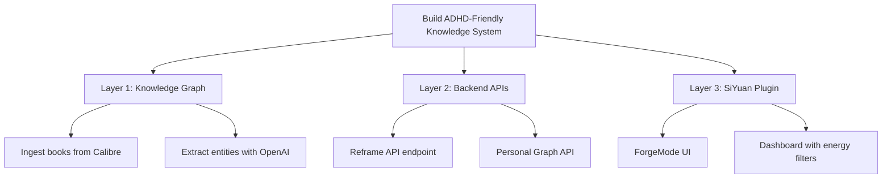

**Node Types:**
- **Goal nodes** (rectangles): High-level outcomes
- **Subgoal nodes** (rounded): Intermediate objectives
- **Task nodes** (circles): Concrete actions

### 2. Decision Points

Critical architectural choices with rationale.

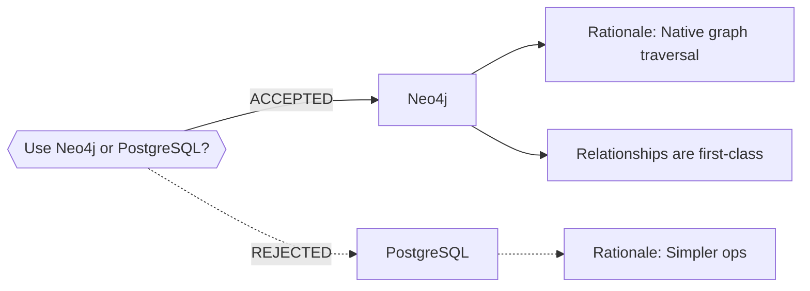

**Decision Schema (DecisionBlockMeta):**
```typescript
{
  block_type: 'decision',
  project_id: string,
  decision_status: 'pending' | 'accepted' | 'rejected' | 'revisited',
  rationale?: string,
  decided_at?: string,
  related_maps?: string[],
  related_concepts?: string[]
}
```

### 3. Subsystems and Components

Major architectural modules with internal structure.

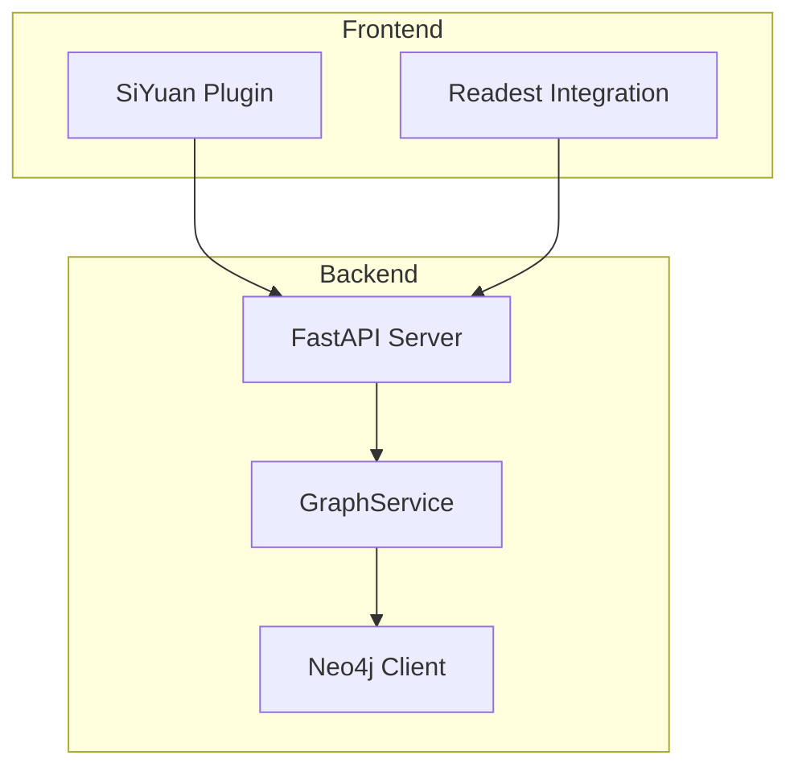

### 4. Data Flows

How information moves through the system.

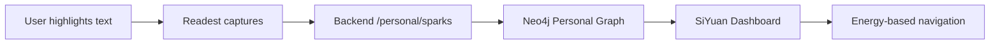

### 5. Tasks and Dependencies

Execution order with critical paths.

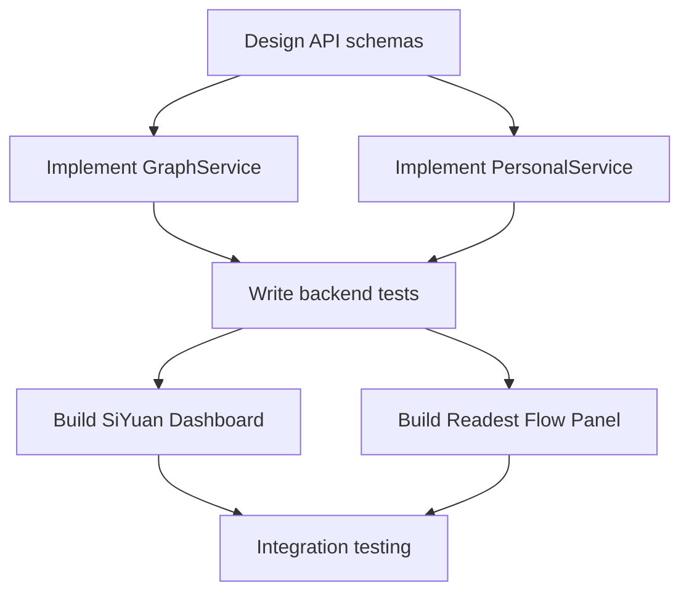

---

## Integration with /Projects/ Folder

Each project in `/Projects/` has an **8-page structure** (Template_Project_Structure.md):

| Page | AST Element | Purpose |
|------|-------------|---------|
| **README.md** | Project overview | Links to key maps and concepts |
| **Goals.md** | Goal tree | Outcomes, constraints, success criteria |
| **Questions.md** | Open questions | Unknowns, hypotheses |
| **Research.md** | References | Links to Seedlings and Concept pages |
| **Maps.md** | AST maps | Visual decomposition (THIS DOCUMENT) |
| **Decisions.md** | Decision nodes | Status, rationale, decision-blocks |
| **Plan.md** | Task graph | High-level roadmap, phases, milestones |
| **Status.md** | Current state | Recently completed, risks, blockers |
| **Logs.md** | Execution log | Chronological log-entry-blocks |

**Maps.md** contains project AST visualizations, stored as:
- Mermaid diagrams (text-based, version-controllable)
- Links to `/03_Flow_Maps/` for concept exploration
- Embedded diagrams showing goal decomposition
- Decision trees with rationale

---

## Template for Creating Project AST Maps

### Step 1: Define Root Goal

```markdown
# Project AST: [Project Name]

**Root Goal:** [Single sentence describing project outcome]

**Success Criteria:**
- [Measurable outcome 1]
- [Measurable outcome 2]
- [Measurable outcome 3]
```

### Step 2: Decompose into Subgoals

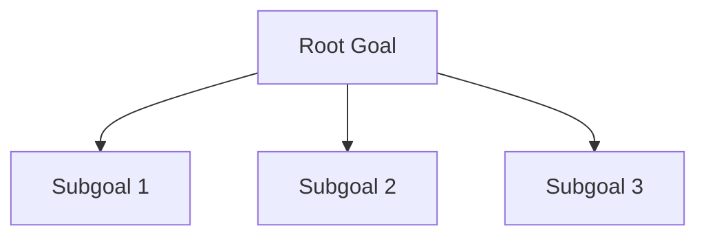

### Step 3: Add Tasks and Dependencies

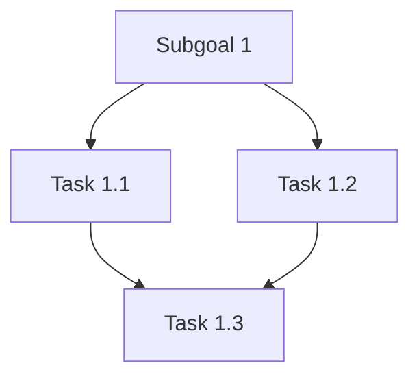

### Step 4: Document Decision Points

```markdown
## Critical Decisions

### Decision: [Decision description]
- **Status:** [pending/accepted/rejected]
- **Rationale:** [Why this choice?]
- **Decided:** [Date]
- **Related:** [[concept-page]], [[map-page]]
```

### Step 5: Add System Diagram (if applicable)

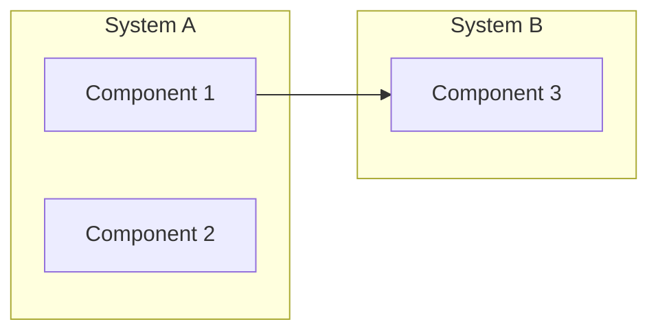

---

## Example: brain_explore Project AST

```mermaid
graph TD
    Root[Build ADHD-Friendly IES]
    Root --> L1[Layer 1: Knowledge Graph]
    Root --> L2[Layer 2: Backend]
    Root --> L3[Layer 3: SiYuan Plugin]
    Root --> L4[Layer 4: Readest]

    L1 --> L1T1[Calibre integration]
    L1 --> L1T2[Entity extraction pipeline]
    L1 --> L1T3[Auto-ingestion daemon]

    L2 --> L2T1[Reframe API]
    L2 --> L2T2[Personal Graph API]
    L2 --> L2T3[Template API]
    L2 --> L2T4[Question Engine]

    L3 --> L3T1[ForgeMode with templates]
    L3 --> L3T2[Dashboard with energy nav]
    L3 --> L3T3[Quick Capture system]
    L3 --> L3T4[Concept Extractor]

    L4 --> L4T1[Entity overlay]
    L4 --> L4T2[Flow Panel components]
    L4 --> L4T3[Journey breadcrumbs]
    L4 --> L4T4[Calibre Library browser]

    style Root fill:#d4a574
    style L1 fill:#2563eb
    style L2 fill:#059669
    style L3 fill:#7c3aed
    style L4 fill:#ea580c
```

**Key Decisions:**
- Use Neo4j for graph (ACCEPTED): Native relationship traversal
- Dual status systems (ACCEPTED): AI processing vs. user engagement
- Calibre as single source of truth (ACCEPTED): Eliminates hash/title matching fragility

---

## Mermaid Examples for Common Project Structures

### Research Project

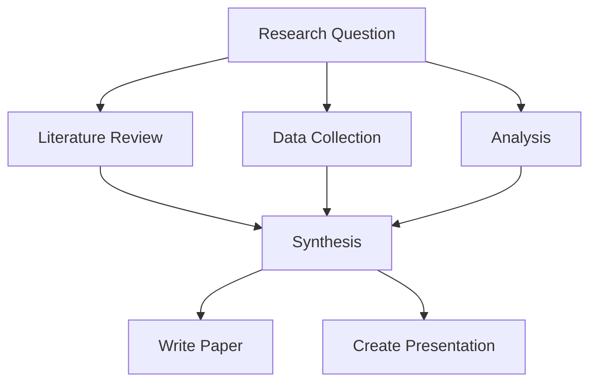

### Product Development

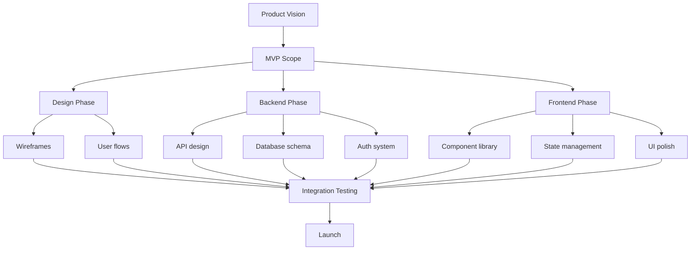

### Learning Project

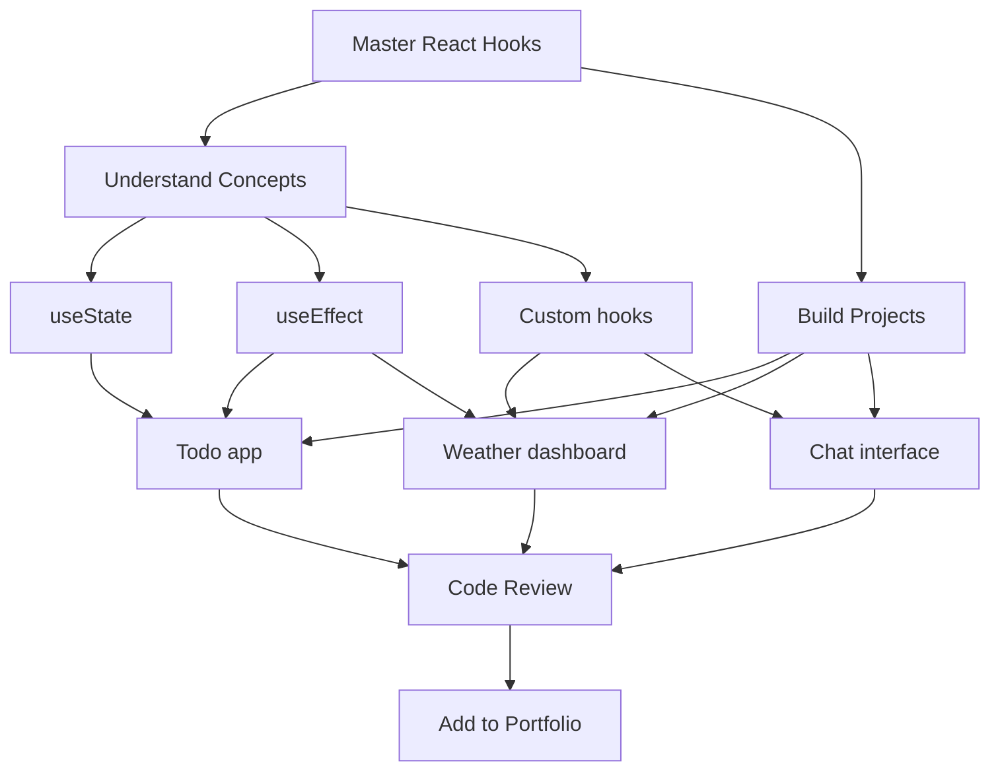

---

## Integration with Dialogue Mode

**AST maps support Planning mode in ForgeMode:**

1. **Mode Selection:** User selects "Planning" mode in ForgeMode
2. **Template Loaded:** `planning-project-structure` template (future implementation)
3. **Section 1: Goal Definition** — AI prompts for root goal and success criteria
4. **Section 2: Goal Decomposition** — AI generates goal tree visualization
5. **Section 3: Task Identification** — AI helps break subgoals into tasks
6. **Section 4: Dependency Analysis** — AI identifies critical paths
7. **Section 5: Decision Documentation** — AI prompts for key architectural choices
8. **Output:** AST map saved to `/Projects/{project}/Maps.md`

**Thinking Partner Questions (Planning Mode):**
- **Schema-Probe:** "What are the main subsystems of this project?"
- **Boundary:** "What's explicitly NOT in scope for this phase?"
- **Dimensional:** "On a spectrum from research to execution, where is this?"
- **Causal:** "What has to happen before X can start?"
- **Counterfactual:** "What if the critical dependency doesn't ship on time?"

---

## Design Rationale

**Why AST Maps for Projects?**
- **Visual clarity:** Spatial representation easier to understand than text lists
- **Dependency tracking:** Critical paths immediately visible
- **Decision documentation:** Rationale preserved in context
- **Mermaid format:** Text-based, version-controllable, renders in SiYuan
- **ADHD-friendly:** Hierarchical structure reduces cognitive load

**Why separate from Flow Maps?**
- Flow maps are **emergent** during exploration (discovery-driven)
- Project ASTs are **deliberate** during planning (goal-driven)
- Different thinking modes require different visualizations

---

## Summary

- **Project AST maps** visualize project structure from goals to tasks
- **5 decomposition elements:** Goal tree, Decision points, Subsystems, Data flows, Tasks/dependencies
- **Integration:** Maps.md in `/Projects/` folder stores AST diagrams
- **Template:** 5-step process for creating project ASTs (goal → subgoals → tasks → decisions → systems)
- **Mermaid examples:** Research, Product, Learning project structures
- **Dialogue integration:** Planning mode generates AST maps interactively
