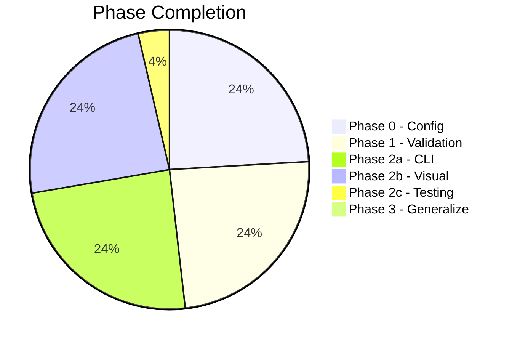
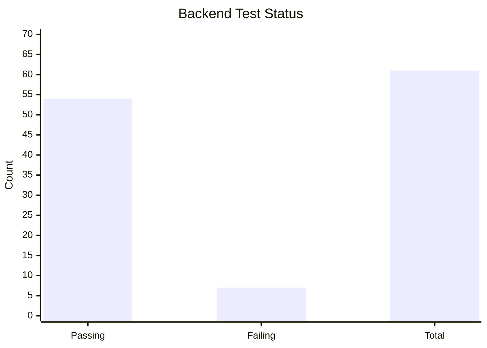

# Development Tracker

*Real-time tracking of brain_explore development progress*

**Exported from SiYuan:** December 4, 2025
**Last Updated:** December 4, 2025

---

## Current Phase: 2c (User Testing)



---

## Sprint Board

### Blocked

- **SiYuan Document Structure** — Where do sparks/insights go? (blocks Quick Capture)
- **Personal Graph Integration** — ADHD ontology not wired to UI

### In Progress

- [ ] User testing of Readest Flow mode
- [ ] User testing of SiYuan Dashboard
- [ ] Planning gaps document creation

### Ready to Start

- [ ] Integration testing (backend <-> frontends)
- [ ] Wire personal graph to backend APIs
- [ ] Define SiYuan notebook structure for captures

### Done (Phase 2b)

- [X] Backend Graph API (6 endpoints)
- [X] SiYuan Dashboard component
- [X] SiYuan 5 Thinking Modes
- [X] SiYuan Flow exploration
- [X] SiYuan Quick Capture
- [X] Readest Flow mode toggle
- [X] Readest Entity panel
- [X] Readest Breadcrumb capture
- [X] Readest Text selection -> entity lookup
- [X] Journey API (5 endpoints)
- [X] Capture API
- [X] ADHD-friendly ontology implementation

---

## Test Coverage



|Test Category|Passing|Total|Status|
|-------------|-------|-----|------|
|Graph API|6|6|OK|
|Session API|12|14|Issues|
|Profile API|8|8|OK|
|Journey API|5|5|OK|
|Capture API|3|3|OK|
|Integration|20|25|Issues|

---

## Git Status

### Recent Commits

```
3952fcd feat(graph): Add ADHD-friendly personal knowledge ontology
1652f24 fix: Remove worktree-specific TASK.md from master
735d857 fix: Restore master CLAUDE.md
3ee0ad6 docs: Add consolidated architecture document
b82acb1 Merge feature/readest-integration into master
```

### Worktree Status

|Worktree|Branch|Status|
|--------|------|------|
|root|master|Up to date|
|.worktrees/readest|feature/readest-integration|Merged to master|
|.worktrees/siyuan|feature/siyuan-evolution|Active development|

---

## Gaps & Technical Debt

### Critical Gaps (Blocking)

1. **SiYuan Structure Undefined** — No place for personal knowledge artifacts
2. **Personal Graph Not Wired** — ADHD ontology exists but not connected to UI
3. **Book Library Inaccessible** — 63 books ingested, no way to browse/open
4. **Cross-App Continuity** — Readest and SiYuan don't share state
5. **Journey Value Loop** — Captured but not analyzed

### Known Issues

1. **7 failing tests** — Need investigation (likely mock/fixture issues)
2. **Graph sources endpoint** — Returns empty content (data issue, not code)
3. **No E2E tests** — Manual testing only currently

### Missing Features (Parking Lot)

- [ ] Profile updates from conversation analysis
- [ ] Automated entity extraction from sessions
- [ ] Readest <-> SiYuan sync
- [ ] Journey export to markdown
- [ ] Keyboard shortcuts in Flow mode

---

## Metrics

### Code Statistics

|Component|Language|Lines|Files|
|---------|--------|-----|-----|
|Backend|Python|~4,500|25|
|SiYuan Plugin|TypeScript/Svelte|~14,000|40|
|Readest Flow|TypeScript|~800|12|
|CLI Tools|Python|~600|5|
|ADHD Ontology|Python|~1,300|2|
|Documentation|Markdown|~15,000|30+|

### Knowledge Graph

|Metric|Count|
|------|-----|
|Entities|50,000+|
|Relationships|125,000+|
|Books|63|
|User Concepts|11|
|Journeys Captured|5 (validation)|

---

## Decision Log

|Date|Decision|Rationale|
|----|--------|---------|
|Dec 4|ADHD ontology implementation|Enable personal knowledge capture with resonance signals|
|Dec 3|4-layer architecture|Reading (Readest) needs separate layer from processing (SiYuan)|
|Dec 3|Worktree per feature|Parallel development without branch switching|
|Dec 2|Manual concept extraction|Validate quality before automating|
|Dec 2|CLI before UI|Prove exploration works before visual polish|
|Dec 1|Delete active-project system|40% overhead was blocking real work|

---

*Source: SiYuan note "Development Tracker"*
