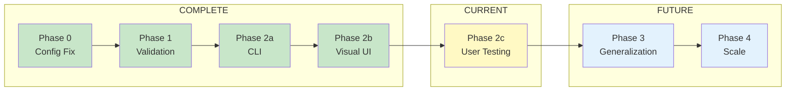
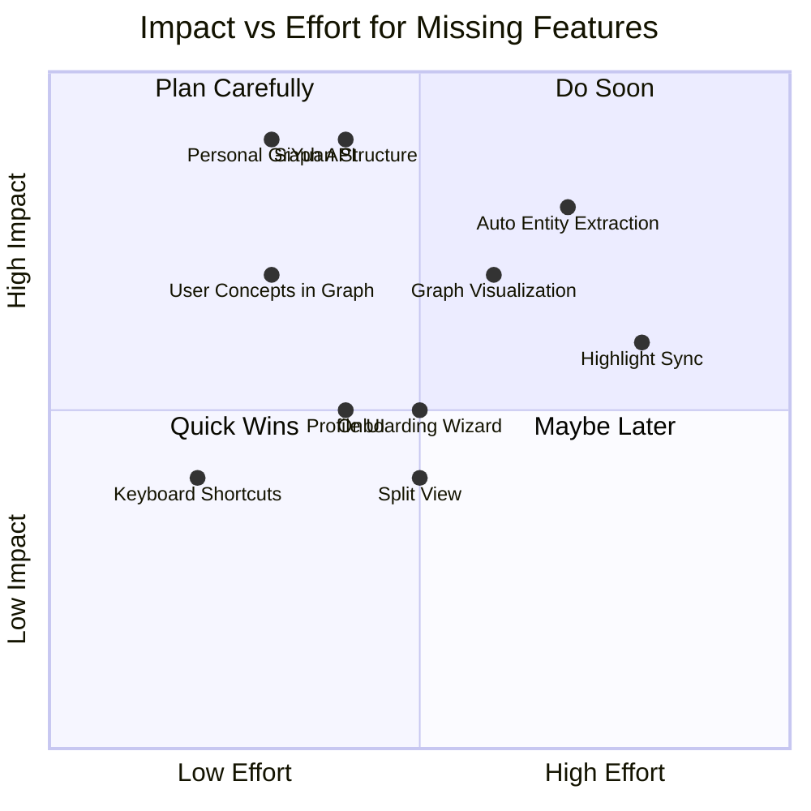

# Roadmap and Gap Analysis

*Strategic view of what's built, what's missing, and what's next*

**Exported from SiYuan:** December 4, 2025

---

## Phase Roadmap

---

## What's Built vs What's Missing

### Layer 4: Readest (Reading Interface)

|Feature|Status|Notes|
|-------|------|-----|
|Flow mode toggle|Built|In header bar|
|Entity panel|Built|Definition, relationships, sources, questions|
|Text selection -> lookup|Built|Button in annotation popup|
|Breadcrumb capture|Built|Local storage + backend sync|
|Keyboard shortcuts|Missing|Would improve UX|
|Highlight sync|Missing|Phase 4 feature|
|Annotation sync|Missing|Phase 4 feature|
|Offline mode|Partial|Local storage works, no queue|

### Layer 3: SiYuan Plugin (Processing Hub)

|Feature|Status|Notes|
|-------|------|-----|
|Dashboard|Built|Stats, suggestions, journeys|
|5 Thinking modes|Built|Learning, Articulating, Planning, Ideating, Reflecting|
|Flow exploration|Built|Grouped relationships|
|Quick Capture|Built|Entity extraction|
|Journey resumption|Built|Click to resume in Flow mode|
|Split view (conversation + notes)|Missing|Deferred for simplicity|
|Profile management UI|Missing|API exists, no UI|
|Onboarding wizard|Missing|Direct to modes currently|
|**SiYuan document structure**|**Missing**|**Where do captures go?**|

### Layer 2: Backend APIs

|Feature|Status|Notes|
|-------|------|-----|
|Graph API (6 endpoints)|Built|All working|
|Journey API (5 endpoints)|Built|CRUD complete|
|Capture API|Built|Entity extraction|
|Session API|Built|Dialogue management|
|Question Engine|Built|Context-aware questions|
|**Personal Graph API**|**Missing**|**ADHD ontology not exposed**|
|Profile updates from conversation|Missing|Schema exists, no auto-update|
|Automated entity extraction|Missing|Manual process currently|
|Graph enrichment pipeline|Missing|Phase 3 feature|

### Layer 1: Knowledge Graph

|Feature|Status|Notes|
|-------|------|-----|
|Neo4j with 50k entities|Built|Fully populated|
|Qdrant vectors|Built|Semantic search works|
|63 books ingested|Built|Current test corpus (psychology/therapy)|
|**ADHD ontology schema**|**Built**|**spark, insight, thread, favorite_problem**|
|User concepts in graph|Missing|11 concepts not yet added|
|Bidirectional links|Missing|Literature <-> user concepts|
|Graph visualization|Missing|Only list view currently|

---

## Gap Prioritization Matrix

---

## Technical Debt

### High Priority

|Issue|Impact|Effort to Fix|
|-----|------|-------------|
|7 failing tests|CI/CD blocked|2-4 hours|
|No E2E tests|Regression risk|8-16 hours|
|Graph sources empty|Feature incomplete|2 hours (data issue)|

### Medium Priority

|Issue|Impact|Effort to Fix|
|-----|------|-------------|
|Hardcoded user ID|Single-user only|2 hours|
|No error boundaries|Crashes on API fail|4 hours|
|No loading states|UX feels broken|2 hours|

---

## Phase 2c Success Criteria

### Must Have

- [ ] Flow mode usable for 30+ min
- [ ] No crashes during testing
- [ ] Journey saves correctly
- [ ] Entity lookup works reliably

### Should Have

- [ ] Questions feel helpful
- [ ] Navigation is intuitive
- [ ] Dashboard shows relevant data

### Nice to Have

- [ ] Performance feels snappy
- [ ] Discover unexpected insights
- [ ] Want to use it daily

---

## Decision Points

### After Phase 2c

1. **If Flow mode works well** -> Proceed to Phase 3 (generalization)
2. **If UX needs major work** -> Phase 2d for polish before generalization
3. **If core value unclear** -> Revisit architecture

### Phase 3 Options

|Option|Effort|Value|
|------|------|-----|
|A: Second domain (philosophy)|20 hours|Proves generalization|
|B: Multi-user support|40 hours|Enables sharing|
|C: Advanced profile|30 hours|Better personalization|

**Recommendation:** Option A first - refine core system through real usage before adding domains.

---

*Source: SiYuan note "Roadmap and Gaps"*
