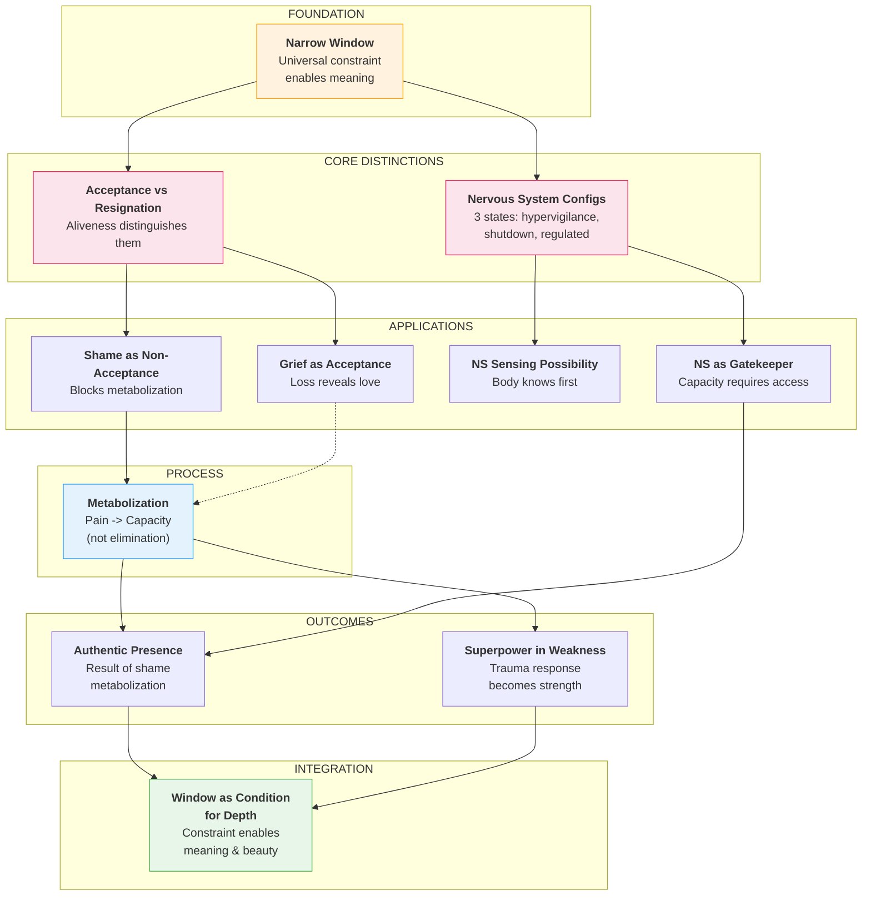
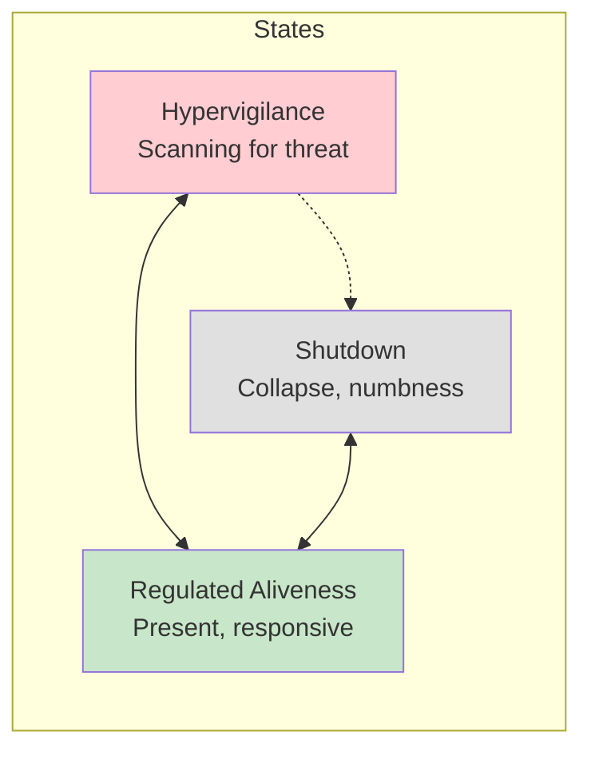
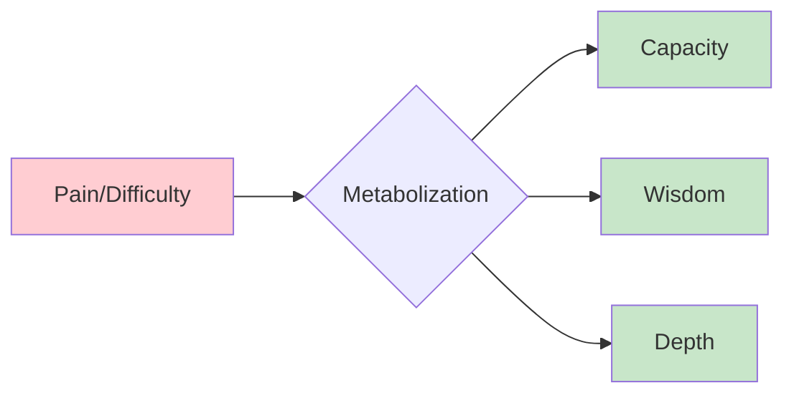
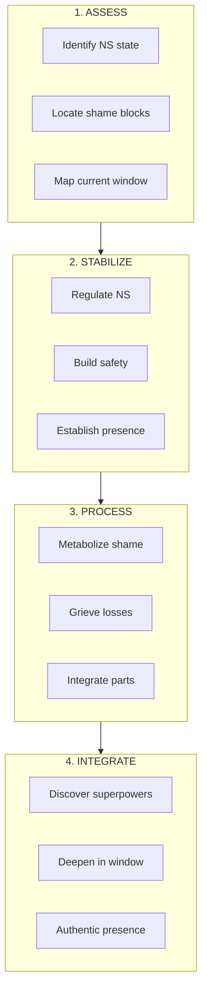

# Personal Growth Framework Map

*An active personal project using brain_explore — demonstrates system capability, not system purpose*

**Exported from SiYuan:** December 4, 2025
**Context:** This is an ongoing personal exploration of meaning, acceptance, and presence — one application of the domain-agnostic intelligent exploration system.

---

## Concept Hierarchy

---

## Concept Cards

### 1. Narrow Window of Awareness

> **The window is universal, not pathology; constraint enables meaning**

|Aspect|Description|
|------|-----------|
|**Core Insight**|Human perception operates through a narrow window - this is how we work, not a defect|
|**Clinical Application**|Reframe "limitations" as the condition for depth and meaning|
|**Connections**|Foundation for all other concepts|

---

### 2. Acceptance vs Resignation

> **Distinction is aliveness/energy, not external form**

|Aspect|Description|
|------|-----------|
|**Core Insight**|Both may look similar externally, but acceptance has aliveness, resignation has deadness|
|**Clinical Application**|Help clients feel the energetic difference in their body|
|**Connections**|Leads to grief work, blocks shame work|

---

### 3. Nervous System Configurations

> **Three states determine capacity**

---

### 4. Grief as Acceptance

> **Loss reveals love; grief-with-presence preserves connection**

|Aspect|Description|
|------|-----------|
|**Core Insight**|Grief is not the opposite of acceptance but its expression|
|**Clinical Application**|Support grieving as active presence, not passive suffering|
|**Paradox**|Letting go deepens connection|

---

### 5. Metabolization of Difficulty

> **Process by which pain becomes capacity (not elimination)**

---

### 6. Shame as Non-Acceptance

> **Blocker to metabolization; prevents movement toward presence**

|Aspect|Description|
|------|-----------|
|**Core Insight**|Shame is the refusal to accept what is - it freezes the metabolization process|
|**Clinical Application**|Address shame before deeper work can proceed|
|**Relationship**|Opposite of self-compassion (paradoxically supports it)|

---

### 7. Authentic Presence

> **Outcome of shame metabolization and nervous system re-regulation**

|Path|Description|
|----|-----------|
|Through shame|Metabolizing shame frees energy for presence|
|Through NS|Regulated nervous system enables presence|
|Result|Capacity to be with what is, without defense|

---

### 8. Nervous System as Gatekeeper

> **Capacity emerges when nervous system is accessed**

|Aspect|Description|
|------|-----------|
|**Core Insight**|The nervous system determines what's possible - cognitive insight is insufficient|
|**Clinical Application**|Work with the body, not just the mind|
|**Implication**|Capacity isn't built through thinking|

---

### 9. Nervous System Sensing Possibility

> **How the body knows before the mind**

|Aspect|Description|
|------|-----------|
|**Core Insight**|The nervous system senses safety/danger before conscious awareness|
|**Clinical Application**|Trust somatic signals as data|
|**Connection**|Foundation for "felt sense" work|

---

### 10. Superpower in Weakness

> **Adaptive trauma response becomes strength when metabolized**

|Example|Trauma Response|Superpower|
|-------|---------------|----------|
|Hypervigilance|Constant scanning|Deep attunement|
|People-pleasing|Loss of self|Empathy, service|
|Perfectionism|Fear of failure|Excellence, craft|

---

### 11. Window as Condition for Depth

> **Constraint itself enables meaning, beauty, presence**

|Aspect|Description|
|------|-----------|
|**Core Insight**|The narrow window isn't a limitation to overcome but the condition for depth|
|**Full Circle**|Returns to Concept 1 with integration of all intermediate concepts|
|**Therapeutic Vision**|Not expanding the window, but deepening within it|

---

## Personal Application Framework

---

*Discovered through 10 Phase 1 validation sessions, December 2025*
*This is an active personal project — ongoing development using brain_explore*
*Demonstrates the system's concept extraction pipeline, not its purpose*
*Source: SiYuan note "Therapy Framework Map"*
