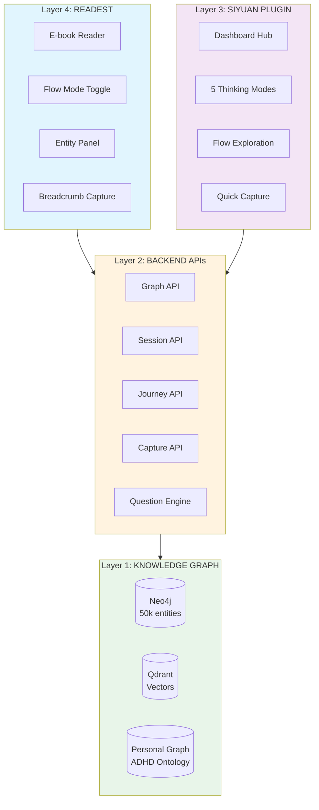
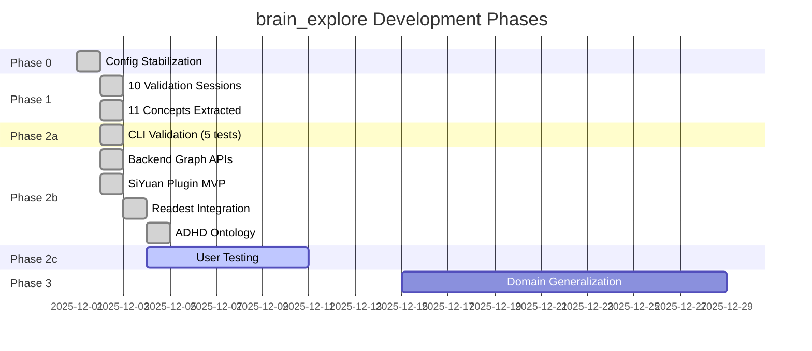
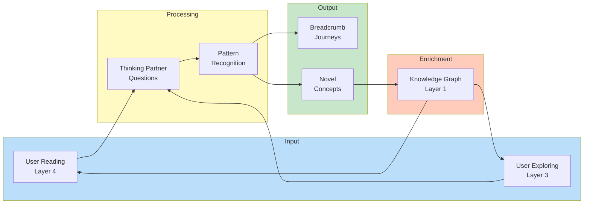
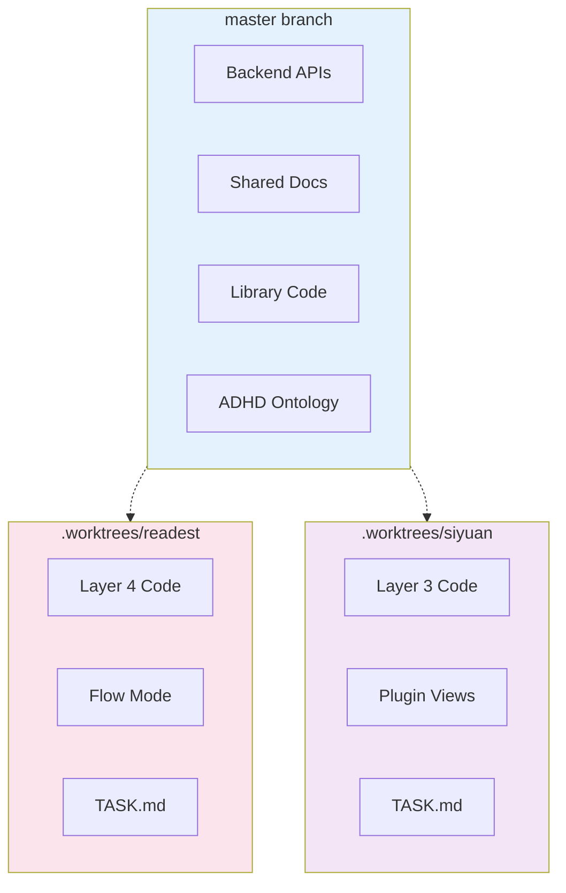
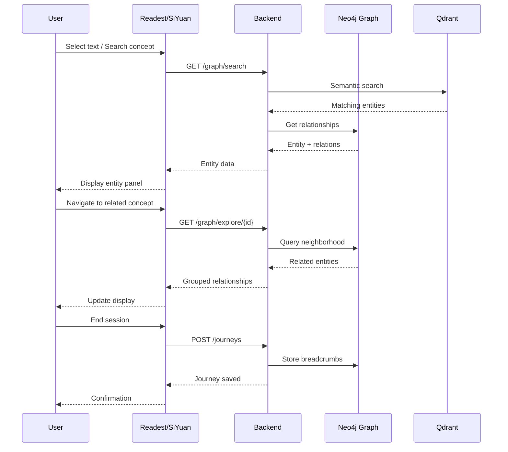

# brain_explore Project Visualizations

*Visual representations of architecture, progress, and roadmap*

**Exported from SiYuan:** December 4, 2025

---

## 1. Four-Layer Architecture



---

## 2. Phase Progress Timeline



---

## 3. Thinking Partnership Cycle



---

## 4. Component Status Dashboard

|Layer|Component|Status|Progress|
|-----|---------|------|--------|
|4|Readest Flow Mode|Complete|100%|
|4|Entity Panel|Complete|100%|
|4|Journey Capture|Complete|100%|
|3|Dashboard|Complete|100%|
|3|5 Thinking Modes|Complete|100%|
|3|Flow Exploration|Complete|100%|
|3|Quick Capture|Complete|100%|
|2|Graph API|Complete|100%|
|2|Journey API|Complete|100%|
|2|Session API|Complete|100%|
|2|Personal Graph API|**Missing**|0%|
|2|Tests|Partial|89%|
|1|Neo4j Graph|Complete|100%|
|1|Qdrant Vectors|Complete|100%|
|1|ADHD Ontology|Complete|100%|

---

## 5. Worktree Organization



---

## 6. API Endpoint Map

```mermaid
flowchart LR
    subgraph Client["Clients"]
        C1[Readest]
        C2[SiYuan Plugin]
        C3[CLI Tools]
    end

    subgraph Backend["Backend :8081"]
        subgraph Graph["/graph"]
            G1[/stats]
            G2[/search]
            G3[/explore]
            G4[/sources]
            G5[/suggestions]
            G6[/thinking-partner]
        end

        subgraph Journey["/journeys"]
            J1[POST /]
            J2[GET /id]
            J3[GET /user/id]
        end

        subgraph Capture["/capture"]
            CP1[POST /process]
        end

        subgraph Session["/session"]
            S1[POST /]
            S2[POST /id/message]
            S3[GET /context/id]
        end

        subgraph Personal["/personal - NEEDED"]
            P1[/sparks]
            P2[/insights]
            P3[/threads]
            P4[/favorite-problems]
        end
    end

    C1 --> Graph
    C1 --> Journey
    C2 --> Graph
    C2 --> Journey
    C2 --> Capture
    C2 --> Session
    C3 --> Graph
```

---

## 7. Data Flow Diagram



---

## 8. Knowledge Graph Statistics

|Metric|Value|
|------|-----|
|**Total Entities**|50,000+|
|**Relationships**|125,000+|
|**Books Ingested**|63|
|**Relationship Types**|supports, contrasts, develops, component_of, cites, authored_by|
|**Entity Types**|Concept, Theory, Researcher, Assessment, Book, Chapter|
|**User Concepts**|11 (personal growth framework — active application)|
|**ADHD Entity Types**|spark, insight, thread, favorite_problem|

---

*Source: SiYuan note "Project Visualizations"*
