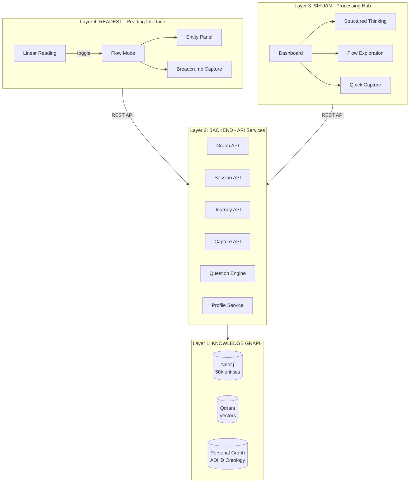
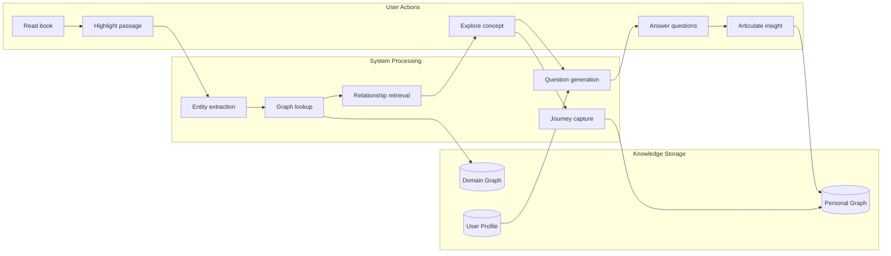
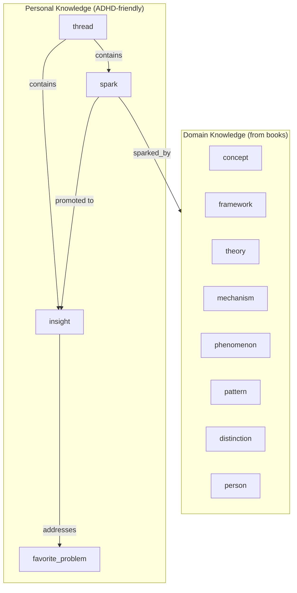
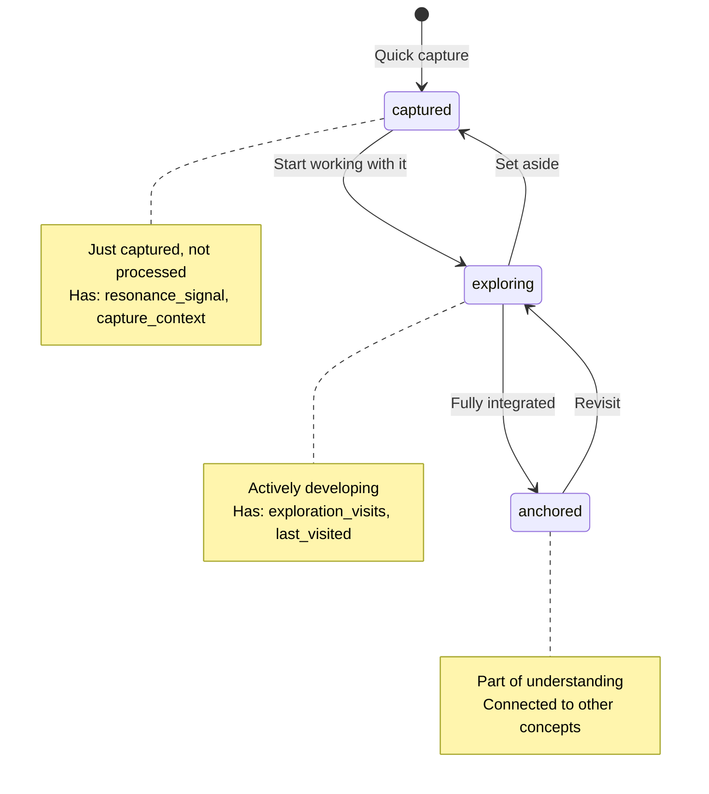
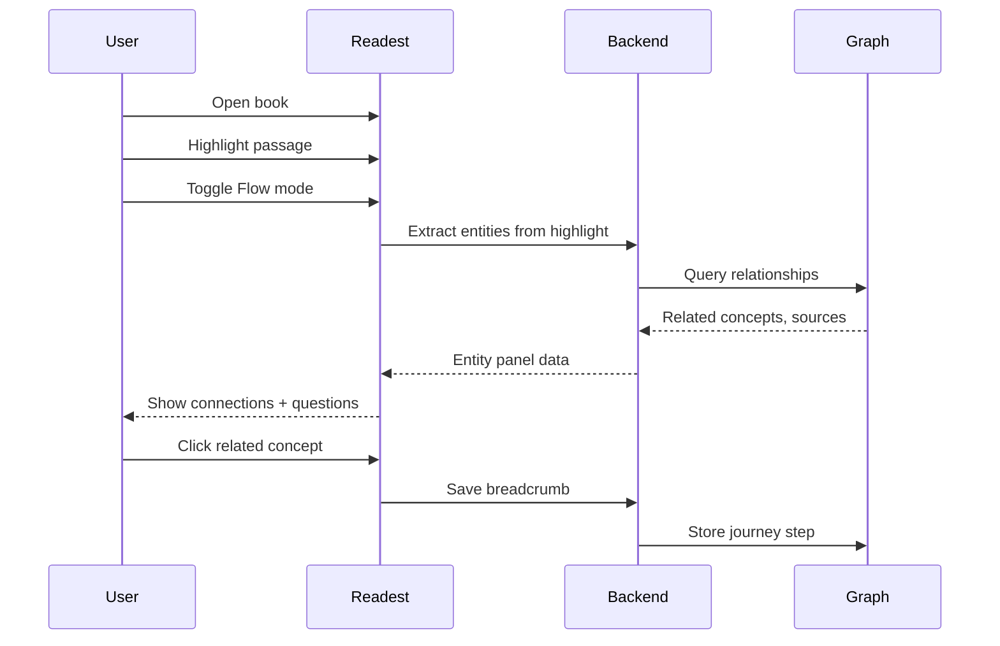
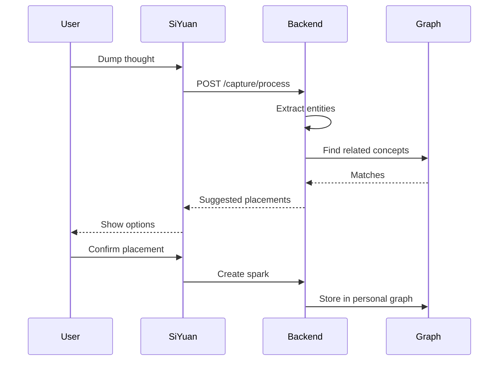
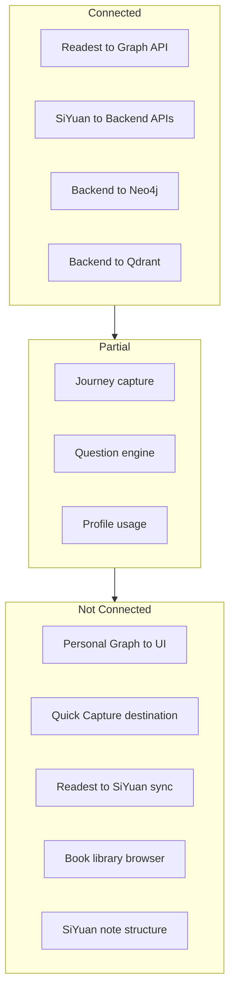
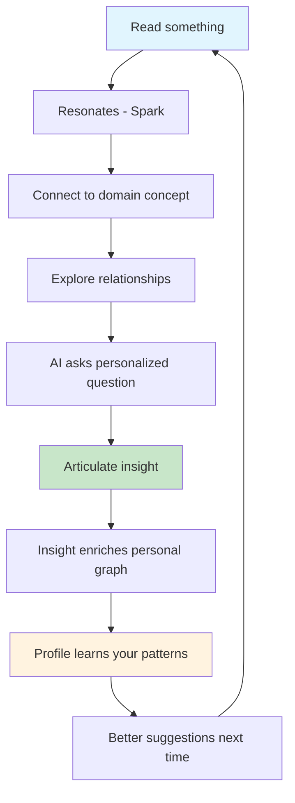

# brain_explore System Design Visual

*Visual diagrams of the complete system architecture*

**Exported from SiYuan:** December 4, 2025

---

## Four-Layer Architecture

---

## Data Flow: Reading to Insight

---

## Entity Types

---

## Spark Lifecycle

---

## User Workflows

### Reading Flow

### Quick Capture Flow

---

## Integration Status

---

## The Virtuous Cycle

---

## Critical Gaps

|Gap|What's Missing|Impact|
|---|--------------|------|
|Gap 1|SiYuan Structure|Can't capture - no destination|
|Gap 2|Personal Graph Integration|Can't personalize|
|Gap 3|Book Library Access|Can't start reading from system|
|Gap 4|Journey to Value loop|Data captured but unused|
|Gap 5|Cross-App Sync|Fragmented experience|

---

*Source: SiYuan note "System Design Visual"*
