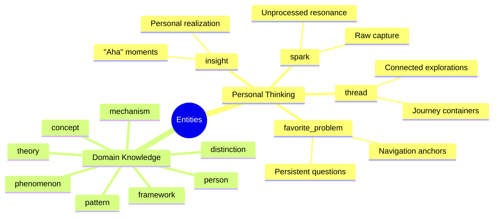
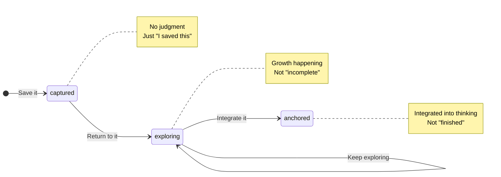
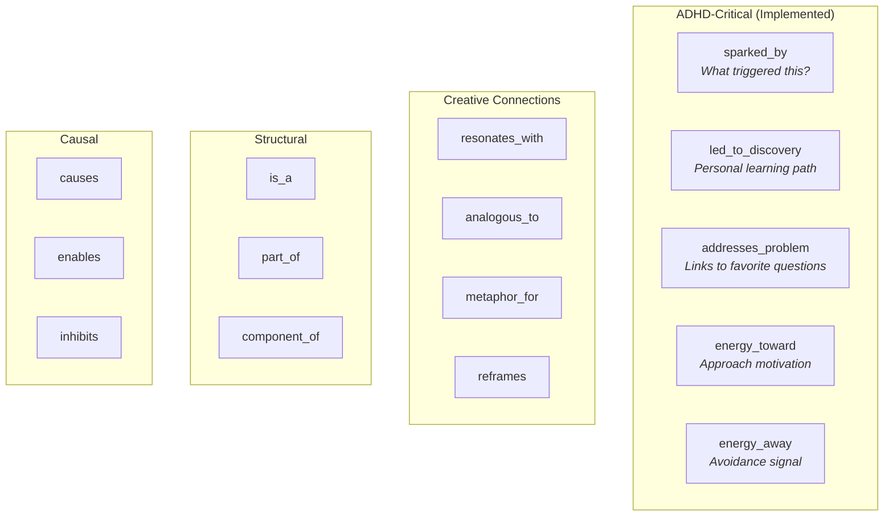
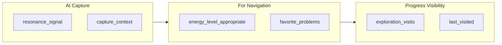

# ADHD-Friendly Ontology Design

> *Research-backed design for a knowledge system that works WITH the ADHD brain*

**Exported from SiYuan:** December 4, 2025
**Implementation Status:** Complete (library/graph/adhd_ontology.py, adhd_graph_client.py)

---

## Core Insight

**ADHD brains are not broken** — they're interest-based, emotionally-driven, and connection-making machines.

The ontology must work WITH these traits, not against them.

---

## Entity Types

---

## Status Lifecycle

**Why this matters:** Traditional statuses like "draft" trigger shame. Growth metaphors feel like cultivation, not judgment.

---

## Relationship Types

---

## Resonance Signals

> "Capture what resonates" — Tiago Forte

|Signal|Meaning|
|------|-------|
|**curious**|Want to know more|
|**excited**|Energy surge|
|**surprised**|Unexpected insight|
|**moved**|Emotional impact|
|**disturbed**|Challenges beliefs|
|**unclear**|Don't know why, but important|
|**connected**|Relates to existing knowledge|
|**validated**|Confirms intuition|

---

## The 7 Design Principles

### 1. Resonance Over Importance

Capture emotional engagement, not just taxonomic accuracy. "Did this spark?" beats "Is this important?"

### 2. Multiple Entry Points

Never require the "right" way to find something. Mood-based, question-based, serendipitous.

### 3. Visible Progress

Make momentum tangible. Breadcrumb trails as treasure maps, not audit logs.

### 4. Low Friction, High Return

Capture must be effortless. Organization happens automatically.

### 5. Context Preservation

Save "why now?" alongside "what." Enable future self to re-evoke capture state.

### 6. Non-Judgmental Lifecycle

Status = growth, not grades. "Incomplete" is valid forever.

### 7. Interest-Following Navigation

Graph traversal feels like following curiosity. "What else is like this?"

---

## Metadata for ADHD Support

|Field|Type|Purpose|
|-----|-----|-------|
|`resonance_signal`|enum|Why did this spark?|
|`capture_context`|string|What were you doing when you saved this?|
|`energy_level`|low/med/high|When to surface this|
|`exploration_visits`|integer|How many times you've returned|
|`last_visited`|timestamp|For "continue where I left off"|
|`favorite_problems`|array|Which persistent questions this relates to|

---

## Favorite Problems (Feynman's Method)

> "Keep a dozen of your favorite problems constantly present in your mind... Every time you hear a new result, test it against each of your problems." — Richard Feynman

Favorite problems become **navigation anchors** — stable entry points for a wandering mind.

---

## Research Sources

|Source|Key Insight|
|------|-----------|
|**Russell Barkley**|"ADHD is not knowing what to do; it's DOING what you know"|
|**Tamara Rosier**|Interest-based nervous system; shame as destructive motivator|
|**Gabor Maté**|Emotional resonance as retrieval cue; implicit memory|
|**Tiago Forte**|Capture what resonates; 12 favorite problems|
|**Cognitive Architecture**|Spreading activation; conceptual spaces|

---

## Implementation Status

### Tier 1: Foundation (COMPLETE)

1. Add `spark`, `favorite_problem`, `thread`, `insight` types
2. Implement `captured -> exploring -> anchored` lifecycle
3. Add `resonance_signal` and `capture_context` metadata

**Location:** `library/graph/adhd_ontology.py`

### Tier 2: Navigation (COMPLETE)

4. Add relationship types (`sparked_by`, `led_to_discovery`, `addresses_problem`)
5. Implement favorite_problems as first-class navigation
6. Add visit tracking (`exploration_visits`, `last_visited`)

**Location:** `library/graph/adhd_graph_client.py`

### Tier 3: Integration (PENDING)

7. Backend API endpoints for personal graph CRUD
8. SiYuan plugin integration
9. Readest integration
10. Energy-level-based surfacing

---

*Full research: `.interleaved-thinking/final-answer.md`*
*Source: SiYuan note "ADHD-Friendly Ontology Design"*
