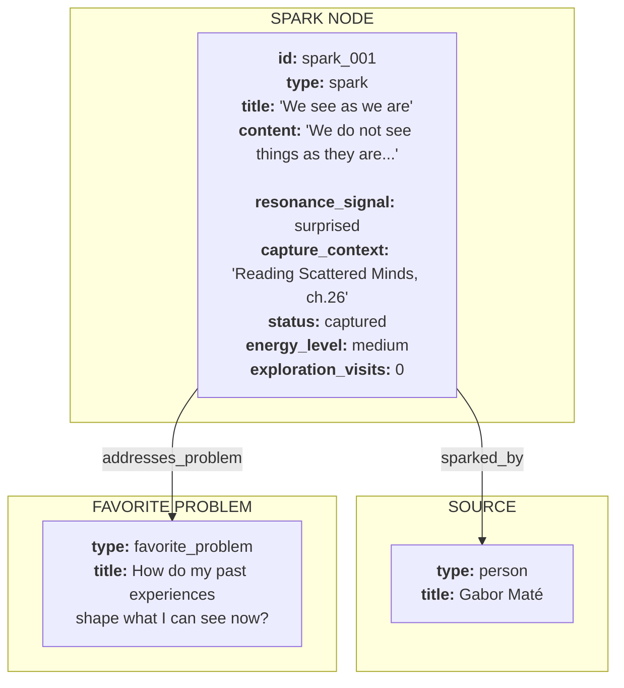
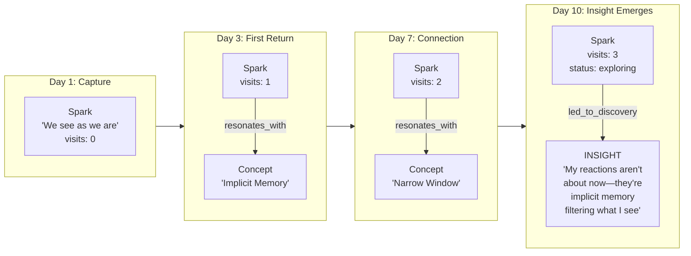
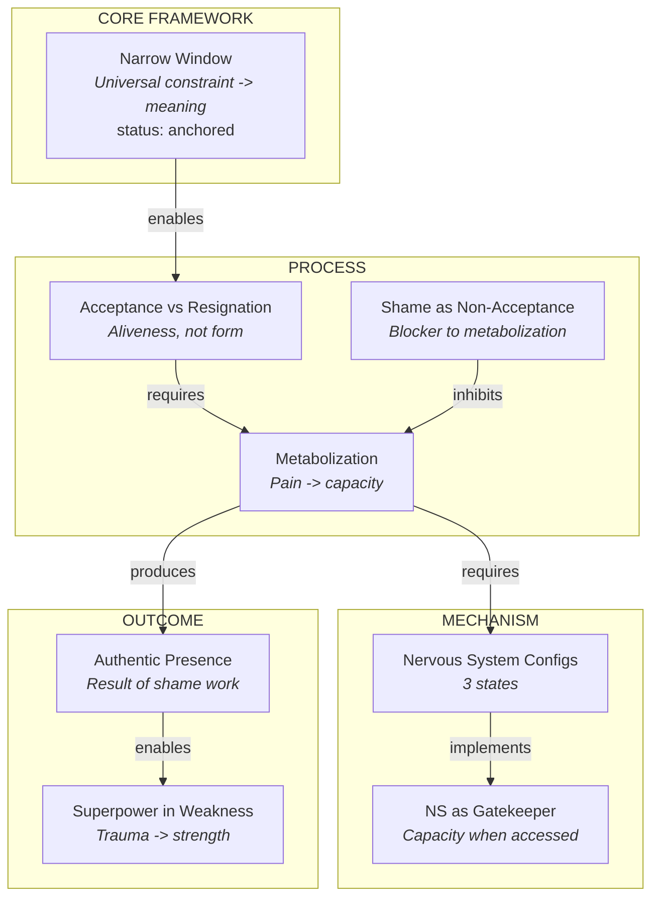
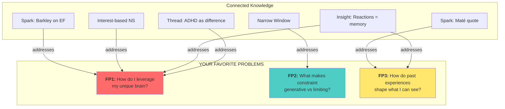
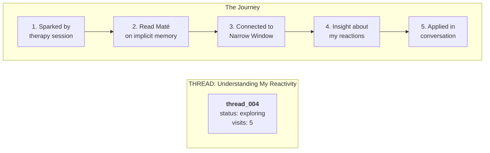

# Real Examples: The ADHD Ontology in Action

*Actual examples showing exactly how nodes and edges would look*

**Exported from SiYuan:** December 4, 2025
**Parent Document:** ADHD-Friendly Ontology Design

---

## Example 1: Capturing a Spark While Reading

You're reading Gabor Maté and this hits you:

> "We do not see things as they are, we see them as we are."

### What Gets Created



### The Actual Data

```json
{
  "id": "spark_001",
  "type": "spark",
  "title": "We see as we are",
  "content": "We do not see things as they are, we see them as we are.",
  "resonance_signal": "surprised",
  "capture_context": "Reading Scattered Minds, ch.26 - section on implicit memory.",
  "status": "captured",
  "energy_level": "medium",
  "favorite_problems": ["fp_003"],
  "exploration_visits": 0,
  "created_at": "2024-12-04T10:30:00Z",
  "source_ref": "Scattered Minds, p.284"
}
```

---

## Example 2: A Spark Becomes an Insight

You return to that spark 3 times. Each time, you connect it to other things. Eventually you realize something:

### The Journey



### The Insight Node

```json
{
  "id": "insight_007",
  "type": "insight",
  "title": "Reactions are implicit memory filtering",
  "content": "My strong reactions to criticism aren't about the present moment—they're implicit memories from childhood filtering what I can see.",
  "resonance_signal": "moved",
  "capture_context": "Journaling after therapy session. Connected the Maté quote to my own reactivity pattern.",
  "status": "exploring",
  "energy_level": "high",
  "favorite_problems": ["fp_003", "fp_001"],
  "exploration_visits": 0,
  "created_at": "2024-12-10T19:45:00Z"
}
```

---

## Example 3: Personal Growth Framework Concepts

From your Phase 1 work, here's how the 11 concepts would look:



---

## Example 4: Favorite Problems as Navigation Anchors



### Navigation: "Show me everything about FP1"

Query: `MATCH (n)-[:addresses_problem]->(fp {id: "fp1"}) RETURN n`

Returns:
- Spark: Barkley on EF
- Concept: Interest-based nervous system
- Insight: Reactions = memory
- Thread: ADHD as difference

**Every path leads somewhere.** No dead ends.

---

## Example 5: A Thread (Exploration Journey)



### Thread Node

```json
{
  "id": "thread_004",
  "type": "thread",
  "title": "Understanding My Reactivity",
  "content": "A journey from noticing my strong reactions to criticism, through Maté's implicit memory work, to realizing my reactions are survival echoes.",
  "status": "exploring",
  "breadcrumbs": [
    {"node_id": "spark_therapy_001", "note": "Noticed pattern"},
    {"node_id": "spark_001", "note": "Maté resonated"},
    {"node_id": "concept_implicit_memory", "note": "This explains it"},
    {"node_id": "concept_narrow_window", "note": "Connected!"},
    {"node_id": "insight_007", "note": "Aha moment"}
  ],
  "exploration_visits": 5,
  "last_visited": "2024-12-10T19:50:00Z"
}
```

---

## Navigation Scenarios

### "I have low energy, show me something familiar"

Query: `energy_level = low AND exploration_visits > 3`

### "What sparked my thinking about shame?"

Query: `MATCH path = (n)-[:sparked_by|led_to*]->(shame_concept) RETURN path`

### "Continue where I left off"

Query: `ORDER BY last_visited DESC LIMIT 5`

### "Surprise me with something I haven't seen"

Query: `exploration_visits = 0 AND resonance_signal IN ['curious', 'surprised']`

---

This is what your knowledge graph would actually look like—a living map of your thinking, with multiple paths in and no dead ends.

---

*Source: SiYuan note "ADHD-Friendly Ontology Design/Real Examples"*
