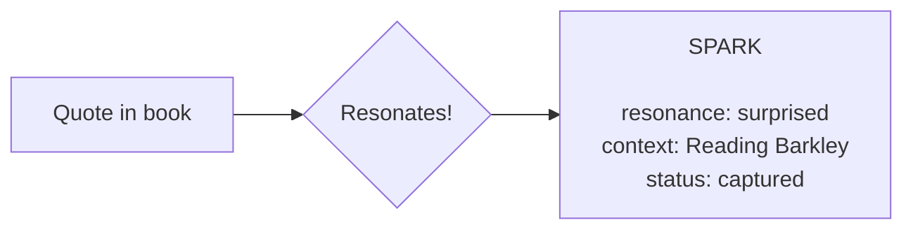
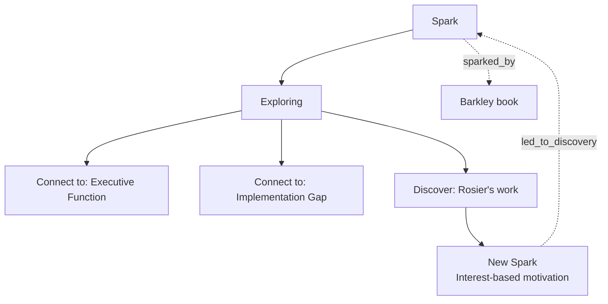
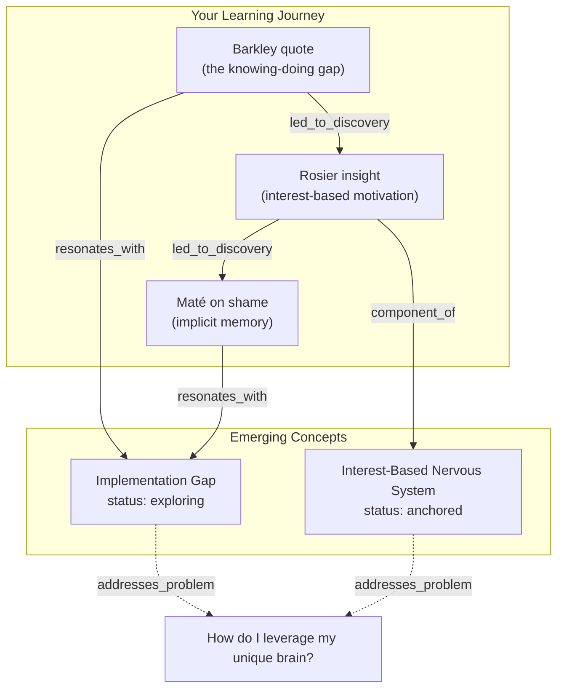
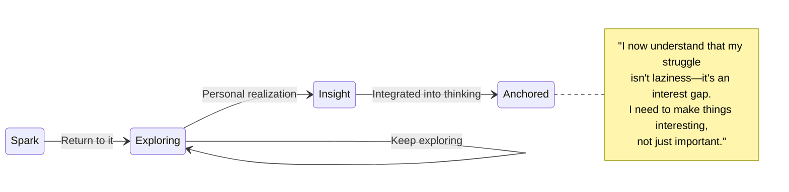
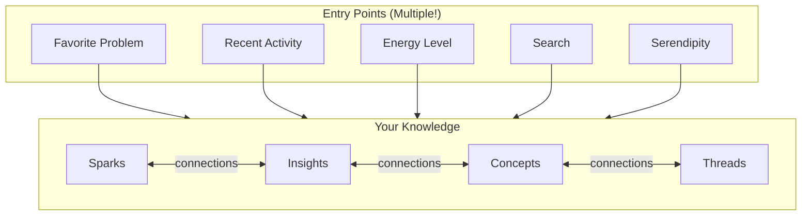

# Example: How a Spark Becomes Knowledge

> A practical walkthrough of the ADHD-friendly ontology in action

**Exported from SiYuan:** December 4, 2025
**Parent Document:** ADHD-Friendly Ontology Design

---

## The Scenario

You're reading about ADHD and come across this quote:

> "ADHD is not a problem of knowing what to do; it is a problem of doing what you know." — Russell Barkley

Something about this **resonates**. You don't know exactly why yet, but it matters.

---

## Step 1: Capture the Spark

**What gets saved:**

|Field|Value|
|-----|-----|
|type|`spark`|
|content|"ADHD is not a problem of knowing..."|
|resonance_signal|`surprised`|
|capture_context|"Reading Executive Functions, ch.3"|
|status|`captured`|
|favorite_problems|`["How do I leverage my unique brain?"]`|

**Key:** No classification required. Just save it.

---

## Step 2: Return and Explore

Later, you return to this spark. Maybe through:

- Your favorite problem ("How do I leverage my unique brain?")
- Recent captures
- Searching for "ADHD"
- Serendipitous discovery

**Status changes:** `captured` -> `exploring`
**Visits:** 1 -> 2 -> 3...

---

## Step 3: Connections Emerge

As you explore, relationships form:

---

## Step 4: Crystallization (Optional)

Some explorations become anchored insights:

**The insight that emerged:**

> My struggle isn't laziness—it's an interest gap. Importance doesn't motivate me; interest does. I need to make things interesting, not just important.

---

## The Navigation Experience

**No "right" way in.** Every path is valid.

---

## What Makes This ADHD-Friendly

|Traditional PKM|This System|
|---------------|-----------|
|"Where should I file this?"|Just capture it as a spark|
|"Is this important enough?"|Did it resonate? That's enough|
|"I never finish anything"|`exploring` is a valid permanent state|
|"I can't find anything"|Multiple entry points, no wrong way|
|"I forgot why I saved this"|`capture_context` preserves the moment|
|"I feel behind"|`exploration_visits` shows you've been here|

---

## Try It Now

1. **Capture a spark** — Something that resonated recently
2. **Tag a favorite problem** — What persistent question does it relate to?
3. **Note the resonance** — curious? surprised? moved?
4. **Save the context** — What were you doing when this struck you?

No need to organize. No need to classify. Just capture the spark. The connections will emerge as you explore.

---

*Source: SiYuan note "ADHD-Friendly Ontology Design/Example Flow"*
