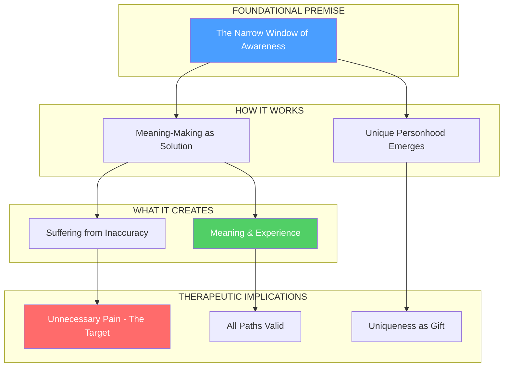

# Initial Framework Map

## Visual Representation (Mermaid)

## Concept Relationships

| From | To | Relationship |
|------|-----|--------------|
| Narrow Window | Meaning-Making | enables/necessitates |
| Narrow Window | Unique Personhood | creates |
| Meaning-Making | Suffering | can cause (when inaccurate) |
| Meaning-Making | Experience of Meaning | enables (the gift) |
| Suffering | Unnecessary Pain | subset that's addressable |
| Experience of Meaning | All Paths Valid | implies |
| Unique Personhood | Uniqueness as Gift | reframes |

## Concepts Identified (Status)

| Concept | Status | Track |
|---------|--------|-------|
| Narrow Window of Awareness | developing | 1-Human Mind |
| Meaning-Making as Solution | seed | 1-Human Mind |
| Unique Personhood | seed | 1-Human Mind |
| Unnecessary Pain | seed | 2-Change Process |
| All Paths Valid | seed | 3-Method |

## Expansion Points

These concepts need deeper exploration:

1. **Narrow Window + Neurodivergence**: Is ND a different window shape? Not narrower/wider but differently positioned?

2. **Meaning-Making + Nervous System**: How does felt safety interact with the capacity to examine meaning?

3. **Unnecessary Pain → Change Process**: What makes pain "unnecessary"? When can beliefs be revised vs. accepted?

4. **Uniqueness → Method**: How do we operationalize "allowing unique contribution" in session?
